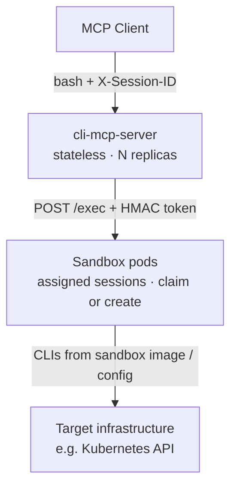

# cli-mcp-server

MCP server that gives AI agents a **sandboxed bash shell** inside per-session Kubernetes pods.

Agents call a single `bash` tool — pipes, redirects, chaining, and whatever CLIs are installed in the sandbox image. The MCP server is a stateless control plane: it creates and routes to sandbox pods, then proxies commands. Session state (working directory, env vars, files) lives in the pod’s persistent bash process.

Designed to run against a Kubernetes (or OpenShift) cluster — the server manages sandbox pods via the API. It is not a local-only shell MCP.

## Features

- **Persistent bash per session** — cwd, environment, and `/workspace` files survive across tool calls
- **Full shell, not a command allowlist** — security comes from pod isolation, RBAC, and network policy
- **Per-session agent auth** — MCP server → sandbox `/exec` uses an HMAC-derived bearer token (defense in depth beyond NetworkPolicy)
- **Customizable CLIs** — available tools are whatever is in the sandbox agent image (the default image includes `oc`/`kubectl`)
- **Stateless, multi-replica ready** — any server replica can handle any request; Kubernetes is the source of truth
- **Claim then create** — MCP claims an instance-labeled unassigned pod if one exists, otherwise creates on demand

## Usage

Works with any MCP client that can call tools over HTTP (or stdio) and send an `X-Session-ID` header. Over HTTP this is straightforward; over stdio it depends on whether the client/SDK can attach request headers.

### MCP tool: `bash`

| Parameter | Type | Required | Description |
|-----------|------|----------|-------------|
| `command` | string | yes | Shell command (full bash — pipes, redirects, chaining) |
| `timeout` | int | no | Max execution time in seconds (default 60, max 300) |

Example calls:

```json
{"command": "kubectl get pods -n kube-system --context=prod"}
{"command": "kubectl get pods -o json | jq '.items[].metadata.name'", "timeout": 120}
```

Returns `stdout`, `stderr`, `exit_code`, and `duration_ms`. Non-zero exit codes are tool results (not transport errors) so the agent can use failure output.

### Session routing

Every request must include:

```http
X-Session-ID: <session-id>
```

The server only uses this value to find or create a sandbox pod. Session IDs must be RFC 1123 DNS labels (`^[a-z0-9]([a-z0-9-]{0,61}[a-z0-9])?$`); invalid IDs fail at pod create.

Typical client practice (agent harness / orchestrator — not the LLM):

1. Generate a new session ID when starting work that should share one sandbox
2. Send that same ID on every follow-up `bash` call to reuse the persistent shell and `/workspace`
3. Call `DELETE /sessions/{id}` when finished (HTTP transport only) — removes the sandbox pod, auth secret, and cache entry

If the client never deletes the session, the sandbox pod remains until something else deletes it (operator idle GC, or a manual `DELETE`).

## Configuration

### Server flags

| Flag | Default | Description |
|------|---------|-------------|
| `--transport` | `stdio` | `stdio` or `http` (`http` requires `--stateless`) |
| `--address` | `localhost:8080` | Listen address (HTTP; must be loopback) |
| `--stateless` | `false` | Required for HTTP / multi-replica |
| `--namespace` | _(required)_ | Namespace for sandbox pods |
| `--instance-name` | _(required)_ | Instance id on sandbox labels (`cli-mcp.redhat.com/instance`) |
| `--sandbox-image` | _(required)_ | Container image for sandbox pods |
| `--hmac-key-file` | _(required)_ | Path to shared HMAC secret |
| `--kubeconfig-secret` | _(required)_ | Investigation kubeconfig Secret mounted into sandbox pods |
| `--sandbox-service-account` | _(required)_ | ServiceAccount name for sandbox pods |
| `--kubeconfig` | _(in-cluster)_ | Kubeconfig for the MCP process's Kubernetes client (not the investigation Secret) |
| `--sandbox-cpu-request` | `100m` | Sandbox CPU request |
| `--sandbox-cpu-limit` | `500m` | Sandbox CPU limit |
| `--sandbox-memory-request` | `128Mi` | Sandbox memory request |
| `--sandbox-memory-limit` | `512Mi` | Sandbox memory limit |
| `--sandbox-image-pull-policy` | _(empty)_ | Sandbox `imagePullPolicy` (`Always`, `Never`, `IfNotPresent`) |
| `--sandbox-env` | _(empty)_ | JSON `[]corev1.EnvVar` overlay for sandbox pods |
| `--idle-timeout` | `30m` | Parsed for CLI compatibility; MCP does not idle-GC |
| `--warm-pool-size` | `0` | Parsed for CLI compatibility; MCP does not replenish a pool |

### Sandbox image (available CLIs)

CLIs available to the agent are determined by the **sandbox agent image**, not by server code.

The default image (`Containerfile.agent`) is based on `oc-client-base-minimal` and includes `oc`, `kubectl`, plus utilities such as `jq`, `yq`, and `curl`.

To add other CLIs (for example `helm` or `virtctl`):

1. Extend `Containerfile.agent` (or build a custom image from it)
2. Build and push the image
3. Point the MCP server at it with `--sandbox-image`

No MCP server code changes are required. Tell the LLM what is available via your client’s server instructions (or equivalent); the `bash` tool description stays generic.

## Architecture



Bash commands run in the sandbox pods. What they can reach (for example a Kubernetes API via `kubectl`) depends on the sandbox image and the kubeconfig/RBAC mounted into those pods — not on the MCP server binary.

### Scalability

The MCP server holds no durable session state. Pod identity is stored in Kubernetes labels; an in-memory cache speeds up routing. Any replica can serve any request, so you can scale the Deployment horizontally behind a load balancer with no sticky sessions.

MCP always claims an instance-labeled unassigned pod if one exists, otherwise creates on demand. Pool replenishment and idle GC are owned by the operator, not this process.

### Sandboxing and security

Each session gets its own pod. That pod is the security boundary:

- **Isolation** — non-root (runAsNonRoot), no privilege escalation, all capabilities dropped, resource limits
- **Credentials** — investigation kubeconfig Secret mounted into the sandbox; dedicated sandbox SA with `automountServiceAccountToken: false`
- **Network** — NetworkPolicy can restrict ingress to the MCP server and egress to intended APIs
- **Agent auth** — per-session HMAC bearer token; unauthenticated `/exec` calls are rejected
- **Ephemeral workspace** — `/workspace` is an `emptyDir`; destroyed with the pod

The server does not filter shell commands. Capability is controlled by what is in the image and what RBAC allows.

### Components

| Component | Role |
|-----------|------|
| **cli-mcp-server** | Control plane: MCP `bash` tool, pod lifecycle, command proxy |
| **sandbox-agent** | Data plane inside each pod: persistent bash over HTTP (`/exec`, `/health`, `/assign`) |

## Development

```bash
make build          # Build both server and agent
make build-server   # Build only the MCP server
make build-agent    # Build only the sandbox agent
make test           # Run tests
make lint           # Run linter
make build-prod     # Production build (static, CGO disabled)
```

```
cli-mcp-server/
├── cmd/server/     # MCP server entry point
├── cmd/agent/      # Sandbox agent entry point
├── pkg/session/    # Pod lifecycle, claim, cache
├── pkg/sandbox/    # Bash session + agent HTTP handlers
├── pkg/tools/      # MCP tool handlers
├── pkg/server/     # MCP server + HTTP mux
└── docs/           # Design docs
```

### Further reading

- [Sketch](docs/sketch.md) — problem statement and approach
- [Architecture Overview](docs/architecture-overview.md) — architecture overview
- [Detailed Design](docs/design.md) — session lifecycle, security, deployment

## License

[Apache License 2.0](LICENSE)
