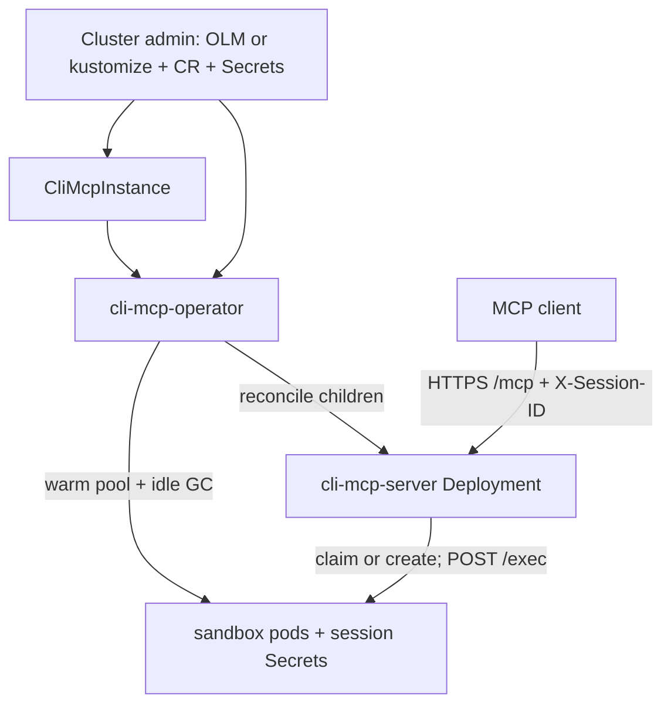
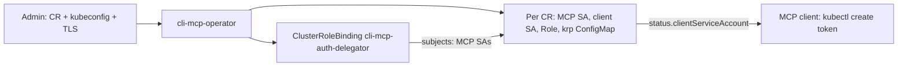

# ADR-0001: CLI MCP Operator

**Status:** Implemented

**Date:** 2026-10-08

**Related:** [Architecture](../architecture.md) · [Credential-isolating proxy](0002-credential-proxy.md)

This record is the instance infrastructure: a Kubernetes operator that owns one MCP instance per custom resource. Credential isolation (dummy kubeconfig, MITM proxy, sandbox egress lock) is [ADR-0002](0002-credential-proxy.md). The same custom resource and reconciler own both.

This is an open-source Kubernetes operator. Any cluster can install it. A first-party GitOps consumer is one catalog subscriber, not part of the API.

## Overview

CLI MCP is a stateless, multi-replica MCP server that creates per-session sandbox pods and proxies `bash` to them. Session pods and HMAC auth Secrets are created on the request path. Everything around that data plane — the MCP Deployment, Service, kube-rbac-proxy sidecar, NetworkPolicies, ServiceAccounts, warm pool, and idle garbage collection — has to be derived from live Secrets and from the custom resource. A static YAML pile cannot do that, and an ensure-loop inside the MCP process would put infrastructure reconciliation on every replica.

The decision is a leader-elected operator. The MCP server stays the data plane: it claims or creates a sandbox on `bash` and deletes it on `DELETE /sessions/{id}`. It does not watch the custom resource, replenish the pool, or run idle garbage collection.

An MCP client calls `/mcp` with `X-Session-ID` and `DELETE /sessions/{id}`. That path is unchanged.

```
Cluster admin                         Cluster
─────────────                         ───────
OLM catalog / kustomize  ───────────► cli-mcp-operator (leader-elected)
CliMcpInstance CR        ───────────► reconciler
admin Secrets (not children):           ├── HMAC Secret (generate-once)
  cli-mcp-<name>-kubeconfig             ├── MCP Deployment (kube-rbac-proxy + server)
  cli-mcp-<name>-tls (non-OpenShift)    ├── Service (ClusterIP)
                                        ├── MCP SA + Role/RoleBinding (pods; secret create/delete)
                                        ├── client SA + Role/RoleBinding (climcpinstances/mcp)
                                        ├── ConfigMap cli-mcp-<name>-krp (kube-rbac-proxy config)
                                        ├── sandbox SA (no RoleBindings, automount false)
                                        └── NetworkPolicy (sandbox :8090 from this MCP)
ClusterRoleBinding (shared, not a      operator also: ClusterRoleBinding
  per-CR child; no instance ownerRef):   cli-mcp-auth-delegator (subjects = MCP SAs)
                                              │
                                              ▼
                                        cli-mcp-server × N  (flags only; no CR watch)
                                              ├── always claim unassigned or create on demand
                                              └── session HMAC Secrets
                                        operator also: warm pool + idle GC
                                        proxy children: ADR-0002
```

## Design Principles

1. **The operator is the singleton; the MCP server is the data plane.** Leader-elected controller. MCP replicas stay stateless and horizontally scaled. Sessions are not custom resources.
2. **The MCP server does not reconcile infrastructure, the pool, or idle garbage collection.** No Deployment or NetworkPolicy ensure-loop in the server. The server claims or creates session pods on the `bash` path and deletes them on `DELETE /sessions/{id}`.
3. **The custom resource, labels, and ownership are the extension point for the proxy.** Instance identity, owner references, and an admin-provided investigation kubeconfig are what [ADR-0002](0002-credential-proxy.md) builds on. This record does not re-specify proxy children.
4. **The operator does not mint investigation tokens or MCP client tokens.** The kubeconfig Secret is provided (GitOps, External Secrets, or `kubectl`) under `cli-mcp-<name>-kubeconfig`, or under a kubernetes target’s optional `secretName` ([ADR-0002](0002-credential-proxy.md)). The operator does not mint that Secret or set an owner reference on it. HMAC is an internal MCP-to-agent secret: the operator generates it once and does not rotate it on reconcile. The client ServiceAccount is operator-owned; the admin mints a token against `status.clientServiceAccount`.
5. **The MCP server remains runnable without the operator.** Local stdio, unit tests, and a flag-driven server stay valid. That mode claims and creates on demand. It does not replenish a pool or idle-collect; run the operator for those, or delete sessions explicitly.
6. **Instance delete fails closed.** Removing the custom resource must not leave sandbox pods as unlabeled orphans.
7. **Portable Kubernetes, optional OpenShift.** The operator installs and reconciles on generic Kubernetes. OpenShift-only behavior (serving-certificate annotation, SCCs) is detected or left to the admin.
8. **One module, several images.** The repository is `cli-mcp-operator`. The operator, MCP server, sandbox agent, and credential proxy are separate images.

## Decisions

| # | Topic | Decision | Rationale |
|---|---|---|---|
| 1 | Where the operator lives | Rename this repository in place to `cli-mcp-operator`. One module, separate images: operator, MCP server, sandbox, and later the proxy. Types live in this module. | One review surface for the CRD, the data plane, and the proxy. Matches the shape of a multi-image operator already used in this org. A second repository would add remotes with nothing consuming the module yet. Keeping the name `cli-mcp-server` would describe only the data plane. Types do not go in the shared toolchain API: that API is a different product, and two operators do not share this CRD. |
| 2 | API group and Kind | `cli-mcp.redhat.com/v1alpha1`, Kind `CliMcpInstance`. Portable Kubernetes operator. OpenShift extras are optional. | The group matches the instance label domain and does not collide with toolchain or claw groups. The Kind names one instance, which is what a second sandbox class is. `redhat.com` stays until real external community use justifies a new domain. `tarsy.redhat.com` would couple the CRD to one internal consumer. |
| 3 | Install | OLM is the default install (bundle, catalog, continuous delivery). Kustomize remains the source of truth and a supported non-OLM install. Helm may wrap the same manifests later. | Same out-of-the-box story as the existing operator catalog pattern: channels and `relatedImages` for every image. Clusters without OLM still apply kustomize. Helm is not a second source of truth in v1. |
| 4 | OLM install modes | OwnNamespace and SingleNamespace. Children always live in the custom resource’s namespace. Watch scope is the OperatorGroup `targetNamespaces`, not a namespace baked into the binary. | Tight RBAC. The admin picks namespaces at install time. AllNamespaces widens RBAC. OwnNamespace alone drops the layout where the operator and the custom resource live in different namespaces. There is no operator-config singleton and no product namespace in the binary. |
| 5 | Who owns what | Admin owns install, the custom resource, the investigation kubeconfig, TLS off OpenShift, and the client token. The operator owns instance infrastructure, HMAC generate-once, the warm pool, idle garbage collection, teardown, and per-instance client identity. The MCP server owns claim, on-demand create, `/exec`, and explicit session delete. | Request-synchronous work stays on the multi-replica server, so an empty pool does not wait for the next reconcile. Desired count and the janitor stay on the leader, so replicas do not stampede the pool. A session CRD would add a hop and a second API. The operator does not mint cluster identities. |
| 6 | What belongs on the spec | Typed instance spec: `replicas` and `spec.sandbox` (image, idle, pool, resources, env, image pull policy). Optional `spec.serverContainer` for MCP container resources and pull policy. In-cluster transport, address, and namespace are not spec fields. | Reviewable and validated. A second instance can differ. Pool size and idle timeout are operator fields, so changing them does not roll the MCP server. An opaque args array would skip validation. A secret-ref-only spec would freeze pool and idle outside the instance API. The kubeconfig Secret uses a conventional name, the same convention as TLS. |
| 7 | Images | OLM `relatedImages` set `RELATED_IMAGE_SERVER`, `RELATED_IMAGE_SANDBOX`, and `RELATED_IMAGE_KUBE_RBAC_PROXY` on the operator (the proxy image is [ADR-0002](0002-credential-proxy.md)). The MCP container always uses `RELATED_IMAGE_SERVER`. Empty `spec.sandbox.image` means `RELATED_IMAGE_SANDBOX`; a set value is that class’s image. Status records `resolvedSandboxImage` only. | A catalog bump rolls every instance’s MCP server together. Two custom resources differ by sandbox class, not by MCP server version. A per-CR server image pin would survive upgrades and fight the operator. ImageStream triggers fight the operator the same way. Image tags are not baked into the CRD as defaults. |
| 8 | Instance identity | `metadata.name` is the instance id. Labels and annotations use `cli-mcp.redhat.com`. Children are named `cli-mcp-<name>`. CEL requires the name to be at most 44 characters so `cli-mcp-<name>-kubeconfig` fits in 63. | One id keeps NetworkPolicies, pool, claim, and idle collection from mixing two custom resources in one namespace. Nothing was in production, so `tarsy.redhat.com` keys are replaced in place with no migration. Encoding the instance only inside a component label overloads one key. Random child names are worse for operators; owner references already collect them. |
| 9 | How the MCP process learns the spec | The operator renders Deployment args, env, and mounts. Kubernetes rolls replicas. The MCP server does not get or watch `CliMcpInstance`. `warmPoolSize` and `idleTimeout` are consumed by the operator and are not passed as in-cluster flags. Claim is always attempted; it is not gated on pool size. | One control loop. The MCP ServiceAccount needs no permission to read the custom resource. Gating claim on pool size would roll the MCP server whenever the pool moved between 0 and N. A second reconciler inside the data plane was rejected. |
| 10 | Custom resource delete | Finalizer `cli-mcp.redhat.com/finalizer`. On delete, do not re-ensure MCP replicas. Scale the MCP Deployment to 0, wait until this instance’s server pods are gone, delete instance-labeled sandbox pods and session Secrets, wait until they are gone, then remove the finalizer. Operator-created namespaced children have an owner reference to the custom resource and are garbage-collected after the finalizer drops. | Background owner-reference collection alone can drop the name while session pods are still terminating, so a same-name recreate overlaps. Quiescing the MCP server first stops it from creating a session during that wait. Rolling the MCP Deployment must not destroy sessions, so session pods are not owned by the Deployment. The shared auth-delegator binding has no per-instance owner reference; the finalizer still patches its subject list, including when this instance is the last one. |
| 11 | NetworkPolicy in the operator | The operator creates the sandbox ingress policy only: TCP `:8090` from this instance’s `component=server` pods. kube-rbac-proxy is the MCP front door. There is no MCP ingress NetworkPolicy and no client-pod label. Sandbox egress lock is [ADR-0002](0002-credential-proxy.md). | Callers often cannot set a pod label, and kube-rbac-proxy already authenticates `/mcp`. The sandbox selector is a label, not an identity; `/assign` stays unauthenticated once. The OperatorGroup target namespace is the trust boundary, the same boundary as Secrets. An egress allowlist to kube API IPs would be a stopgap that ADR-0002 removes. |
| 12 | Sandbox pod identity | Dedicated ServiceAccount `cli-mcp-<name>-sandbox`, no RoleBindings, `automountServiceAccountToken: false`. | OpenShift still needs a ServiceAccount. The account is not the investigation subject: an accidental automount must not project a useful host token. Reusing an investigation ServiceAccount would carry that footgun. [ADR-0002](0002-credential-proxy.md) keeps this identity and replaces the real kubeconfig mount with a dummy kubeconfig. |
| 13 | MCP client authentication | kube-rbac-proxy is part of the MCP Deployment. The operator owns a per-instance client ServiceAccount and Role on the fake subresource `climcpinstances/mcp`, a per-instance kube-rbac-proxy ConfigMap, `status.clientServiceAccount`, and one shared ClusterRoleBinding `cli-mcp-auth-delegator`. The admin mints the client token. | Auth-delegator is sidecar machinery: kube-rbac-proxy cannot review tokens without it, and there is no admin-chosen value. A ClusterRole on the non-resource URL `/mcp` is cluster-wide, so one client token would pass every instance. A fake subresource with `resourceNames` set to the custom resource name scopes the grant and does not allow deleting the custom resource. The operator’s permission is `bind` on `system:auth-delegator`, unscoped create of ClusterRoleBindings (a create has no name at authorize time), and get/update/patch of the one named binding. Listing or watching every ClusterRoleBinding would grow a cluster-wide informer in OwnNamespace and SingleNamespace. |
| 14 | `spec.proxy` on the first CRD | Omit the field until the proxy decisions exist. | An empty `spec.proxy.enabled` stub would freeze injector shape before those decisions. Additive `v1alpha1` fields are normal. [ADR-0002](0002-credential-proxy.md) adds the real `spec.proxy.targets` field. There is no proxy-less instance after that record. |
| 15 | `status.Ready` | Ready requires the required Secrets and keys, every operator-managed child, the auth-delegator subject, and an Available MCP Deployment. If `warmPoolSize > 0`, the first Ready, a pool-size increase, and an unassigned overlay rebuild wait until the unassigned Ready count meets the desired count. After that, a claim does not clear Ready unless a pool pod is Failed or in backoff, or the shortfall lasts past a 5-minute replenish deadline. | A stuck pool must not look Ready. A claim is success, not an outage, so Ready must not flicker on every replenish. Tracking the unassigned count every second would make a claim look like an outage. Assigned sessions are not part of Ready. [ADR-0002](0002-credential-proxy.md) folds proxy children and token-only kubeconfig parsing into this same condition. |
| 16 | More than the shipped sandbox | One custom resource is one sandbox class. `spec.sandbox.image` plus `env`, `resources`, and `imagePullPolicy` are the class. Empty image means the shipped sandbox. A custom image must speak the agent contract (`/health`, `/exec`, `/assign`, HMAC) and include `curl` for the exec readiness probe. | A second custom resource (`curl`, `aws`, a user’s image) is another class in the same namespace, not a new Kind. A closed type enum would make every class an operator release. A full pod template would fight HMAC, labels, the ServiceAccount, and the two pod writers. The operator owns the base pod; the user merges the class overlay. |

## Architecture

### Install and ownership

OLM is the default install. Kustomize remains a supported path. CSV install modes are OwnNamespace and SingleNamespace.

The admin applies:

- the operator (catalog subscription, or kustomize)
- a `CliMcpInstance`
- investigation kubeconfig Secret `cli-mcp-<name>-kubeconfig` (key `kubeconfig`), unless a kubernetes target sets `secretName` ([ADR-0002](0002-credential-proxy.md))
- TLS Secret `cli-mcp-<name>-tls` on generic Kubernetes (OpenShift serving-cert annotation fills it)
- OpenShift SCC or namespace PSA as needed (sandbox is non-root, all capabilities dropped)
- if the namespace is default-deny ingress, a rule allowing clients to the MCP Service on `:8443` (the operator does not create an MCP ingress NetworkPolicy)

After Ready, mint a client token from `status.clientServiceAccount` (`kubectl create token` or `oc create token`).



**Two pod writers.** The MCP server claims, creates on demand, patches last-activity, and deletes a session on `DELETE /sessions/{id}`. The operator creates and surplus-deletes unassigned pool pods, idle-collects assigned sessions, and runs the finalizer. They coordinate only through labels. Claim is a resourceVersion label patch; the first writer wins.

After a successful claim the MCP server does not signal replenishment. The operator watches instance sandbox pods and enqueues on create, delete, and `session-id` appearing. It does not enqueue on last-activity-only annotation patches or routine kubelet status. Ready, Failed, and backoff updates enqueue when pool readiness cares. The operator does not server-side-apply or delete a pod that has `session-id`, except idle collection and the finalizer. Before deleting an unassigned surplus or hash-rebuild pod, it re-gets the pod and skips it if `session-id` appeared. An overlay or image change recreates unassigned pods only; assigned sessions keep the old spec until delete, idle collection, or custom-resource delete. Terminating unassigned pods occupy pool slots. Claim skips terminating and Failed or backoff unassigned pods. After a successful claim, re-list assigned pods for that session id and keep the oldest (delete extras, keep the auth Secret) so two MCP replicas cannot each bind a pool pod to the same session. The claim patch refreshes `last-activity` so pool age is not treated as session idle.

**Idle timer.** Each reconcile lists assigned pods, deletes those past `idleTimeout` (`last-activity`, else `created-at`), and requeues until the soonest remaining expiry. A quiet session still collects when that delay fires. Create and claim must enqueue; if those events are filtered along with last-activity, a session can sit with no idle timer. Pool pods stamp `last-activity` at create; claim must refresh it.

**Managed resync.** Requeue is the soonest of idle collection and any remaining pool replenish deadline. If both are zero, the operator still requeues after 5 minutes (an operator constant, not a spec field) so a deleted `cli-mcp-auth-delegator` binding is recreated. The operator gets that binding by name. It does not watch ClusterRoleBindings.

### Children

Namespaced children of a custom resource `metadata.name=oc` use the prefix `cli-mcp-<name>`:

| Child | Role |
|---|---|
| Deployment `cli-mcp-oc` | kube-rbac-proxy `:8443` to the MCP server on `127.0.0.1:8080`. The sidecar mounts ConfigMap `cli-mcp-oc-krp`. |
| Service `cli-mcp-oc` | ClusterIP `:8443`. OpenShift serving-cert annotation when the cluster is OpenShift. |
| ServiceAccount `cli-mcp-oc` | MCP pod identity for session objects and for the kube-rbac-proxy sidecar. There is no dedicated proxy ServiceAccount. |
| Role + RoleBinding `cli-mcp-oc` | Pods create/get/list/watch/update/patch/delete. Secrets create/delete only. No secret get/list/watch. |
| ConfigMap `cli-mcp-oc-krp` | kube-rbac-proxy ResourceAttributes for this custom resource. Its resourceVersion is stamped on the pod template so an edit rolls the sidecar. |
| ServiceAccount `cli-mcp-oc-client` | MCP HTTP client identity. The token is not operator-minted. Name published on `status.clientServiceAccount`. |
| Role + RoleBinding `cli-mcp-oc-client` | `climcpinstances/mcp` with `resourceNames: [oc]`, verbs `get`, `create`, `delete`. |
| ServiceAccount `cli-mcp-oc-sandbox` | Sandbox pods. No RoleBindings. |
| Secret `cli-mcp-oc-hmac` | MCP-to-agent HMAC key (data key `key`). Generate once. Owner reference to the custom resource. Never overwrite if present. |
| NetworkPolicy sandbox ingress | `:8090` from pods labeled this instance and `component=server`. Egress is [ADR-0002](0002-credential-proxy.md). |

The client objects are `cli-mcp-<name>-client`. They do not reuse the MCP Role, RoleBinding, or ServiceAccount. There is no Ingress or Route child and no extra custom resource. The built-in ClusterRole `system:auth-delegator` already exists; the operator does not create or modify it.

Session pods and per-session auth Secrets are not children. The MCP server creates and claims them. The operator keeps the unassigned count equal to `warmPoolSize`: create on deficit, delete surplus immediately (oldest first; re-get and skip a pod that just gained `session-id`). It recreates unassigned pods when the desired sandbox spec changes, not on a timer. It does not age-drain unassigned pods.

The operator does not create the CRD, the operator Deployment, the investigation kubeconfig Secret, the TLS Secret on non-OpenShift, OpenShift SCCs, or extra Secrets referenced from `spec.sandbox.env`. It does own ClusterRoleBinding `cli-mcp-auth-delegator` and the per-instance client ServiceAccount and Role.

All operator-owned namespaced objects get an owner reference to the custom resource and instance labels. Pool pods the operator creates get an owner reference. MCP on-demand session pods do not. The auth-delegator binding does not get an instance owner reference. The admin kubeconfig and TLS Secrets do not get an owner reference.

### MCP client authentication



The auth-delegator binding is shared, one per install, and is not a per-instance child:

```yaml
apiVersion: rbac.authorization.k8s.io/v1
kind: ClusterRoleBinding
metadata:
  name: cli-mcp-auth-delegator
roleRef:
  apiGroup: rbac.authorization.k8s.io
  kind: ClusterRole
  name: system:auth-delegator
subjects:
  - kind: ServiceAccount
    name: cli-mcp-oc
    namespace: cli-mcp
  # one subject per live CliMcpInstance MCP SA (deletionTimestamp == nil)
```

Subjects are the MCP ServiceAccounts of watched instances whose `deletionTimestamp` is unset. The list is replaced, not merged, sorted by namespace then name. A resourceVersion conflict requeues. The operator gets the binding by name from instance reconcile. It does not list or watch ClusterRoleBindings. There is no owner reference to a custom resource: deleting one instance must not collect the binding. The operator creates the binding if it is missing. `roleRef` is immutable: a foreign object with a different `roleRef` leaves Ready as `ChildrenNotReady`. Empty subjects when no instance is live; the binding is not deleted. A deleting instance drops out of the desired subjects as soon as `deletionTimestamp` is set, and its finalizer still patches the binding. One operator install per cluster. Subjects are the source of truth; instance labels on this binding are not a selector contract.

The operator ClusterRole allows `bind` on `system:auth-delegator`, unscoped `create` of ClusterRoleBindings, and get/update/patch of `cli-mcp-auth-delegator` only. It does not list, watch, or delete ClusterRoleBindings. Install does not precreate the binding. These rules are separate from the TokenReview and SubjectAccessReview already granted so the operator’s own metrics sidecar can run.

kube-rbac-proxy uses ResourceAttributes, not a non-resource URL on `/mcp`. ConfigMap shape for custom resource `oc` in namespace `cli-mcp`:

```yaml
authorization:
  resourceAttributes:
    apiGroup: cli-mcp.redhat.com
    apiVersion: v1alpha1
    resource: climcpinstances
    subresource: mcp
    namespace: cli-mcp
    name: oc
```

`mcp` is a fake subresource. Granting it does not allow deleting the custom resource. `--allow-paths` still covers `/mcp`, `/metrics`, `/live`, `/health`, `/sessions`, and `/sessions/*`. Those paths share the same ResourceAttributes (HTTP GET to `get`, POST to `create`, DELETE to `delete`). Path allowlisting stays so other URLs are not forwarded. Sidecar probes are TCP. MCP `/live` and `/health` probes are loopback and do not need the client Role. `/metrics` uses the same authorization; a Prometheus ServiceAccount is a later extra RoleBinding, not part of this record. The ConfigMap resourceVersion is stamped on the MCP pod template so an edit rolls the sidecar. Image: `RELATED_IMAGE_KUBE_RBAC_PROXY`.

Client Role:

```yaml
rules:
  - apiGroups: ["cli-mcp.redhat.com"]
    resources: ["climcpinstances/mcp"]
    resourceNames: ["oc"]
    verbs: ["get", "create", "delete"]
```

The client Role does not grant `climcpinstances` without the subresource, and it does not grant `create` or `delete` on Services. The MCP ServiceAccount Role (pods, plus secret create/delete) stays separate.

`status.clientServiceAccount` is always published. The CRD description is:

> Name of the operator-managed ServiceAccount that is allowed to call this instance through kube-rbac-proxy. Mint a token with `kubectl create token <name> -n <namespace>` (or `oc create token`). The operator does not mint or store that token.

There is no bearer token on status and no operator-created service-account token Secret.

HMAC is a file mount. The investigation kubeconfig is a volume on the proxy ([ADR-0002](0002-credential-proxy.md)), not a Secret the MCP server reads. The MCP server must not get, list, or watch Secrets. Session Secret create/delete is namespace-wide; RBAC cannot prefix-limit the session Secret names. The operator’s namespaced Role can get, list, watch, create, update, patch, and delete Secrets in the target namespace (HMAC, Ready keys, idle collection, finalizer). That ServiceAccount is the OperatorGroup target-namespace secret trust boundary. The cluster role is custom resources plus the auth-delegator binding.

TLS for kube-rbac-proxy mounts Secret `cli-mcp-<name>-tls`. On OpenShift the operator sets the Service serving-cert annotation and the platform creates the Secret. On generic Kubernetes the admin creates it. The operator does not generate certificates and does not set an owner reference on this Secret.

### How the MCP process is configured

The operator renders Deployment args and env from the custom resource. The MCP binary does not watch the custom resource. Spec changes that affect the process roll the Deployment. Pool and idle fields do not.

| Input | Source |
|---|---|
| HTTP, stateless, loopback `:8080` | Fixed for in-cluster |
| Namespace | Custom resource namespace |
| Sandbox image | `spec.sandbox.image` or `RELATED_IMAGE_SANDBOX` |
| HMAC key file | Mount of Secret `cli-mcp-<name>-hmac` (data key `key`) |
| Idle timeout, warm pool size | Operator-only. Not passed in-cluster, so they cannot start a second janitor or pool inside the MCP server. |
| Instance name | Custom resource `metadata.name`. Required. |
| Kubeconfig Secret name | In-cluster with the proxy: not passed. The real Secret is not a sandbox mount ([ADR-0002](0002-credential-proxy.md)). Local/dev without proxy flags may still mount it. |
| Sandbox ServiceAccount | `cli-mcp-<name>-sandbox`. Required. |
| Sandbox CPU and memory | `spec.sandbox.resources`. Empty means `100m` / `500m` / `128Mi` / `512Mi`. |
| Image pull policy and env | `spec.sandbox`. Env is a list of env vars, including `valueFrom`. |

The MCP process kubeconfig flag is the process’s own client config (empty means in-cluster). It is not the investigation Secret.

In-cluster, the MCP server always lists and claims instance-labeled unassigned pods, then creates on demand if none are free. `warmPoolSize: 0` means the list is empty and create runs.

Local/dev stays flag-only. There is no default namespace. After the operator exists, a flag-driven server still claims and creates on demand and does not replenish a pool or idle-collect.

The MCP image always comes from `RELATED_IMAGE_SERVER`. Empty `spec.sandbox.image` selects the shipped sandbox class. Status records `resolvedSandboxImage` only.

Operator pool pods and MCP on-demand pods share one pod builder: operator-owned base (ServiceAccount, automount false, instance and component labels, probes, non-root security context) plus the class overlay (image, resources, env, image pull policy). The session token env is assigned or on-demand only. Unassigned pool pods receive the token through `POST /assign`. The shared builder does not import the CRD. The MCP server does not import the controller. Empty `spec.sandbox.resources` uses the default requests and limits above, not BestEffort. The pool recreate hash includes the overlay, not only the image tag. A custom resource `securityContext` or extra volume field is later; the builder still ships the current non-root, drop-all-capabilities context.

User env entries for `KUBECONFIG`, `HOME`, and `SANDBOX_AUTH_TOKEN` are ignored. [ADR-0002](0002-credential-proxy.md) also reserves the proxy env names (`HTTP_PROXY`, `HTTPS_PROXY`, `NO_PROXY`, and their lowercase forms, plus `SSL_CERT_FILE` and `REQUESTS_CA_BUNDLE`).

**HMAC Secret.** The operator creates `cli-mcp-<name>-hmac` if it is missing (random bytes, key `key`), sets an owner reference, and mounts it into every MCP replica. It does not overwrite an existing Secret and does not rotate on reconcile: rotation would invalidate live session tokens. If the Secret is deleted, the operator recreates it and rolls the MCP Deployment by stamping the Secret’s resourceVersion on the pod template. If `key` is missing or empty, Ready is `SecretKeysInvalid`. There is no `spec.hmacKeySecretRef`.

### Instance identity

A single install may run one custom resource. The API is already multi-class: a second custom resource in the same namespace is another sandbox class.

- `cli-mcp.redhat.com/instance=<name>` on MCP pods, sandbox pods, session Secrets, and proxy pods.
- `cli-mcp.redhat.com/component` is `sandbox`, `server`, or `proxy`.
- `cli-mcp.redhat.com/session-id` on assigned sandbox pods and their auth Secrets.
- Annotations `cli-mcp.redhat.com/created-at` and `cli-mcp.redhat.com/last-activity` (RFC3339). The MCP server patches last-activity on `bash` and on claim. Idle collection reads the annotations. The pod watch does not enqueue on those patches. Unassigned pool pods have `created-at` and no session id.
- Children are named `cli-mcp-<name>` (sandbox ServiceAccount, client ServiceAccount, kube-rbac-proxy ConfigMap, kubeconfig Secret). The longest child is `cli-mcp-<name>-kubeconfig`, so the name is at most 44 characters.

Pool, claim, and garbage-collection selectors are component plus instance, plus the absence of `session-id` for unassigned pods.

### Custom resource delete

Deleting the custom resource destroys the instance. Rolling the MCP Deployment does not.

While the finalizer is set, the reconciler does not re-ensure MCP replicas. It scales the MCP Deployment to 0, waits until this instance’s `component=server` pods are gone, deletes instance-labeled sandbox pods and session Secrets, waits until they are gone, then removes the finalizer. The name stays taken until then. Operator-created namespaced children (MCP Deployment, Service, NetworkPolicies, ServiceAccounts including the client, Roles and RoleBindings including the client, HMAC Secret, kube-rbac-proxy ConfigMap, pool pods, and the proxy children from [ADR-0002](0002-credential-proxy.md)) have an owner reference and are collected after the finalizer drops. The finalizer does not wait for them. Desired auth-delegator subjects exclude instances with `deletionTimestamp`; the deleting instance’s finalizer still patches that binding and does not delete it. The admin kubeconfig and TLS Secrets are not deleted.

### CR API

One custom resource is one sandbox class plus one MCP Deployment. `spec.replicas` defaults to 1 and has a minimum of 1. `spec.sandbox.idleTimeout` defaults to 30 minutes. `spec.sandbox.warmPoolSize` defaults to 0. Optional `spec.serverContainer` sets MCP container resources and image pull policy only. There is no HMAC secret ref, no client ServiceAccount spec field, no `spec.args`, no `spec.sandbox.type`, no pod template, and no `spec.serverImage`.

`spec.proxy.targets` is required. Its shape is [ADR-0002](0002-credential-proxy.md). Omitting `spec.proxy` is invalid.

Operator-owned on every sandbox pod: dedicated ServiceAccount, `automountServiceAccountToken: false`, instance and component labels, probes, agent port, and the non-root drop-capabilities security context. The kubeconfig volume is the dummy ConfigMap when a kubernetes target exists ([ADR-0002](0002-credential-proxy.md)). The session token env is set only when the pod is assigned.

User-mergeable fields on `spec.sandbox`: `image`, `resources`, `env` (including `valueFrom`), `imagePullPolicy`. Empty image means `RELATED_IMAGE_SANDBOX`. Empty resources mean the default requests and limits. Extra Secrets in `valueFrom` are admin-owned and are not Ready gates.

```yaml
apiVersion: cli-mcp.redhat.com/v1alpha1
kind: CliMcpInstance
metadata:
  name: oc                    # instance / class id; another CR is another class
  namespace: cli-mcp
spec:
  replicas: 2                 # default 1; minimum 1
  sandbox:
    # image omitted → RELATED_IMAGE_SANDBOX
    idleTimeout: 30m
    warmPoolSize: 0
    # resources omitted → 100m / 500m / 128Mi / 512Mi
    # env:
    #   - name: AWS_REGION
    #     value: us-east-1
  proxy:                      # required; see ADR-0002
    targets:
      - type: kubernetes
status:
  warmPoolReady: 0
  warmPoolDesired: 0
  resolvedSandboxImage: ""
  clientServiceAccount: cli-mcp-oc-client
  conditions:
    - type: Ready
    - type: WarmPoolReady     # optional; strict unassigned Ready count
```

### Ready

`Ready` requires all of the following.

1. **Required Secrets exist with non-empty keys.** HMAC Secret data `key`. On generic Kubernetes, TLS Secret data `tls.crt` and `tls.key`. Missing object is `SecretsNotFound`. Missing or empty required key is `SecretKeysInvalid`. Generate-once does not fill an existing Secret that has an empty key. Extra Secrets referenced only from `spec.sandbox.env` are not this check. When a kubernetes target exists, [ADR-0002](0002-credential-proxy.md) also parses the effective kubeconfig (`KubeconfigInvalid` on failure). An allowlist-only instance does not require the kubeconfig Secret.
2. **Every operator-managed namespaced child matches spec,** including the client ServiceAccount, Role, and RoleBinding, and the kube-rbac-proxy ConfigMap mounted with its resourceVersion stamped on the pod template. ClusterRoleBinding `cli-mcp-auth-delegator` exists with `roleRef` `system:auth-delegator` and includes this instance’s MCP ServiceAccount while the instance is not deleting. Apply failure or a foreign `roleRef` is `ChildrenNotReady`. `status.clientServiceAccount` is always published. No client token Secret is a Ready gate. Proxy children from [ADR-0002](0002-credential-proxy.md) fold into this same list.
3. **The MCP Deployment is Available,** including the kube-rbac-proxy sidecar.
4. **Warm pool, if `warmPoolSize > 0`.** The first Ready, a pool-size increase, and an unassigned overlay rebuild wait until `warmPoolReady` meets `warmPoolDesired`. After that, a claim does not clear Ready unless a pool pod is Failed, ImagePullBackOff, or CrashLoopBackOff, or the shortfall lasts past 5 minutes. Decreasing `warmPoolSize` does not wait. `warmPoolReady` and `warmPoolDesired` are always published. Optional condition `WarmPoolReady` is the strict count and may flap; aggregate `Ready` does not flap on claim. `warmPoolSize: 0` skips this clause. Pool pods are not created until the proxy gate in [ADR-0002](0002-credential-proxy.md) passes.

### Module boundaries

Types live in this module. The data-plane binaries do not import the controller. The shared sandbox pod spec does not import the CRD; the operator maps the spec onto that config in process, and the MCP server receives the same overlay as Deployment flags. Instance children are built by the reconciler. The kustomize tree installs the operator, not the per-instance children. The operator manager binary stays `manager` so the install manifest stays on the usual operator rails. OpenShift is not required to run the operator.

## Future considerations

- Extra client subjects (a foreign ServiceAccount in another namespace) are a later additive spec or RoleBinding.
- Later additive sandbox fields, not stubbed on the CRD now: extra volumes and mounts, `imagePullSecrets`, args, `securityContext` override, agent port.
- Helm chart wrapping the same manifests.
- A validating admission policy that limits MCP secret delete to session auth Secrets.
- Prometheus scrape as an extra subject, not the default client Role.
- First-party catalog consume (investigation identity, dropping a parallel `/mcp` ClusterRole) is a catalog-consumer change. It is not this API. Production client wiring follows [ADR-0002](0002-credential-proxy.md).

## Out of scope

- Session custom resources, MCP leader election, and command allowlists.
- Putting these types in the shared toolchain API, or dispatching the CRD from a sibling repository.
- Operator-generated TLS certificates, operator-minted investigation tokens, and operator-minted MCP client tokens.
- An `/mcp` ClusterRole on non-resource URLs. Unrestricted verbs on every ClusterRoleBinding. A per-instance auth-delegator binding. A dedicated kube-rbac-proxy ServiceAccount.
- A closed `spec.sandbox.type` enum, extra default sandbox image env keys per class, `spec.serverImage`, and `spec.investigationKubeconfigSecretRef`.
- Gating MCP claim on warm pool size.
- Enqueueing the instance reconciler on every last-activity patch.
- HMAC or mutual TLS on `/assign`.
- MCP Secret get/list/watch.
