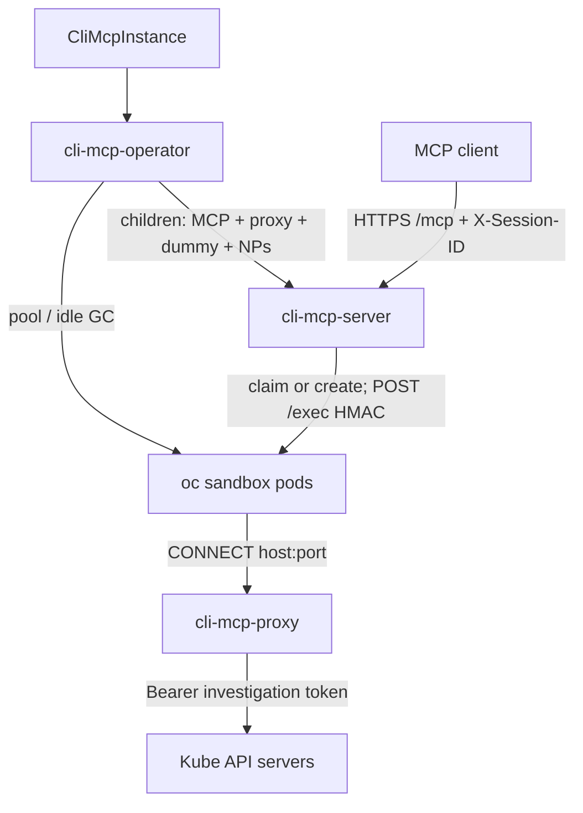

# ADR-0002: CLI MCP — credential-isolating proxy

**Status:** Implemented

**Date:** 2026-10-08

**Related:** [Architecture](../architecture.md) · [CLI MCP Operator](0001-cli-mcp-operator.md)

This record is the proxy pass on the operator in [ADR-0001](0001-cli-mcp-operator.md): a MITM forward proxy, a dummy kubeconfig, and NetworkPolicies so a bash sandbox cannot replay a stolen token. The operator owns the objects. The MCP server stays the stateless `bash` and session data plane and does not reconcile the proxy.

This is proxy design for an open-source Kubernetes operator. A first-party deploy is one catalog consumer, not part of the API.

v1 gives an MCP client a per-session `oc` / `kubectl` bash sandbox whose effective cluster identity is the investigation identity in the admin kubeconfig, even if the model passes `--token`, `--server`, `--kubeconfig`, or a token copied from another tool.

## Overview

The operator and MCP server from [ADR-0001](0001-cli-mcp-operator.md) create per-session sandbox pods and proxy `bash` over HMAC-authenticated `/exec`. Before this record, the investigation kubeconfig was mounted into every sandbox, the sandbox image includes `oc`, `kubectl`, and `curl`, there is no command allowlist, and sandbox egress was unrestricted. That is a token-replay path:

1. Another tool, or anything the sandbox can read, can yield a projected ServiceAccount token or a kubeconfig-like file. The model can feed that into the same bash session.
2. Redacting tool output sent back to the model does not stop a same-sandbox pipeline (`cat … | oc --token …`) where the token never returns to the client.
3. `oc --token <stolen>` or `curl` with an `Authorization` header talks to the API as that identity. Read-only RBAC on the mounted kubeconfig is bypassed.

A NetworkPolicy and a dummy kubeconfig are not enough on their own. `unset HTTPS_PROXY` and `--server` must fail at the network, and any `Authorization` that does reach the API must be stripped and replaced with the investigation token.

This pass adds a fourth image, `cli-mcp-proxy`: a MITM forward proxy inspired by the claw-operator proxy, with its own code, image, and lifecycle. The operator creates one proxy Deployment per `CliMcpInstance`. Sandboxes can reach only that proxy. Kubernetes targets put a dummy kubeconfig on the sandbox and the real kubeconfig Secret on the proxy. Allowlist targets are MITM plus strip, with no inject and no kubeconfig Secret.

**v1 scope:** one proxy per `CliMcpInstance`. The sample `oc` instance uses `type: kubernetes`. `type: allowlist` is implemented for any cluster (domain allowlist, no inject). A first-party install does not have to use it. Proxies are not shared across custom resources.

## Design Principles

1. **The sandbox remains the security boundary.** There is no bash command allowlist. Capability is the image, investigation RBAC, proxy L7, and NetworkPolicy.
2. **The sandbox never holds a useful cluster credential.** Dummy kubeconfig token, `automountServiceAccountToken: false`, and a sandbox ServiceAccount with no RoleBindings.
3. **Strip, then inject.** Client `Authorization` and impersonation headers are discarded. The proxy injects the configured credential for that host. A stolen token in the sandbox cannot be replayed through the proxy.
4. **NetworkPolicy makes the proxy mandatory.** The dummy kubeconfig is convenience. Egress-to-proxy-only is the control. Direct API access, `--server`, and `unset HTTPS_PROXY` fail closed.
5. **One proxy per instance, shared by every session of that class.** A sidecar shares a network namespace and can be bypassed. A per-session proxy adds nothing when every session uses the same identity.
6. **Do not share a proxy across custom resources.** A union allowlist would let the `oc` sandbox connect to whatever another instance may reach. Mixing `kubernetes` and `allowlist` on one custom resource is that class’s union and is allowed. The first-party `oc` sample ships kubernetes only.
7. **Own the proxy.** Do not consume the claw-operator proxy image or vendor its package. Claw is an example. This proxy implements only the behavior this record locks.
8. **No namespace EgressFirewall to kube API addresses once the proxy is in place.** That firewall was a no-proxy stopgap and would reopen direct API access from sandbox pods.
9. **The MCP server stays a dumb shell proxy.** It does not parse bash. Credential isolation is a network and identity feature, not a command filter.
10. **Fail closed.** If the proxy, the dummy kubeconfig (when a kubernetes target exists), or sandbox egress is not ready, neither the operator (pool) nor the MCP server (on-demand create) creates a sandbox that could egress more freely.
11. **The operator owns instance infrastructure.** The MCP server does not watch the custom resource. The operator renders flags onto the MCP Deployment, including the dummy ConfigMap name and the proxy Service DNS name.
12. **`spec.proxy.targets` is the proxy API.** It is not a sandbox type enum and not a top-level credentials list. The proxy image is `RELATED_IMAGE_PROXY`. Proxy replicas are 1, with `maxUnavailable: 0` and `maxSurge: 1`. A kubernetes target may set `secretName`; the default is the conventional kubeconfig Secret name.
13. **Reuse operator patterns from [ADR-0001](0001-cli-mcp-operator.md).** The CA Secret is generate-once: never overwrite a present Secret; empty keys are `SecretKeysInvalid`. Investigation kubeconfig, routes ConfigMap, and CA rotation stamp those objects’ resourceVersions on the proxy pod template. The unassigned-sandbox overlay hash fingerprints dummy kubeconfig bytes, CA certificate bytes, and proxy env. It does not include the investigation Secret’s resourceVersion, so token rotation does not rebuild the pool. Assigned sandboxes are not deleted on spec change. `subPath` mounts mean a running pool pod does not pick up a rewritten dummy or CA until it is recreated.
14. **The operator does not mint investigation tokens or ClusterRoles.** The admin provides the kubeconfig Secret. Guidance for whoever binds that identity (the operator does not check it): `get`, `list`, and `watch` are appropriate, on whichever resources that user chooses. Do not grant verbs that let the agent leave the sandbox network: `pods/exec`, `pods/attach`, `pods/portforward`, a create that starts a container, impersonate, VM mutate, or `nodes/proxy`. If those verbs are granted anyway, the proxy still denies URL paths ending in `exec`, `attach`, `portforward`, and `proxy`.
15. **The MCP server remains runnable without the operator.** Local and dev runs that omit the proxy flags still mount the kubeconfig Secret and do not gate on NetworkPolicies. In-cluster, the operator always passes the proxy flags and never mounts the real Secret on sandboxes.
16. **Compatible custom-resource updates apply immediately.** Adding an allowlist host or a kubeconfig `server` must not drain sessions or take `/mcp` down. Narrowing may break `oc` in assigned pods; bash stays. The proxy drains on SIGTERM. Sandbox `oc` and `curl` are not wrapped in retries.

## Decisions

| # | Topic | Decision | Rationale |
|---|---|---|---|
| 1 | What the proxy may reach | `spec.proxy.targets[]` with types `kubernetes` and `allowlist`. A kubernetes target may set `secretName` (DNS-1123 label). Empty means `cli-mcp-<name>-kubeconfig`. The operator gets that Secret and does not mint it, create it, or set an owner reference. Targets are required (minimum 1). At most one kubernetes target. Many allowlist rows are allowed. | The sandbox image stays the class ([ADR-0001](0001-cli-mcp-operator.md) decision 16). Targets are proxy policy: which hosts this instance may connect to, and whether the proxy injects an identity. An allowlist-only instance needs no fake kubeconfig. Inferring “no proxy” from a missing Secret would hide a not-Ready instance. A top-level credentials list is the wrong name for allowlist rows and repeats a union-on-one-gateway model. There is no proxy-less instance: omitting `spec.proxy` is invalid, and there is no default of `[{type: kubernetes}]`. |
| 2 | Child names | Pack names. Deployment, Service, ServiceAccount, ConfigMap, and NetworkPolicy share `cli-mcp-<name>-proxy`. The CA Secret is `cli-mcp-<name>-proxy-ca`. Dummy kubeconfig and routes share the proxy ConfigMap. The existing sandbox NetworkPolicy `cli-mcp-<name>-sandbox` gains egress and keeps ingress `:8090`. The 44-character name cap is unchanged. | Longer suffixes (`-dummy-kubeconfig`, `-proxy-config`) do not fit at name length 44. One ConfigMap keeps dummy and routes from drifting. One sandbox NetworkPolicy gives the fail-closed check a single object to read. Opaque short suffixes were rejected because dummy and routes could drift. |
| 3 | Proxy ServiceAccount | Dedicated `cli-mcp-<name>-proxy`. No RoleBindings. `automountServiceAccountToken: false`. | The proxy mounts Secrets as volumes and does not need in-cluster API access. Reusing the sandbox account would let a future sandbox binding cover the proxy. Reusing the MCP account would make a proxy breakout equivalent to the MCP server. OpenShift still has a ServiceAccount for SCC. |
| 4 | Does Ready parse the kubeconfig? | When a kubernetes target exists, parse the effective Secret as token-only. Invalid kubeconfig is not Ready, reason `KubeconfigInvalid`. Allowlist-only instances skip this Secret. Proxy children fold into the same `Ready`. There is no separate `ProxyReady` condition. | Key-present without a parse leaves Ready while every `oc` is dead, and the proxy cannot build routes from garbage. A second condition cannot be watched by the MCP server ([ADR-0001](0001-cli-mcp-operator.md) decision 9). Missing object stays `SecretsNotFound`. Empty key stays `SecretKeysInvalid`. Dummy data, kubernetes routes, and the kubeconfig volume on the proxy are not written until parse succeeds. |
| 5 | Fail closed for both pod writers | The operator does not create or replenish unassigned pods until the routes ConfigMap exists (dummy key when a kubernetes target exists), the sandbox NetworkPolicy has egress, the proxy NetworkPolicy exists, and this proxy Service has a ready EndpointSlice address. The MCP server, using flags rather than a custom-resource watch, lists that Service’s EndpointSlices and reads the sandbox NetworkPolicy before on-demand create and before claim. Already-assigned sessions are not gated. Local runs without proxy flags do not gate. | Sandbox pods created before egress exists have unrestricted egress, which is the original bug. Withholding only the MCP Deployment is not enough: running replicas would still create open sandboxes. A namespace default-deny was already rejected. The MCP server must not watch the custom resource, so the gate is flags plus named reads. Another Service’s EndpointSlice must not open the gate. Slice names are generated, so the read is a list filtered by service name, not a named get. Core Endpoints are deprecated and cannot be name-scoped the same way. |
| 6 | Proxy authentication | NetworkPolicy only. No `Proxy-Authorization` on CONNECT. | The proxy ingress policy is what stops other pods from using `:8080`. A principal that can create pods in the instance namespace can mount the investigation kubeconfig and skip the proxy with unrestricted egress. Basic auth on CONNECT does not close that path, and the secret would be readable from sandbox bash. Label spoofing of `component=sandbox` is the same create-pod compromise. |
| 7 | Proxy egress | No proxy egress NetworkPolicy. The host allowlist is L7 route match on this instance’s targets. Sandbox egress (proxy plus cluster DNS) and proxy ingress stay. | NetworkPolicy matches IP and port, not DNS names. A wide `443`/`6443` block does not enforce hostnames and breaks an allowlist host on another port. Resolving hostnames at reconcile time and writing address blocks fails when that resolution differs from connect time (split horizon, load-balancer churn, a different DNS view). Unknown CONNECT is still 403. A compromised proxy can already read the mounted kubeconfig. |
| 8 | Raw IP CONNECT | Reject CONNECT unless the host matches a route `host:port`. An IP is allowed only when that kubeconfig `server` or allowlist domain is already an IP. Do not resolve names and add address records. No suffix match, no wildcard, and a bare host does not match every port. | With no proxy egress policy, an unmatched IP could still tunnel. Strip-then-inject does not help when the IP is not in the route map. Mapping resolved addresses onto the same token has the same drift problem as decision 7, and a shared load-balancer address may front more than the API. |
| 9 | Kube subresource denylist | On kubernetes injector routes only, deny URL path suffixes `exec`, `attach`, `portforward`, and `proxy`. Canonicalize the path and ignore the query. `logs`, `watch`, and `explain` stay allowed. Allowlist routes are not filtered. | Investigation RBAC should already deny these. Unconstrained bash can still attempt them. The denylist survives a RoleBinding mistake and does not break `curl` to an HTTP API whose path happens to contain `/exec`. Applying it to allowlist routes would. RBAC remains authoritative. |
| 10 | How much of the claw proxy to take | Implement only what this proxy needs: MITM on CONNECT and on plaintext HTTP proxy requests, a kubernetes injector, a `none` injector that still MITMs, strip-then-inject, exact `host:port`, the path denylist, upstream TLS verification, and SIGTERM shutdown. Do not vendor the claw proxy package. | Claw’s `none` injector opens a direct CONNECT tunnel and would skip strip. Suffix and wildcard match, gateway path allowlists, bearer, GCP, and oauth2 injectors are unused. A later class that must inject a static bearer is a new injector then. Owning the code avoids a release coupling and allows the differences this record locks (proxy ingress policy, no proxy egress policy, `subPath` mounts, dedicated ServiceAccount). |
| 11 | In-place updates and running sessions | Compatible updates apply immediately. Do not delete assigned sandbox pods on spec change. Do not wait for idle. Do not run a second proxy generation. The proxy Deployment is 1 replica with `maxUnavailable: 0` and `maxSurge: 1`, drains on SIGTERM, and uses a short pre-stop so ready addresses drop first. Dummy kubeconfig and CA on sandboxes are `subPath` mounts. | Sessions live in sandbox pods. The MCP Deployment rolling does not destroy them. The blast radius is the one shared proxy and live file mounts. A second generation needs extra DNS names, policies, and mixed CAs. Waiting for idle before an additive edit can stall for the whole idle timeout. Narrowing is visible to assigned `oc` immediately; bash keeps running. During surge, two proxy configs coexist for a few seconds. `subPath` means assigned sandboxes keep the files they started with. Sandbox retry wrappers were rejected: a 403 is not a blip, and clients do not share a retry policy. |

## Architecture

### Traffic flow

Sample `oc` (kubernetes only):

```yaml
apiVersion: cli-mcp.redhat.com/v1alpha1
kind: CliMcpInstance
metadata:
  name: oc
spec:
  replicas: 2
  sandbox: {}
  proxy:
    targets:
      - type: kubernetes
        # secretName omitted → Secret cli-mcp-oc-kubeconfig, key kubeconfig
```

Allowlist-only (no kubeconfig Secret, no dummy kubeconfig):

```yaml
spec:
  sandbox:
    image: quay.io/example/cli-mcp-sandbox-curl:1.2.3
  proxy:
    targets:
      - type: allowlist
        domains:
          - api.example.com
```

```
MCP client
  │  bash + X-Session-ID
  ▼
cli-mcp-server (instance=<CR name>)
  │  POST /exec (HMAC) to sandbox :8090
  ▼
oc sandbox pods
  dummy KUBECONFIG (real server URLs, placeholder token, proxy CA)
  HTTPS_PROXY=http://cli-mcp-<name>-proxy:8080
  automountServiceAccountToken: false
  │  CONNECT api.<cluster>:6443
  ▼
cli-mcp-proxy (MITM)
  real kubeconfig Secret (tokens)
  strip Authorization + Impersonate-*
  inject investigation Bearer for that hostname:port
  │
  ▼
kube API server(s)
```



An allowlist class is the same binary and a different custom resource, image, route ConfigMap, and NetworkPolicies. Those sandboxes get `HTTPS_PROXY` and the proxy CA, no dummy kubeconfig, and an injector of `none` (strip, no inject).

### Custom resource

```text
spec.proxy.targets[]          required, min 1
  type                        kubernetes | allowlist
  secretName                  optional; kubernetes only; DNS-1123 label; empty → cli-mcp-<name>-kubeconfig
  domains                     allowlist only; min 1; each is host or host:port (bare host → :443)
```

CEL, in addition to the existing name length of at most 44:

- At most one `type: kubernetes`.
- `kubernetes` must not set `domains`. `secretName` only on `kubernetes`.
- `allowlist` requires non-empty `domains` and must not set `secretName`.
- `domains` entries are literal hosts or `host:port`. No `*.example.com` and no leading-dot suffix. An invalid port is rejected.

There is no `spec.proxy.image`, `spec.proxy.replicas`, `spec.proxy.resources`, or secret key field. The key stays `kubeconfig`. The operator computes the effective Secret name and does not write that default back onto the stored spec. Mixing kubernetes and allowlist on one custom resource is that class’s union. The first-party `oc` sample is kubernetes only.

### Traffic rules

On CONNECT and on each MITM’d request:

| Step | Behavior |
|---|---|
| Host allowlist | Exact `host:port` on CONNECT and on plaintext HTTP proxy requests. The operator always writes `host:port` (kubeconfig `server` URL; allowlist bare host becomes `:443`). An IP matches only when that server or domain is already an IP. Unknown host is 403 and no tunnel. No leading-dot suffix, no wildcards, and a bare host does not match every port. IPv6 literals are a single `host:port` token. |
| MITM | Every v1 route is MITM’d, including allowlist `none`. Leaf certificates are signed by the proxy CA. A direct CONNECT tunnel would skip strip. |
| Strip | Before inject, drop `Authorization`, `X-Api-Key`, `Proxy-Authorization`, `Impersonate-User`, `Impersonate-Group`, `Impersonate-Uid`, and any `Impersonate-Extra-*`. Allowlist injects nothing after strip. |
| Inject | The kubernetes injector maps `host:port` to the token from the real kubeconfig, then denies path suffixes `exec`, `attach`, `portforward`, and `proxy` (canonical path, query ignored). `logs`, `watch`, and `explain` stay allowed. Allowlist uses injector `none` and has no path denylist. |
| Upstream TLS | When the kubeconfig has `certificate-authority-data`, the proxy trusts only that CA for that host and does not add public roots. When it is omitted, the proxy uses the system trust store and still checks the API hostname. Allowlist routes use the system trust store. Verification is never skipped. |

`oc --token`, `oc --kubeconfig` pointed at a leaked file, and `curl` with an `Authorization` header, when they still go through `HTTPS_PROXY`, authenticate as the investigation identity.

`curl` trusts the proxy CA through `SSL_CERT_FILE`, which replaces the process default bundle on purpose: sandbox TLS only goes through this MITM, so the file is the proxy CA only. The readiness probe is plain HTTP to loopback with loopback in `NO_PROXY`, so it does not need a CA and is not a reason to append the system bundle.

### NetworkPolicy

NetworkPolicy is required. Without it the model unsets `HTTPS_PROXY` and talks to the API with any token.

| Policy | Selects | Allows |
|---|---|---|
| Sandbox (existing object, egress added) | This instance’s sandbox pods | Ingress: TCP `:8090` from this instance’s MCP server pods. Egress: TCP `:8080` to this instance’s proxy pods, plus DNS. DNS is not `0.0.0.0/0`. UDP/TCP 53 and 5353 only to DNS pods. Each peer is a namespace selector and a pod selector together: `kube-system` (`kubernetes.io/metadata.name=kube-system`) with `k8s-app=kube-dns`, and on OpenShift `openshift-dns` with `dns.operator.openshift.io/daemonset-dns=default`. Plus address `169.254.20.10/32` on UDP/TCP 53 only (NodeLocal DNSCache). `curl` to an arbitrary address on port 53 is denied. |
| Proxy | This instance’s proxy pods | Ingress: TCP `:8080` only from this instance’s sandbox pods. No egress rules. `policyTypes` is ingress only. Adding egress would default-deny proxy egress. |

A sandbox policy whose types include egress makes those pods default-deny egress except the listed rules. A namespace-wide default-deny is not required.

Sandbox pods keep cluster DNS policy. Lookups of an attacker name through cluster DNS can still recurse; closing that would break kube API hostnames. Do not allow port 53 to `0.0.0.0/0`.

Selectors are instance-specific (`cli-mcp.redhat.com/instance` plus `component`), not `component=sandbox` alone. Two instances in one namespace must not reach each other’s proxies.

Proxy pods use `component=proxy` and the same instance label. That Deployment is the credential proxy, not the kube-rbac-proxy sidecar (`component=server`, port `:8443`).

The proxy Service is ClusterIP only: no Route, NodePort, or LoadBalancer.

Do not add an EgressFirewall that allows sandbox pods to kube API addresses.

The sandbox NetworkPolicy name stays `cli-mcp-<name>-sandbox`. The proxy NetworkPolicy name is `cli-mcp-<name>-proxy`. Ingress policy is the only control on who may use the proxy.

### Dummy kubeconfig

Token-only parse. Reject client certificates, exec, auth-provider, basic auth, `tokenFile`, `certificate-authority` file paths, and `insecure-skip-tls-verify`. Inline `certificate-authority-data` is optional. The same server cannot mix a CA with a different CA, or a CA with no CA.

One token per server `host:port`. Contexts that share a server may differ by namespace. Different tokens for that same server are `KubeconfigInvalid` (no last-write-wins, and `current-context` is not a tie-break). Different servers keep different tokens.

The dummy kubeconfig preserves clusters (real `server` URLs), contexts, and namespaces. Every user token becomes `proxy-managed-token`. Each cluster’s `certificate-authority-data` is the proxy CA, not the real API CA. Real API CAs, when present, go on the proxy route so the proxy trusts only that CA upstream. An omitted cluster CA leaves the route CA unset and the proxy uses the public trust store for that host.

Delivery is a ConfigMap (no real credentials), mounted read-only at `/config` with `KUBECONFIG=/config/kubeconfig` when a kubernetes target exists. The real kubeconfig Secret is mounted only on the proxy. The admin Secret is not deleted and has no owner reference. Allowlist-only instances skip the dummy mount and still get `HTTPS_PROXY` and the proxy CA.

Effective Secret name: `secretName` if set, otherwise `cli-mcp-<name>-kubeconfig`. Key `kubeconfig`. Dummy and routes live in ConfigMap `cli-mcp-<name>-proxy` (data `kubeconfig` and `proxy-config.json`; the dummy key only when a kubernetes target exists).

### Identities

| Identity | Where | Purpose |
|---|---|---|
| `cli-mcp-<name>` ServiceAccount | MCP server pod and kube-rbac-proxy sidecar | Sandbox pods and session auth Secret create/delete. No secret get/list/watch. In-cluster client. Fail-closed list of this proxy Service’s EndpointSlices and get of the sandbox NetworkPolicy. Not used for investigation API calls. |
| Investigation tokens | Admin kubeconfig Secret on the proxy only | The user’s binding. The operator gets the Secret and does not mint it. Guidance: `get` / `list` / `watch` on the resources they choose. Do not grant `pods/exec`, `pods/attach`, `pods/portforward`, a create that starts a container, impersonate, VM mutate, or `nodes/proxy`. The proxy still denies those URL paths if the verbs are granted. |
| `cli-mcp-<name>-sandbox` | Sandbox pods | No RoleBindings. `automountServiceAccountToken: false`. |
| `cli-mcp-<name>-proxy` | Proxy pods | Volume mounts only. No RoleBindings. `automountServiceAccountToken: false`. |

### Images

| Image | Role |
|---|---|
| `cli-mcp-operator` | Reconcile children, pool, idle collection, Ready |
| `cli-mcp-server` | MCP `bash`, session claim and create, `/exec` |
| `cli-mcp-sandbox` | Per-session bash. CLIs unchanged; env and mounts change |
| `cli-mcp-proxy` | MITM forward proxy |

`RELATED_IMAGE_PROXY` sits next to the server, sandbox, and kube-rbac-proxy images. Catalog `relatedImages` includes the proxy. There is no `spec.proxyImage`.

### Operator children

The kubeconfig Secret is not a child, whether it uses the default name or `secretName`.

| Child | Role |
|---|---|
| Secret `cli-mcp-<name>-proxy-ca` | MITM CA (`ca.crt`, `ca.key`). Generate once, same rule as HMAC. Owner reference to the custom resource. |
| ConfigMap `cli-mcp-<name>-proxy` | Routes JSON always. Dummy kubeconfig key only if a kubernetes target exists. |
| ServiceAccount `cli-mcp-<name>-proxy` | Proxy pods. No RoleBindings. Automount false. |
| Deployment `cli-mcp-<name>-proxy` | One replica. Rolling update `maxUnavailable: 0`, `maxSurge: 1` set explicitly. Image `RELATED_IMAGE_PROXY`. Mounts the CA, the routes ConfigMap, and the kubeconfig Secret when a kubernetes target exists and token-only parse has succeeded. Stamps routes ConfigMap, kubeconfig Secret, and CA resourceVersions on the pod template. SIGTERM shutdown, a short pre-stop so ready addresses drop, and a termination grace period covering both (operator constants). Readiness and liveness are TCP `:8080`. Non-root, drop all capabilities, runtime-default seccomp. Empty directory for MITM leaf certificates. Resources are operator constants, not spec fields. |
| Service `cli-mcp-<name>-proxy` | ClusterIP `:8080`. |
| NetworkPolicy `cli-mcp-<name>-proxy` | Ingress `:8080` from this instance’s sandboxes. Ingress only. |
| NetworkPolicy `cli-mcp-<name>-sandbox` | Existing. Keep ingress `:8090`. Add egress to this proxy and to DNS. Policy types include ingress and egress. |

Proxy children get an owner reference like HMAC. The instance finalizer does not special-case them: scale the MCP server down, delete sandboxes, then let owner references collect the rest. The admin kubeconfig Secret never gets an owner reference.

The effective kubeconfig Secret is watched even when `secretName` does not match the conventional suffix and has no owner reference. Every instance in that namespace whose effective name equals the Secret is enqueued. The routes ConfigMap and CA Secret enqueue through ownership.

The MCP ServiceAccount does not get secret get. The dummy ConfigMap is mounted by the kubelet into sandbox pods.

### Sandbox pod

| Field | Contract |
|---|---|
| ServiceAccount and automount | Unchanged from [ADR-0001](0001-cli-mcp-operator.md): `cli-mcp-<name>-sandbox`, automount false |
| Kubeconfig volume | Dummy ConfigMap, `subPath` `kubeconfig`, when a kubernetes target exists. Omitted for allowlist-only |
| Proxy CA volume | Secret `cli-mcp-<name>-proxy-ca`, `subPath` `ca.crt`, for `SSL_CERT_FILE`. Assigned pods must not see a later CA rewrite |
| Env | `HTTP_PROXY`, `HTTPS_PROXY`, and the lowercase copies are `http://cli-mcp-<name>-proxy:8080`. Port 8080 is a constant. `NO_PROXY` and `no_proxy` are `127.0.0.1,localhost,::1`. Both cases are set because clients disagree on which spelling they honor. `SSL_CERT_FILE` and `REQUESTS_CA_BUNDLE` point at the proxy CA. `KUBECONFIG=/config/kubeconfig` only with a kubernetes target. Those names are reserved and the operator wins. Do not put `.svc`, `.cluster.local`, the proxy Service name, or API hostnames in `NO_PROXY` |
| Readiness | Unchanged: exec curl of plain HTTP loopback `/health` |

A broad cluster-local `NO_PROXY` would let `oc` reach the in-cluster API directly.

The unassigned overlay hash fingerprints dummy kubeconfig bytes, `ca.crt` bytes, and operator-owned proxy env, in addition to image, resources, and user env. Object names do not change when content does, and `subPath` will not refresh a running pool pod. The investigation Secret resourceVersion is not part of that hash: token rotation rolls the proxy, not the pool. Assigned pods are not deleted.

In-cluster, the sandbox config carries the dummy ConfigMap name (if kubernetes), the proxy Service, and the CA Secret. It does not carry the admin Secret name. Local and dev without proxy flags still use the kubeconfig Secret.

### Proxy configuration

The route list is JSON. A kubernetes target emits one route per kubeconfig cluster `server` (every cluster, not only `current-context`). That route injects the single token for that `host:port`. CONNECT has no context, and the sandbox token is always `proxy-managed-token`, so the proxy does not select a per-user credential. An allowlist target emits one route per domain with injector `none`. The operator always emits `domain` as `host:port`.

```json
{
  "routes": [
    {
      "domain": "api.host.example.com:6443",
      "injector": "kubernetes",
      "kubeconfigPath": "/etc/kube/config",
      "caCert": "<base64 PEM of the real API CA; omit when the API is in the public trust store>"
    }
  ]
}
```

The CA is generate-once P-256, a certificate authority, with cert-sign usage. If the Secret is deleted, the operator recreates it (a new CA), rolls the proxy, rewrites the dummy, and hash-rebuilds unassigned sandboxes. Empty keys are `SecretKeysInvalid`. There is no automatic rotation. Break-glass is: delete the CA Secret and the dummy ConfigMap, bounce the proxy, and idle-collect assigned sandboxes.

The proxy reads routes, CA, and kubeconfig once at start. A file update in a still-running proxy pod is ignored until the resourceVersion stamp rolls the pod. Sandbox dummy and CA must be `subPath` because `oc` and `curl` re-read files from disk.

**Token rotation.** Enqueue on the effective kubeconfig Secret. Rewrite dummy and routes only when those bytes change, so a no-op ConfigMap update does not hash-rebuild the pool. Stamp that Secret’s resourceVersion and the routes ConfigMap resourceVersion on the proxy Deployment. Surge is `maxUnavailable: 0` / `maxSurge: 1`. There is no reloader and no in-process reload of kubeconfig or CA.

### Compatible updates

| Edit | Assigned session |
|---|---|
| Add an allowlist domain or a kubeconfig cluster `server` | Bash and existing `oc` keep working. New hosts work after the new proxy is Ready. During surge, CONNECT to a new host may 403 if it hits the old proxy pod. |
| Sandbox image, env, resources, idle timeout, pool size | Assigned pods keep the old spec. New sessions get the overlay. |
| `spec.replicas` | The MCP Deployment rolls. Sandboxes are unchanged. |
| Token rotation in the same Secret (same `server` URLs) | The proxy rolls and injects the new token. The dummy server list is unchanged, so `oc` keeps working. The investigation identity may change; that is the point of rotation. |
| Remove the kubernetes target, point `secretName` at a different cluster, drop a server, narrow domains, or delete the CA | Bash keeps running. `oc` and `curl` to removed hosts fail. The operator does not kill the session. Wait for idle or DELETE. |

### MCP flags

The operator renders Deployment args. The MCP server does not watch the custom resource.

| Flag | In-cluster | Local server |
|---|---|---|
| Kubeconfig Secret | Not passed. The real Secret is not a sandbox mount. | Optional. If set and proxy flags are omitted, the real Secret is mounted. |
| Dummy kubeconfig ConfigMap | `cli-mcp-<name>-proxy` when a kubernetes target exists. Omitted for allowlist-only. | Omitted means no dummy. |
| Proxy Service | Always `cli-mcp-<name>-proxy`. Port 8080 is code, not a flag. | Omitted means no `HTTPS_PROXY` and no fail-closed reads. |
| Proxy CA Secret | Always `cli-mcp-<name>-proxy-ca` when the proxy Service flag is set. | Omitted together with the proxy Service flag. |

The sandbox NetworkPolicy name for the fail-closed read is `cli-mcp-<instance>-sandbox`, derived from the instance name.

In-cluster (proxy flags set), a kubeconfig Secret is not required to start sessions. Local without proxy flags still requires one. Proxy flags are the proxy Service, the CA Secret, and the dummy ConfigMap when the instance is kubernetes.

### Ready

[ADR-0001](0001-cli-mcp-operator.md) Ready, plus:

1. If a kubernetes target exists: token-only parse of the effective kubeconfig. Allowlist-only skips that Secret. Missing object is `SecretsNotFound`. Empty key is `SecretKeysInvalid`. Parse or validate failure is `KubeconfigInvalid`. Dummy data, kubernetes routes, and the kubeconfig volume on the proxy are not written until parse succeeds.
2. CA Secret present with non-empty `ca.crt` and `ca.key`.
3. Routes ConfigMap applied (dummy key only with kubernetes). Proxy ServiceAccount, Deployment, Service, and NetworkPolicies applied. The sandbox NetworkPolicy includes egress.
4. Proxy Deployment Available, including the TCP `:8080` probe.
5. The warm-pool clause is unchanged, and pool pods are not created until the fail-closed gate passes, so the first Ready with `warmPoolSize > 0` also waits on proxy endpoints.

HMAC, TLS on generic Kubernetes, MCP Deployment Available, the auth-delegator binding, and the existing child list stay. There is no separate `ProxyReady` condition.

### Fail closed

The operator does not create unassigned pods until the routes ConfigMap is in place (dummy key when kubernetes), sandbox egress exists, the proxy NetworkPolicy exists, and an EndpointSlice for this proxy Service has a ready address (`conditions.ready` nil or true, and a non-empty address). Another Service’s slice in the namespace must not open the gate. Overlay rebuild waits on the same gate.

The MCP server, before on-demand create and before claim, lists EndpointSlices for the proxy Service and reads NetworkPolicy `cli-mcp-<instance>-sandbox` (`policyTypes` must include egress). The result is cached for a short time. Already-assigned session pods are not blocked: bash continues, and `oc` fails closed at CONNECT if the proxy is down. Local runs without the proxy flags do not gate.

The MCP Role may list EndpointSlices in the namespace (no resource names; slice names are generated) and may get the sandbox NetworkPolicy by name. It still has no secret get. The label selector is what limits which addresses open the gate. The operator’s namespaced Role holds the same EndpointSlice list, which is what allows that verb to be granted on the MCP Role.

### What stays the same

- One MCP tool: `bash`. No command filter.
- `X-Session-ID`, HMAC `/exec`, warm pool, idle collection, and `DELETE /sessions/{id}`.
- The MCP server does not watch the custom resource. Sessions are not custom resources.
- Namespace-pinned exec or file forensics, if needed, stay on a different tool. This proxy does not provide `oc exec`.
- Client-side masking still matters for tokens that return to the model. It is not a replay control.
- Client auth from [ADR-0001](0001-cli-mcp-operator.md) (kube-rbac-proxy, `climcpinstances/mcp`, `cli-mcp-auth-delegator`) is unchanged.

## Core concepts

| Concept | Role |
|---|---|
| Instance / class | One `CliMcpInstance` is one MCP Deployment, one sandbox image, one proxy, and one NetworkPolicy set. |
| Dummy kubeconfig | What `oc` and `kubectl` read in the sandbox when a kubernetes target exists. Real hosts, fake token, proxy CA. |
| Real kubeconfig | Admin Secret. Tokens and real API CAs. Proxy only. Token-only auth. |
| MITM forward proxy | `HTTPS_PROXY` plus CONNECT. Clients keep real hostnames. A kube-API reverse proxy would not extend to a non-kube class. |
| Strip-then-inject | A stolen `Authorization` does not survive the hop to the API. |
| Proxy ingress policy | Only this instance’s sandbox pods may use the proxy. |
| Sandbox egress policy | Sandboxes cannot skip the proxy. |
| Investigation RBAC | Guidance for the user’s binding, not an operator check. |

## Future considerations

- A static bearer injector, if a later class must inject a credential that is not a kubeconfig token.
- Optional hot reload of route files. v1 stamps resourceVersions and rolls the proxy.
- First-party catalog wiring: the investigation ClusterRole and bindings, and a production or stage MCP client, only after isolation holds. Grant the `get` / `list` / `watch` resources the product needs. Withhold `pods/exec`, `pods/attach`, `pods/portforward`, a create that starts a container, impersonate, VM mutate, and `nodes/proxy`. That follow-up is not a `CliMcpInstance` API change.
- Shipping a curl sandbox image. The allowlist target type is in this record; a first-party curl custom resource is not.

## Out of scope

- Command allowlists on `bash`.
- `oc exec`, port-forward, or attach through the proxy.
- Sharing the claw-operator proxy image, vendoring its proxy package, or extracting a common proxy module.
- Claw’s direct (non-MITM) CONNECT tunnel, suffix or wildcard route match, gateway path allowlists, and bearer, GCP, or oauth2 injectors.
- A namespace EgressFirewall to kube API addresses together with the proxy.
- Per-session proxy pods, proxy sidecars, and one shared proxy for several classes.
- Defaulting an omitted `spec.proxy` to kubernetes.
- DNS port 53 to `0.0.0.0/0`, and blocking recursive lookups through cluster DNS.
- Automatic proxy CA rotation, a reloader, or in-process reload of kubeconfig and CA.
- Sandbox `oc` / `curl` retry wrappers and a generational proxy Service.
- Per-user credentials. The investigation kubeconfig stays shared.
- Operator-minted investigation tokens or ClusterRoles.
- Interactive stdin (`oc edit`, `oc exec -it`).
- MCP secret get, list, or watch.
- An infrastructure ensure-loop in the MCP server.
- `spec.proxy.resources`, `spec.proxy.replicas`, and `spec.proxy.image`.
