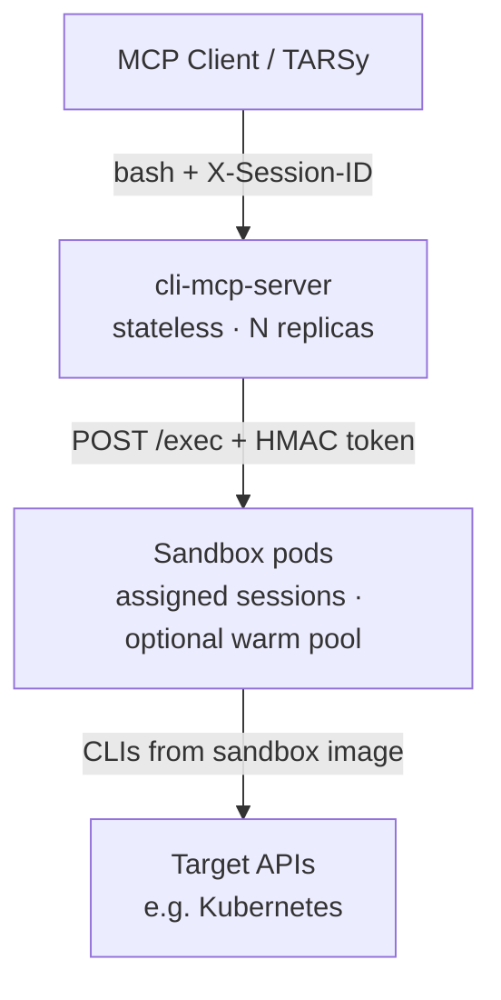

# CLI MCP Server — Architecture Overview

**Status:** Implemented (as-built)

**Related:** [Sketch](sketch.md) · [Detailed Design](design.md) · [README](../README.md)

## What it is

An MCP server that gives AI agents a **sandboxed bash shell** in per-session Kubernetes pods. Agents call one tool — `bash` — and get pipes, redirects, chaining, and whatever CLIs the sandbox image provides.

The MCP server is a **stateless control plane**. Session state (cwd, env, `/workspace` files) lives in the sandbox pod’s persistent bash process.

## Two components

| Component | Role |
|---|---|
| **cli-mcp-server** | MCP `bash` tool, session→pod routing, pod lifecycle, proxy to agent |
| **sandbox-agent** | In-pod HTTP service: persistent bash via `/exec`, `/health`, `/assign` |

## How it works



1. Client sends `bash` with `X-Session-ID`
2. Server finds or creates the sandbox pod for that session
3. Server proxies the command to the agent (`POST /exec` with HMAC bearer token)
4. Agent runs it in the persistent bash process and returns stdout/stderr/exit code
5. Server returns the result as-is (masking/summarization stay in the client)

## Session lifecycle

- **First call:** assign a warm pod (if pool enabled) or create on demand
- **While active:** same session ID reuses the same pod and bash state
- **Cleanup:** client calls `DELETE /sessions/{id}` (HTTP, not an MCP tool)
- **Safety net:** idle pods are deleted after `--idle-timeout` (default 30m)

Session IDs are RFC 1123 DNS labels. Invalid IDs fail at pod create.

## Key decisions

### Stateless server, header-based routing

No sticky sessions. Kubernetes labels are the source of truth for session→pod; an in-memory cache speeds lookups. Any replica can serve any request.

The LLM never manages session IDs — the orchestrator injects `X-Session-ID`. That avoids hallucinated IDs and keeps the tool schema minimal.

### Security from the sandbox boundary

No command allowlist. Capability is what the image and investigation RBAC allow:

- Per-session pod isolation
- Read-only investigation ServiceAccount / kubeconfig
- NetworkPolicy (ingress from MCP server; egress to intended APIs)
- Per-session HMAC bearer token on agent `/exec`
- Ephemeral `/workspace` (`emptyDir`)
- Resource limits and command timeouts

### Optional warm pool

`--warm-pool-size N` (default `0`) keeps unassigned ready pods. Assignment delivers the auth token via `POST /assign` and labels the pod. Replicas claim pods via label patch (first writer wins). Exhausted pool falls back to on-demand create.

### Dumb proxy

The server manages pods and proxies commands. It does not parse or rewrite shell. Output treatment belongs to the client (e.g. TARSy data masking / summarization).

## MCP surface

**Tool: `bash`**

| Parameter | Required | Description |
|---|---|---|
| `command` | yes | Full bash command |
| `timeout` | no | Seconds (default 60, max 300) |

**HTTP (orchestrator, not LLM):** `DELETE /sessions/{id}` — tear down pod, auth secret, and cache entry.

## Package layout

```
cmd/server/     MCP server entry point
cmd/agent/      Sandbox agent entry point
pkg/session/    Pod lifecycle, warm pool, cache
pkg/sandbox/    Bash session + agent HTTP handlers
pkg/agent/      HTTP client + shared request/response types
pkg/tools/      MCP tool handlers
pkg/server/     MCP server + HTTP mux
```

## Out of scope

Same as the [sketch](sketch.md): no replacement of structured MCP servers, no write-capable cluster ops by design, no interactive stdin, no per-user credentials in this design.
