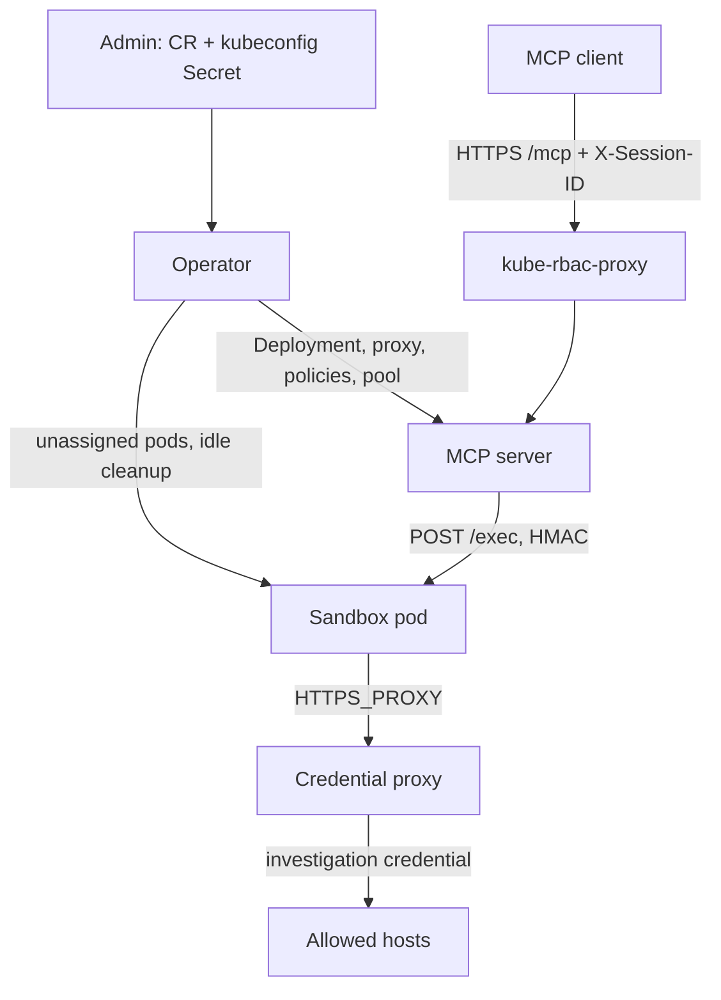

# Architecture

How CLI MCP works.

An MCP client gets a persistent bash shell in its own pod. The pod’s CLIs can reach only a credential proxy. The proxy allows that instance’s targets and discards whatever token the shell presents. A `kubernetes` target then injects the investigation credential. An `allowlist` target injects nothing.



## Pieces

| Piece | Image | Role |
|---|---|---|
| Operator | `cli-mcp-operator` | Leader-elected. Reconciles one instance per `CliMcpInstance`. |
| MCP server | `cli-mcp-server` | Stateless. Serves `bash`, claims or creates a sandbox, proxies the command. Does not watch the custom resource. |
| Sandbox agent | `cli-mcp-sandbox` | Persistent bash inside the session pod. HTTP `:8090`: `/exec`, `/assign`, `/health`. |
| Credential proxy | `cli-mcp-proxy` | MITM forward proxy on `:8080`. One Deployment per instance, shared by every session of that instance. |

kube-rbac-proxy is a sidecar on the MCP Deployment (`:8443` → loopback `:8080`), not the credential proxy.

## An instance

`CliMcpInstance` (`cli-mcp.redhat.com/v1alpha1`) is one sandbox class: one image, one MCP Deployment, one proxy, one set of NetworkPolicies. A second class is a second custom resource in the same namespace. The name is the instance id (`cli-mcp.redhat.com/instance`). Children are named `cli-mcp-<name>…`, so the name is at most 44 characters.

```yaml
apiVersion: cli-mcp.redhat.com/v1alpha1
kind: CliMcpInstance
metadata:
  name: oc
spec:
  replicas: 2                  # MCP server; default 1
  sandbox:
    # image omitted → shipped sandbox (oc, kubectl, jq, yq, curl)
    idleTimeout: 30m
    warmPoolSize: 0
  proxy:
    targets:
      - type: kubernetes       # secretName omitted → cli-mcp-oc-kubeconfig
```

`spec.proxy.targets` is required. `kubernetes` takes an optional `secretName` (key `kubeconfig`) and at most one such target. `allowlist` takes literal `domains` (`host` or `host:port`; a bare host is port 443). Mixing both on one custom resource is that class’s combined allowlist. An allowlist-only instance has no kubeconfig Secret and no dummy mount:

```yaml
spec:
  sandbox:
    image: quay.io/example/cli-mcp-sandbox-curl:1.2.3
  proxy:
    targets:
      - type: allowlist
        domains:
          - api.example.com
```

The operator turns spec into Deployment flags and mounts. Pool size and idle timeout stay on the operator and do not roll the MCP server. The MCP image comes from the operator environment (`RELATED_IMAGE_SERVER`). An empty `spec.sandbox.image` uses `RELATED_IMAGE_SANDBOX`.

## A bash call

1. The client calls `/mcp` with a token for this instance and an `X-Session-ID` (RFC 1123 label).
2. kube-rbac-proxy checks that token against the fake subresource `climcpinstances/mcp` for this custom resource.
3. The MCP server finds the session pod: memory cache, then a label lookup, then claim an unassigned pool pod, otherwise create one.
4. It `POST`s the command to the agent on `:8090` with an HMAC bearer for that session.
5. The agent runs it in a long-lived bash process and returns stdout, stderr, exit code, and duration. A non-zero exit is a tool result.

`command` is required. `timeout` defaults to 60 seconds and caps at 300. The same session id reuses the shell, environment, and `/workspace` (`emptyDir`).

## Sessions

Sessions are pods and auth Secrets, not custom resources. Any MCP replica can serve any session. Claim is a label patch; the first writer wins.

The operator keeps `warmPoolSize` unassigned pods ready. The MCP server always tries to claim one, then creates on demand. Pool pods receive their HMAC token through `POST /assign`. The operator refills the pool. It does not delete a pod that already has a session id, except for idle cleanup and instance delete.

Each `bash` call stamps `last-activity`. The operator deletes assigned pods past `idleTimeout`. `DELETE /sessions/{id}` deletes that session immediately.

Deleting the custom resource scales the MCP Deployment to zero, waits until its pods are gone, then deletes that instance’s sandbox pods and session Secrets. Rolling the MCP Deployment leaves running sessions in place. A spec change that only affects new sandboxes (image, env, resources) does the same: assigned pods keep the spec they started with.

## Credential isolation

The sandbox ServiceAccount has no RoleBindings and does not automount a token. There is no command allowlist.

With a kubernetes target the sandbox mounts a dummy kubeconfig: the real API hostnames, the token `proxy-managed-token`, and the proxy CA. The admin kubeconfig Secret is mounted only on the proxy. `HTTPS_PROXY` points at this instance’s proxy Service. `NO_PROXY` is loopback only, so `oc` cannot reach the in-cluster API directly.

The proxy, on every CONNECT and every proxied request:

- allows only exact `host:port` values from this instance’s targets (kubeconfig `server` URLs, and allowlist domains with bare hosts treated as `:443`)
- intercepts TLS with its own CA
- strips `Authorization`, API-key, and impersonation headers
- on kubernetes routes, injects the investigation bearer for that host and rejects URL paths ending in `exec`, `attach`, `portforward`, or `proxy`
- on allowlist routes, injects nothing

`oc --token`, a leaked kubeconfig, and `curl -H Authorization` still authenticate as the investigation identity if they go through the proxy. Upstream TLS is verified. When the kubeconfig carries a cluster CA, the proxy trusts only that CA for that host.

The proxy CA is generated once per instance. Token rotation in the same Secret rolls the proxy and leaves the sandbox dummy in place. Assigned sandboxes keep the dummy and CA they started with (`subPath` mounts).

Neither the operator nor the MCP server creates a sandbox until the proxy has a ready address and the sandbox egress policy is in place. An already-assigned session keeps running; `oc` fails at CONNECT if the proxy is down.

Allowlist sandboxes still send HTTPS through the proxy and trust its CA.

## Network

Policies are per instance (`instance` + `component`), so two classes in one namespace cannot use each other’s proxy.

| Policy | Allows |
|---|---|
| Sandbox ingress | TCP `:8090` from this instance’s MCP server pods |
| Sandbox egress | TCP `:8080` to this instance’s proxy, plus cluster DNS (CoreDNS, OpenShift DNS, and the node-local cache address) |
| Proxy ingress | TCP `:8080` from this instance’s sandbox pods |
| Proxy egress | Unrestricted at the network. The host allowlist is enforced in the proxy. |

The proxy Service is ClusterIP only. kube-rbac-proxy is the front door for `/mcp`; there is no NetworkPolicy on the MCP Service. The instance namespace is the trust boundary: a principal that can create pods there can mount the kubeconfig Secret directly.

## Identities

| Identity | Where | Can do |
|---|---|---|
| `cli-mcp-<name>` | MCP server and its kube-rbac-proxy sidecar | Create and manage sandbox pods. Create and delete session auth Secrets. Check that the proxy is ready before creating a sandbox. |
| `cli-mcp-<name>-client` | Whoever calls `/mcp` | `get`, `create`, and `delete` on `climcpinstances/mcp` for this instance only. Published as `status.clientServiceAccount`. The admin mints the token. |
| `cli-mcp-<name>-sandbox` | Sandbox pods | Nothing in-cluster. |
| `cli-mcp-<name>-proxy` | Proxy pods | Nothing in-cluster. Volumes only. |
| Investigation kubeconfig | Proxy pod | The admin’s binding. The operator reads the Secret and does not create it. |

One ClusterRoleBinding, `cli-mcp-auth-delegator`, grants the MCP ServiceAccounts `system:auth-delegator` so the sidecar can review tokens. It is shared by the install, not owned by one instance.

HMAC (`cli-mcp-<name>-hmac`) is the MCP-to-agent key. The operator generates it once and does not rotate it on reconcile.

## What the operator reconciles

For each instance: MCP Deployment and Service, MCP and sandbox and proxy and client ServiceAccounts, Roles, the kube-rbac-proxy ConfigMap, HMAC Secret, proxy CA, routes ConfigMap (and dummy kubeconfig when a kubernetes target exists), proxy Deployment and Service, and the NetworkPolicies above.

The admin provides the investigation kubeconfig and, on generic Kubernetes, the TLS Secret `cli-mcp-<name>-tls`. On OpenShift the Service serving-cert annotation fills TLS. The operator does not mint investigation tokens, client tokens, or TLS certificates.

`Ready` means those objects are in place, the kubeconfig parses as token-only when a kubernetes target exists, the MCP Deployment and the proxy are available, and a non-zero warm pool has finished its first fill. A later claim does not clear `Ready`.

Install is OLM (OwnNamespace or SingleNamespace) or kustomize. Instance children always live in the custom resource’s namespace.

## Local development

`make run` is the operator. `make run-server` is the MCP server by itself: it can claim and create sandboxes, and without the proxy flags it mounts a kubeconfig Secret directly. Pool replenishment, idle cleanup, and the proxy run only with the operator.
