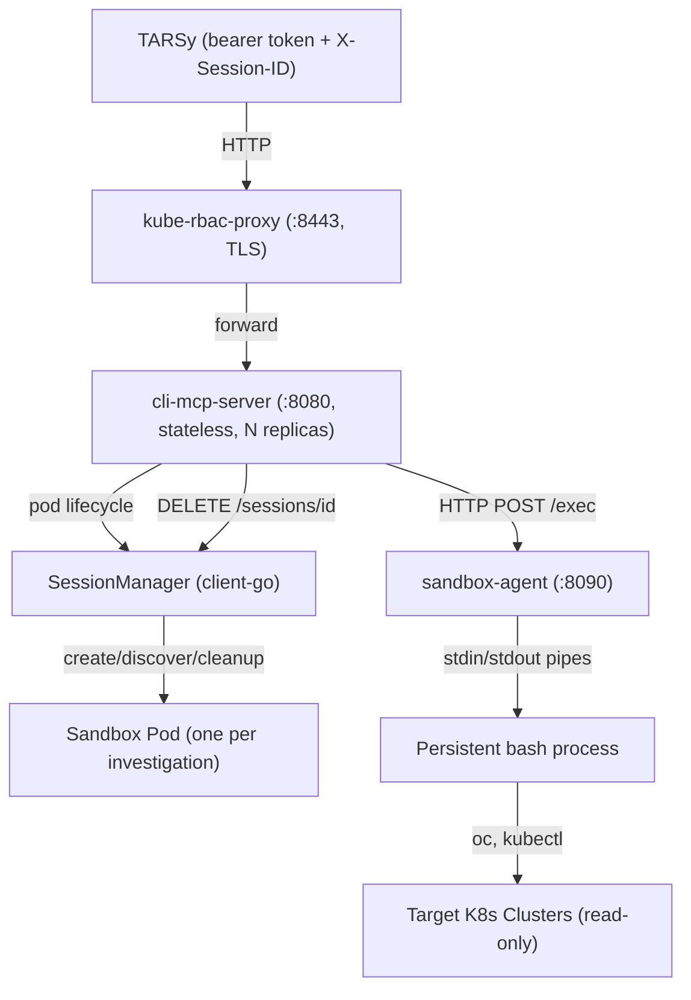
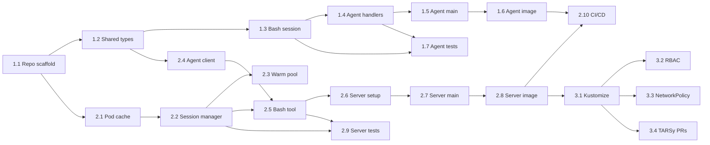

# CLI MCP Server -- Phased Implementation Plan

Based on the three design documents in [mcp-common/docs/proposals/](mcp-common/docs/proposals/):
- [cli-mcp-server-sketch.md](mcp-common/docs/proposals/cli-mcp-server-sketch.md) -- problem statement and approach
- [cli-mcp-server-design-overview.md](mcp-common/docs/proposals/cli-mcp-server-design-overview.md) -- architecture overview
- [cli-mcp-server-design.md](mcp-common/docs/proposals/cli-mcp-server-design.md) -- detailed Go types and implementation

The new repo `cli-mcp-server` will be created under `github.com/codeready-toolchain/` following the same conventions as [mcp-server-devsandbox](mcp-server-devsandbox/) (Cobra CLI, `mcp-common` middleware, kube-rbac-proxy sidecar, GitHub Actions CI/CD, kustomize deployment).

---

## Architecture Overview



**Two binaries, two images, one repo:**
- `cmd/server/main.go` -- MCP server (control plane, distroless image)
- `cmd/agent/main.go` -- Sandbox agent (data plane, oc-client-base image with CLIs)

---

## Phase 1: Repo Scaffold and Sandbox Agent

**Goal:** A working sandbox agent binary that manages a persistent bash session via HTTP API. This is the data-plane component that runs inside each sandbox pod.

### 1.1 -- Repository Setup

Create `cli-mcp-server` repo under `github.com/codeready-toolchain/` with:

- `go.mod` -- module `github.com/codeready-toolchain/cli-mcp-server`, Go 1.24+, dependencies:
  - `github.com/codeready-toolchain/mcp-common` (metrics/logging middleware)
  - `github.com/modelcontextprotocol/go-sdk/mcp` v1.4+
  - `github.com/spf13/cobra`
  - `k8s.io/client-go`, `k8s.io/api`, `k8s.io/apimachinery`
  - `github.com/google/uuid`
  - `github.com/prometheus/client_golang` (promhttp handler for `/metrics`)
  - `github.com/stretchr/testify`
- `pkg/version/version.go` -- version package with `Commit` and `BuildTime` vars (injected via `-ldflags`), consistent with `mcp-common/pkg/version/version.go` and `mcp-server-devsandbox/pkg/version/version.go`
- `Makefile` -- following `mcp-server-devsandbox` pattern (build, test, lint, build-prod targets) with two binary targets (`server` and `agent`). Build uses `-ldflags` to inject `version.commitOverride` and `version.BuildTime`.
- `.gitignore` -- same as `mcp-server-devsandbox`
- `.govulncheck.yaml` -- consistent with existing repos
- `.github/workflows/ci.yml` -- build + test (same pattern as `mcp-server-devsandbox`)
- `.github/workflows/govulncheck.yml` -- vulnerability scanning (same pattern as `mcp-server-devsandbox`)
- `README.md`

**Project structure** (from the design doc):

```
cli-mcp-server/
  cmd/
    server/main.go
    agent/main.go
  pkg/
    session/
      manager.go, manager_test.go
      pool.go, pool_test.go
      cache.go, cache_test.go
    agent/
      client.go, client_test.go
      types.go
    sandbox/
      bash.go, bash_test.go
      handler.go, handler_test.go
    server/
      server.go, server_test.go
    tools/
      bash.go, bash_test.go
    version/
      version.go
  Containerfile.server
  Containerfile.agent
  Makefile
  go.mod
  .govulncheck.yaml
```

### 1.2 -- Shared Types (`pkg/agent/types.go`)

The shared HTTP contract between server (client) and agent (server):

```go
type ExecRequest struct {
    Command string `json:"command"`
    Timeout int    `json:"timeout,omitempty"`
}

type ExecResponse struct {
    Stdout     string `json:"stdout"`
    Stderr     string `json:"stderr"`
    ExitCode   int    `json:"exit_code"`
    DurationMs int64  `json:"duration_ms"`
}

type AssignRequest struct {
    Token string `json:"token"`
}
```

### 1.3 -- Persistent Bash Session (`pkg/sandbox/bash.go`)

Implement `BashSession` struct:
- Spawn `bash --norc --noprofile` with stdin/stdout/stderr pipes
- UUID-based delimiter protocol for isolating command output
- `Execute(command, timeout)` -- write wrapped command to stdin, read stdout/stderr until delimiters, parse exit code
- Timeout handling -- `SIGKILL` to command process group (not bash itself)
- Crash recovery -- detect EOF on pipe reads, respawn bash on next request, report "session state was reset" in stderr
- Mutex for serialized access

### 1.4 -- Sandbox Agent HTTP Handlers (`pkg/sandbox/handler.go`)

Three endpoints:
- `POST /exec` -- bearer token auth (using `hmac.Equal()` for constant-time comparison to prevent timing side-channel attacks), parse `ExecRequest`, call `BashSession.Execute()`, return `ExecResponse`
- `POST /assign` -- one-time token delivery for warm pool pods; stores token in memory, transitions to `assigned` mode; 409 Conflict if already assigned
- `GET /health` -- unauthenticated readiness probe; returns 200 if agent running and bash alive, 503 if bash is dead and not yet respawned (required for K8s readiness probes)

Agent state machine: `unassigned` (rejects `/exec` with 503, `/assign` accepts token) -> `assigned` (after token via env var or `/assign`; `/exec` requires bearer token, `/assign` returns 409)

### 1.5 -- Agent Entry Point (`cmd/agent/main.go`)

- Read `SANDBOX_AUTH_TOKEN` from env (set via `secretKeyRef` for on-demand pods)
- If token present, start in `assigned` state; otherwise `unassigned` (warm pool)
- Start HTTP server on `:8090`
- Signal handling for graceful shutdown

### 1.6 -- Agent Container Image (`Containerfile.agent`)

```dockerfile
FROM golang:1.24-alpine AS go-builder
# ... build sandbox-agent binary ...

FROM quay.io/codeready-toolchain/oc-client-base-minimal
COPY --from=go-builder /workspace/bin/sandbox-agent /usr/bin/
RUN microdnf install -y jq yq curl && microdnf clean all
RUN groupadd -g 1001 sandbox && useradd -u 1001 -g 1001 ...
USER 1001
ENTRYPOINT ["/usr/bin/sandbox-agent"]
```

### 1.7 -- Unit Tests

- `pkg/sandbox/bash_test.go` -- command execution, exit codes, env persistence across calls, crash recovery, timeout, delimiter edge cases (command output containing delimiter-like strings)
- `pkg/sandbox/handler_test.go` -- auth enforcement, assign state machine, health endpoint

**Deliverable:** A standalone `sandbox-agent` binary + container image that can be tested locally (`go run cmd/agent/main.go`, then `curl -X POST localhost:8090/exec -d '{"command":"echo hello"}'`).

---

## Phase 2: MCP Server Core

**Goal:** The MCP server binary that manages sandbox pod lifecycle via client-go, exposes the `bash` MCP tool, and proxies commands to sandbox agents.

### 2.1 -- Pod Cache (`pkg/session/cache.go`)

- `PodCache` struct: thread-safe map of `sessionID -> PodCacheEntry{podName, podIP, cachedAt}`
- TTL-based expiry (~30s)
- `Get(sessionID)`, `Set(sessionID, name, ip)`, `Remove(sessionID)`

### 2.2 -- Session Manager (`pkg/session/manager.go`)

`SessionManager` struct with:
- `clientset kubernetes.Interface`
- `namespace string`
- `config SandboxConfig` (image, CPU/mem requests/limits, idle timeout, HMAC key, warm pool size)
- `cache *PodCache`

**SandboxConfig struct** (from design doc):

```go
type SandboxConfig struct {
    Image          string        // sandbox agent container image
    CPURequest     string        // default: "100m"
    CPULimit       string        // default: "500m"
    MemoryRequest  string        // default: "128Mi"
    MemoryLimit    string        // default: "512Mi"
    IdleTimeout    time.Duration // default: 30m
    KubeconfigPath string        // path to kubeconfig secret for sandbox pods
    HMACKey        []byte        // shared secret for deriving per-session agent auth tokens
    WarmPoolSize   int           // number of pre-warmed pods to maintain (0 = disabled)
}
```

**Operations:**
- `GetOrCreatePod(ctx, sessionID)` -- label lookup (`tarsy.redhat.com/session-id=<id>`, `tarsy.redhat.com/component=cli-mcp-sandbox`), cache hit/miss, create pod + auth Secret if needed, wait for `PodRunning` + agent `/health` 200
  - Cache hit: return cached pod IP
  - Cache miss, warm pool enabled: list unassigned pods, claim via label patch (first writer wins), create per-session auth Secret (`cli-mcp-sandbox-auth-<sessionID>`), call `POST /assign` on agent, trigger async replenishment
  - Cache miss, no warm pod: create auth Secret, create sandbox pod with `secretKeyRef`, wait for ready
  - Caches result in PodCache (TTL ~30s)
- `ExecuteCommand(ctx, sessionID, command, timeout)` -- resolve pod IP, compute `HMAC-SHA256(HMACKey, sessionID)` for bearer token, HTTP POST to agent `/exec`, update `tarsy.redhat.com/last-activity` annotation via patch
- `CleanupSession(ctx, sessionID)` -- delete pod by label selector, then delete `cli-mcp-sandbox-auth-<sessionID>` Secret, remove from cache
- `CleanupStale(ctx)` -- periodic goroutine (every 5 min), list all sandbox pods, check `tarsy.redhat.com/last-activity` annotation against `IdleTimeout`, delete stale pods + their auth Secrets
- `buildPodSpec(sessionID)` -- build pod in Go code with:
  - `GenerateName: "cli-mcp-sandbox-"`
  - Labels: `tarsy.redhat.com/session-id`, `tarsy.redhat.com/component=cli-mcp-sandbox`
  - Annotations: `tarsy.redhat.com/created-at`, `tarsy.redhat.com/last-activity` (both RFC3339)
  - `ServiceAccountName: "cli-mcp-investigation-sa"`
  - `RestartPolicy: OnFailure`
  - Pod security: `RunAsNonRoot`, `RunAsUser: 1001`, `RunAsGroup: 1001`
  - Container security: `AllowPrivilegeEscalation: false`, `Drop: ALL`
  - `secretKeyRef` for `SANDBOX_AUTH_TOKEN` env var
  - Kubeconfig volume (Secret), workspace volume (emptyDir)
  - Env: `KUBECONFIG=/config/kubeconfig`, `HOME=/workspace`
  - Readiness probe: HTTP GET `/health` on port 8090
  - Resource requests/limits from SandboxConfig

### 2.3 -- Warm Pod Pool (`pkg/session/pool.go`)

(Only when `--warm-pool-size > 0`)
- `ReconcilePool()` -- periodic goroutine (every 30s), list unassigned pods, create to reach target size
- Assignment flow: claim warm pod via label patch (first writer wins), create auth Secret, call `POST /assign` on agent, trigger async replenishment
- Fallback to on-demand creation when pool exhausted

### 2.4 -- Agent HTTP Client (`pkg/agent/client.go`)

- `AgentClient` struct wrapping `http.Client`
- `Execute(podIP, token, req ExecRequest) (ExecResponse, error)`
- `Assign(podIP, token string) error`
- `HealthCheck(podIP) error`
- Configurable timeouts

### 2.5 -- Bash Tool Handler (`pkg/tools/bash.go`)

```go
type BashInput struct {
    Command string `json:"command" jsonschema:"required,description=Shell command to execute (full bash — pipes, redirects, chaining supported)"`
    Timeout *int   `json:"timeout,omitempty" jsonschema:"description=Max execution time in seconds (default 60, max 300)"`
}

type BashOutput struct {
    Stdout     string `json:"stdout"`
    Stderr     string `json:"stderr"`
    ExitCode   int    `json:"exit_code"`
    DurationMs int64  `json:"duration_ms"`
}
```

- Extract `X-Session-ID` from `req.Extra.Header.Get("X-Session-ID")`; reject with clear error if missing
- Parse `BashInput` from `req.Params.Arguments` via `json.Unmarshal`
- Clamp timeout: default 60, max 300
- Call `SessionManager.ExecuteCommand()`
- Marshal `BashOutput` as JSON into `mcp.TextContent`
- Return `mcp.CallToolResult` with `IsError: true` for non-zero exit codes (not MCP errors) -- a command returning exit code 1 (e.g., "NotFound") is still useful output for the LLM
- Only infrastructure failures (pod creation failed, agent unreachable) return MCP errors (`fmt.Errorf`)

### 2.6 -- MCP Server Setup (`pkg/server/server.go`)

Following `mcp-server-devsandbox/pkg/mcpinit/init.go` pattern:
- Create `mcp.Server` with `mcp-common` middleware: `middleware.NewMetricsMiddleware()` + `middleware.NewLoggingMiddleware()`
- Configure `ServerCapabilities` with `Tools: &mcp.ToolCapabilities{ListChanged: !stateless}`
- Register `bash` tool
- `mcp.NewStreamableHTTPHandler` with `Stateless: true` + `DisableLocalhostProtection: true` (server runs behind kube-rbac-proxy which forwards with external Host header)
- HTTP mux with endpoints:
  - `/mcp` -- StreamableHTTPHandler
  - `DELETE /sessions/{id}` -- `SessionDeleteHandler` (plain HTTP, not MCP; returns 204 No Content on success)
  - `/metrics` -- `promhttp.Handler()` for Prometheus scraping
  - `/live` -- liveness probe (process responsive, no external deps)
  - `/health` -- readiness probe (verifies K8s API reachable via lightweight namespace get; returns 503 when unreachable)

### 2.7 -- Server Entry Point (`cmd/server/main.go`)

Cobra root command with flags:
- `--address`, `--transport`, `--stateless`
- `--namespace` (default "tarsy")
- `--sandbox-image` (required)
- `--kubeconfig` (for sandbox pods)
- `--hmac-key-file` (shared secret path)
- `--idle-timeout` (default 30m)
- `--warm-pool-size` (default 0)

`runServer()` flow:
1. Create K8s clientset (in-cluster config)
2. Create `SessionManager`
3. Create `mcp.Server` with middleware
4. Register `bash` tool
5. Start stale cleanup goroutine
6. Start warm pool reconciler (if pool size > 0)
7. Start HTTP server
8. Signal handling for graceful shutdown

### 2.8 -- Server Container Image (`Containerfile.server`)

```dockerfile
FROM golang:1.24-alpine AS go-builder
# ... build cli-mcp-server binary ...

FROM gcr.io/distroless/static-debian12
COPY --from=go-builder /workspace/bin/cli-mcp-server /usr/bin/
USER 1001
ENTRYPOINT ["/usr/bin/cli-mcp-server"]
CMD ["--transport", "http", "--stateless"]
```

### 2.9 -- Unit Tests

- `pkg/session/manager_test.go` -- pod creation, label discovery, cache hit/miss, cleanup, using `client-go` `fake.NewSimpleClientset()`
- `pkg/session/pool_test.go` -- pool reconciliation, warm pod claiming, concurrent replica coordination
- `pkg/session/cache_test.go` -- TTL expiry, thread safety
- `pkg/agent/client_test.go` -- success/timeout/error responses using `httptest.NewServer`
- `pkg/tools/bash_test.go` -- header extraction, session routing, error mapping, mock `SessionManager` interface
- `pkg/server/server_test.go` -- tool registration, health check, DELETE endpoint

### 2.10 -- CI/CD

- `.github/workflows/ci.yml` -- build both binaries, run all tests
- `.github/workflows/cd.yml` -- build and push two images to `quay.io/codeready-toolchain/cli-mcp-server` and `quay.io/codeready-toolchain/cli-mcp-sandbox`

### Error handling (from design doc)

| Scenario | Behavior |
|---|---|
| Pod creation fails | MCP error returned, session manager retries once |
| Agent unreachable (pod IP, network) | MCP error with "sandbox agent unreachable", cache entry invalidated, next request retries |
| Bash process died (OOM, signal) | Agent detects on next `/exec` (pipe EOF), respawns bash, returns result with stderr "session state was reset". Agent process stays alive. |
| Agent process crashed | K8s `RestartPolicy: OnFailure` restarts container. Pod gets new IP. Cache becomes stale; next request rediscovers by label. Session state lost. |
| Command timeout | Agent kills command after timeout, returns partial output + exit code 137 (SIGKILL) |
| Pod evicted (node pressure) | Next request creates new pod. LLM sees "new session" |
| K8s API unreachable | Session manager returns MCP error. Health check fails, pod marked not ready |

**Deliverable:** Two binaries, two container images, full test suite. The MCP server can be tested locally against a K8s cluster.

---

## Phase 3: Deployment and TARSy Integration

**Goal:** Production-ready Kubernetes manifests and TARSy wiring.

### 3.1 -- Kustomize Manifests

Per the design doc, production manifests live in **`sandbox-sre/components/cli-mcp-server/`** (separate repo). The `cli-mcp-server` repo itself may also include a `deploy/base/` for dev/testing convenience (following `mcp-server-devsandbox` pattern).

| File | Purpose |
|---|---|
| `deployment.yaml` | MCP server: kube-rbac-proxy sidecar (`:8443`, TokenReview bearer auth) + main container (`:8080`) with CLI flags |
| `service.yaml` | ClusterIP port 8443, serving cert annotation |
| `service-accounts.yaml` | `cli-mcp-server` SA (pod management RBAC) |
| `investigation-sa.yaml` | `cli-mcp-investigation-sa` SA (read-only cluster access for sandbox pods) |
| `clusterrole.yaml` | Pod + Secret RBAC for MCP server SA |
| `clusterrolebinding.yaml` | Bind role to SA + `system:auth-delegator` for kube-rbac-proxy token review |
| `network-policy.yaml` | Ingress to MCP server + sandbox pod ingress/egress (K8s API only, no internet) |
| `servicemonitor.yaml` | Prometheus ServiceMonitor for metrics scraping |
| `kustomization.yaml` | Ties everything together |

### 3.2 -- RBAC

**`cli-mcp-server` SA** (MCP server pod):
- **Role** in `tarsy` namespace:
  - Pods: `create`, `delete`, `get`, `list`, `watch`, `patch` (patch needed for `last-activity` annotation updates)
  - Secrets: `create`, `delete` (needed for per-session HMAC auth token delivery via `cli-mcp-sandbox-auth-<sessionID>` Secrets)
- **ClusterRoleBinding** to `system:auth-delegator` -- required for kube-rbac-proxy to perform TokenReview for bearer token validation

**`cli-mcp-investigation-sa` SA** (mounted into sandbox pods via kubeconfig) -- ClusterRoleBindings:
- `view` ClusterRole -- standard K8s read-only for namespaced resources (explicitly excludes Secrets)
- `list-nodes` ClusterRole -- node/machine listing
- `kube-investigation-readonly` ClusterRole -- cluster-scoped reads (namespaces, PVs, CRDs, metrics, OpenShift operators, machine configs)
- Explicitly does NOT include `pods/exec` or KubeVirt lifecycle permissions (which are present on `sandbox-mcp-sa` for `mcp-server-devsandbox`). Since the sandbox gives the LLM full shell access, the SA must be tightly scoped.

### 3.3 -- NetworkPolicy

Sandbox pod network rules:
- **Ingress:** only from pods labeled `app: cli-mcp-server`, port 8090
- **Egress:** only to K8s API server CIDR on port 6443, plus kube-dns (port 53 UDP/TCP)
- No internet access, no lateral movement

### 3.4 -- TARSy Integration (separate PRs to `tarsy` repo)

**PR 1: `custom_headers` in TransportConfig**
- Add `CustomHeaders map[string]string` field to `config.TransportConfig` in `pkg/config/types.go`
- Update `mcp.createHTTPTransport` to inject headers via custom round-tripper (same pattern as bearer token injection)
- `ClientFactory` must resolve template variables (like `{{.SESSION_ID}}`) per-session

**PR 2: Session cleanup HTTP call**
- After investigation chain completes in `pkg/queue/executor.go`, call `DELETE /sessions/{id}` on the MCP server
- Build HTTP client from transport config (URL base, bearer token, TLS)
- Can be deferred -- TTL safety net handles cleanup as fallback

**PR 3: tarsy.yaml entry**
- Add `cli-mcp-server` to `mcp_servers` with `custom_headers`, instructions, data_masking, and summarization config
- Wire to investigation agents that benefit from flexible CLI access

**Deliverable:** Fully deployable to staging cluster, integrated with TARSy.

---

## Phase 4: Production Rollout and Hardening

**Goal:** Production deployment, monitoring, and iterative tuning.

### 4.1 -- Production Overlay
- Create `deploy/overlays/production/` with production-specific image tags, resource limits, and replica count

### 4.2 -- Observability
- Prometheus metrics via `mcp-common` middleware (tool call counts, latency, errors)
- Add custom metrics: sandbox pod creation latency, warm pool utilization, active session count, command execution duration histogram
- `ServiceMonitor` manifest for Prometheus scraping
- Dashboard for sandbox pod lifecycle (creation rate, idle cleanup rate, pool hit rate)

### 4.3 -- Tuning
- Monitor real-world pod startup latency to decide on `--warm-pool-size`
- Tune `--idle-timeout` based on investigation duration patterns
- Adjust CPU/memory limits based on observed resource usage
- Adjust command `timeout` defaults based on usage patterns

### 4.4 -- Additional CLIs
- Evaluate adding `virtctl`, `helm`, or other CLIs based on agent investigation needs
- Only requires updating `Containerfile.agent` (install binary) -- no server code changes

### 4.5 -- Documentation
- `CLAUDE.md` / `AGENTS.md` for AI coding agent guidance (consistent with `mcp-server-devsandbox`)
- Operational runbook for common issues (pod stuck, cleanup not running, auth failures)

---

## Dependency Graph



---

## Key Patterns from Existing MCP Servers

All patterns sourced from [mcp-server-devsandbox](mcp-server-devsandbox/):

- **Server bootstrap:** Cobra CLI with flags -> `mcp.NewServer()` with `mcp-common` middleware -> `mcp.NewStreamableHTTPHandler` with `Stateless: true` + `DisableLocalhostProtection: true`
- **Middleware:** `middleware.NewMetricsMiddleware()` + `middleware.NewLoggingMiddleware()` from `mcp-common`
- **HTTP mux:** `/mcp`, `/metrics` (promhttp), `/live` (liveness), `/health` (readiness)
- **Deployment:** kube-rbac-proxy sidecar on `:8443`, MCP server on `127.0.0.1:8080`, `ServiceAccount`, kustomize base/overlays
- **CI/CD:** GitHub Actions -- `ci.yml` (build + test on PRs), `cd.yml` (build + push image on master merge to `quay.io/codeready-toolchain/`)
- **Image build:** `redhat-actions/buildah-build@v2` + `redhat-actions/push-to-registry@v2`
- **Module path:** `github.com/codeready-toolchain/cli-mcp-server`

The key **difference** from `mcp-server-devsandbox`: this server manages sandbox pods dynamically via `client-go` (create/delete/list/patch pods and secrets) rather than inspecting existing workloads. It also has two separate binaries and images.

---

## Out of Scope (from design docs)

- Replacing existing structured MCP servers -- this is additive
- Write/mutate operations against clusters -- read-only investigation by design (RBAC-enforced)
- Interactive commands requiring stdin -- no `oc edit`, no interactive `oc exec -it`
- Multi-tenancy / per-user credentials -- uses shared kubeconfig (per-user auth is a separate proposal)
- Custom output parsing -- the server returns raw shell output; TARSy's summarization handles compression

## Future Considerations

If the server later adds write-capable CLIs (e.g., `helm install`, `oc apply`), per-cluster sandbox pods should be considered. With write access, targeting the wrong cluster has destructive consequences, and per-cluster isolation eliminates that risk. For read-only investigation, a shared kubeconfig with all contexts is safe.
