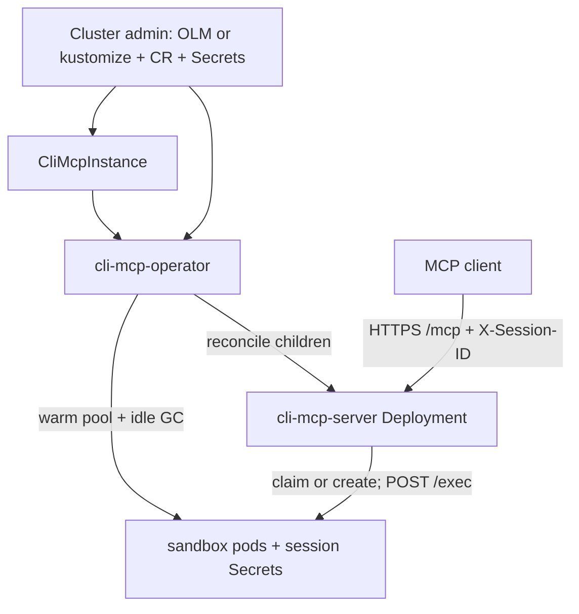

# CLI MCP Operator

**Status:** Final

**Related:** [cli-mcp-operator-questions.md](cli-mcp-operator-questions.md) · [As-built design](../design.md) · [Credential proxy WHAT](credential-proxy-design.md) · [Umbrella proxy analysis](../../../docs/proposals/cli-mcp-credential-proxy.md)

This document is the **HOW** for instance infrastructure: a Kubernetes operator that owns one MCP instance per CR. It is **not** the proxy design. This phase is for **building and testing** that operator (bash + session pods + investigation kubeconfig still mounted so `oc` works). Nothing is in production; the MCP is not used until the proxy exists. The next design pass adds proxy children to the same operator.

This is an **open-source Kubernetes operator**. Docs describe the product any cluster can install. First-party internal deploy is one consumer of the OLM catalog, not part of the operator API.

## Overview

CLI MCP is a stateless, multi-replica MCP server (`cmd/server`) that creates per-session sandbox pods and proxies `bash` to them. Session pods and HMAC auth Secrets are already created in-process. Everything *around* that data plane — the MCP Deployment, Service, kube-rbac-proxy sidecar, NetworkPolicies, ServiceAccounts — would otherwise be a growing pile of YAML that cannot derive later objects (dummy kubeconfig, proxy CA, route list) from live Secrets.

[Proxy Q1](credential-proxy-questions.md) already decided: a **real operator**, not an ensure-loop inside `cmd/server`. This design is that operator, implemented **before** the proxy:

1. Convert today’s MCP into an operator-managed instance (same bash/session contract).
2. Implement and deploy that (no proxy components).
3. Return to the proxy design and add proxy children to this operator.

```
Cluster admin                         Cluster
─────────────                         ───────
OLM catalog / kustomize  ───────────► cli-mcp-operator (leader-elected)
CliMcpInstance CR        ───────────► reconciler
admin Secrets (not children):           ├── HMAC Secret (generate-once)
  cli-mcp-<name>-kubeconfig             ├── MCP Deployment (kube-rbac-proxy + server)
  cli-mcp-<name>-tls (non-OpenShift)    ├── Service (ClusterIP)
                                        ├── MCP SA + Role/RoleBinding (pods/secrets)
                                        ├── sandbox SA (no RoleBindings, automount false)
                                        └── NetworkPolicy (sandbox :8090 from this MCP)
                                              │
                                              ▼
                                        cli-mcp-server × N  (flags only; no CR watch)
                                              ├── always claim unassigned or create on demand
                                              └── session HMAC Secrets
                                        operator also: warm pool + idle GC
```

An MCP client calls `/mcp` with `X-Session-ID` and `DELETE /sessions/{id}`. That path does not change.

## Design Principles

1. **Operator is the singleton; MCP is the data plane.** Leader-elected controller. MCP replicas stay stateless and horizontally scaled. Sessions are **not** CRs.
2. **MCP does not reconcile infrastructure, pool, or idle GC.** No Deployment/NP/CA ensure-loop in `cmd/server`. The server claims or creates session pods on the bash hot path and deletes on `DELETE /sessions/{id}` only.
3. **Testable bash contract before proxy.** One tool, HMAC `/exec`, real investigation kubeconfig mounted so operator tests can run `oc`. Isolation (dummy kubeconfig, egress lock) is the next design. Warm pool and idle GC move to the operator (Q5).
4. **CR + labels + ownership must be proxy-ready.** Instance identity, ownerRefs, and “admin provides investigation kubeconfig” are the extension points. Do **not** implement proxy children here, and do **not** freeze a `spec.proxy` API before that design.
5. **Operator does not mint investigation tokens.** That kubeconfig Secret is provided (GitOps, External Secrets, or `kubectl`) under the conventional name `cli-mcp-<name>-kubeconfig`. The operator does not put a secret ref on the CR (same as TLS). HMAC is an internal MCP↔agent shared secret: the operator **generate-once**s it (same pattern as the later proxy CA). The operator does not rotate HMAC on reconcile.
6. **`cmd/server` remains runnable without the operator.** Local stdio, unit tests, and `go run ./cmd/server` stay flag-driven. After Phase 3 that means claim + on-demand create only — not pool replenish or idle GC (operator: idle GC in Phase 4, pool in Phase 5).
7. **Fail closed on instance delete.** Removing the CR must not leave sandbox pods as unlabeled orphans forever.
8. **Portable Kubernetes, optional OpenShift.** The operator must install and reconcile on generic Kubernetes. OpenShift-only behavior (serving-cert annotation, SCCs) is detected or left to the admin, not required. (Q2)
9. **One repo, renamed to `cli-mcp-operator`, multiple images (Q1).** Kubebuilder go/v4 + operator-sdk in this module; `cmd/server` stays a data-plane binary. First-party GitOps is a consumer of the catalog, documented separately when we deploy it.

## Architecture / How It Works

### As-built (today)

`cli-mcp-server` runs with flags. The process uses an in-cluster (or `--kubeconfig` path) **client-go** config to create sandbox pods in `--namespace` (flag default `tarsy`). The flag’s help text today says “for sandbox pods”; that is wrong — `--kubeconfig` is only `buildClientset`. The investigation Secret name is **not** that flag; it is hardcoded in `pkg/session.DefaultConfig` as `cli-mcp-investigation-kubeconfig`. Also hardcoded: SA `cli-mcp-investigation-sa`, agent port `8090`, CPU/memory requests+limits (`100m`/`500m`/`128Mi`/`512Mi`). `buildBasePodSpec` does **not** set `automountServiceAccountToken` (Kubernetes defaults **true**). Labels/annotations are `tarsy.redhat.com/{session-id,component,created-at,last-activity}` with `component=cli-mcp-sandbox`. Claim, discover, idle GC, and `unassignedSelector` are **component-only** (no instance id).

HTTP mux (`pkg/server.NewMux`): `/mcp`, `/metrics`, `/live`, `/health`, `DELETE /sessions/{id}`. `/mcp` already sets `DisableLocalhostProtection: true` (loopback bind is still required). `/health` today does a **cluster-scoped** `get` on the Namespace object (`CoreV1().Namespaces().Get`) — that must not become MCP Role RBAC (Q13). Idle GC (`CleanupStale` / `startCleanupLoop`) uses `last-activity` (else `created-at`) and skips pods with no session-id. Warm pool: unassigned pods have no session-id and no auth Secret; claim is a label patch + Secret + `POST /assign`. `WarmPool` exists only when `--warm-pool-size > 0`. As-built `ReconcilePool` **creates on deficit only** — it does not trim surplus — and deletes unassigned pods older than **2× idle timeout** (drain extras when every replica replenished). The operator does **not** copy that timer; it trims surplus immediately. Sandbox readiness is an **exec** curl to loopback `/health` so kubelet does not need NP ingress. There is no egress NetworkPolicy in-tree (as-built `design.md` “egress limited” is aspirational).

### This phase



OLM is the OOTB install (bundle + catalog + CD, like claw-operator). `config/` kustomize remains the source of truth and a supported non-OLM path (`make deploy`). Helm can wrap the same manifests later; it is not v1.

CSV install modes (Q4), same as claw-operator: **OwnNamespace** and **SingleNamespace**. Not MultiNamespace, not AllNamespaces. Instance children always live in the CR’s namespace. Watch scope is OLM OperatorGroup `targetNamespaces` (controller-runtime cache), **not** a product namespace in the binary. Do not copy claw’s `WATCH_NAMESPACE` meaning (that env is claw’s operator-config singleton lookup). We have no operator-config CR.

**Ownership (Q5):** admin provides CR + investigation kubeconfig Secret + cluster RBAC (+ TLS Secret on generic Kubernetes). Operator reconciles instance infrastructure (including HMAC Secret generate-once), **warm pool**, **idle GC**, and instance teardown. MCP replicas **always try claim** of instance-labeled unassigned pods, else **create** on demand, wait Ready, HMAC `/exec`; `DELETE /sessions/{id}` deletes that session. Claim is **not** gated on `--warm-pool-size` (Q9: pool size must not roll MCP). No session CRD.

**Two Pod writers:** MCP (claim / on-demand create / last-activity patch / explicit session delete) and operator (unassigned pool create/surplus delete, idle assigned GC, finalizer). Coordinate only via labels. Claim remains a resourceVersion label patch (first writer wins). After a successful claim, MCP must **not** signal replenish (`TriggerReplenish` goes away with `ReconcilePool`); the operator **Watches** instance sandbox Pods (and session Secrets for idle GC) so a claim refills the pool on the next reconcile. Operator must **not** server-side-apply or delete pods that have `session-id` except idle GC / finalizer. Operator must **not** treat MCP-created assigned pods as drift to delete during SSA of “children.” Before deleting an unassigned surplus/hash-rebuild pod, **re-get** it and skip if `session-id` appeared (stale list vs claim race). Overlay/image change: recreate **unassigned** pods only; assigned sessions keep the old spec until DELETE / idle GC / CR delete.

### What the operator reconciles

Namespaced children of a CR `metadata.name=oc` in the CR’s namespace (`cli-mcp-<name>`):

| Child | Role |
|---|---|
| Deployment `cli-mcp-oc` | kube-rbac-proxy `:8443` → MCP `127.0.0.1:8080`; N replicas |
| Service `cli-mcp-oc` | ClusterIP `:8443`; OpenShift serving-cert annotation **when on OpenShift** (Q2, Q13) |
| ServiceAccount `cli-mcp-oc` | MCP pod identity (in-cluster client for session objects) |
| Role + RoleBinding | MCP SA: pods, secrets in this namespace (create/get/list/watch/update/patch/delete). Covers claim patch, last-activity, session Secrets. If overlay is a ConfigMap, add get on that object. |
| ServiceAccount `cli-mcp-oc-sandbox` | Sandbox pods. No RoleBindings. Q12 |
| Secret `cli-mcp-oc-hmac` | MCP↔agent HMAC key (data key `key`). Generate-once; `ownerRef` → CR. Never overwrite if present. |
| NetworkPolicy sandbox ingress | `:8090` only from this instance’s MCP pods (`cli-mcp.redhat.com/instance` **and** `component=server`) |

TLS for kube-rbac-proxy: mount Secret `cli-mcp-<name>-tls`. On OpenShift the operator sets the Service serving-cert annotation (platform creates the Secret). On generic Kubernetes the **admin** creates that Secret. The operator does not generate certs and does not `ownerRef` this Secret.

Investigation kubeconfig: admin creates Secret `cli-mcp-<name>-kubeconfig` (key `kubeconfig`). This phase it is mounted on sandbox pods. No spec field, no `ownerRef` (same as TLS). Proxy pass unmounts it from the sandbox and mounts it on the proxy.

All operator-owned objects get `ownerRef` → the CR and instance labels. Pool pods the operator creates get `ownerRef`; MCP on-demand session pods do not.

**Not** created as CRs: session pods and per-session `cli-mcp-sandbox-auth-*` Secrets. MCP creates/claims them on the hot path. Operator keeps **unassigned** count equal to `warmPoolSize` (same pod spec as MCP): create on deficit, delete surplus immediately (oldest first; re-get and skip a pod that just gained `session-id`). Recreate unassigned pods when the desired sandbox spec/image/env/resources changes (hash), not on a timer. Do not copy as-built 2× idle age-drain (that existed because MCP replicas overshot and `ReconcilePool` would not trim extras). Idle-GC **assigned** sessions via `last-activity` at 1× `idleTimeout` (Q5).

**Not** created by the operator: CRD (OLM/kustomize), operator Deployment, cluster-scoped RBAC, investigation kubeconfig Secret, MCP client SA, TLS Secret on non-OpenShift, OpenShift SCCs / namespace PSA, extra Secrets referenced from `spec.sandbox.env`.

Q13: kube-rbac-proxy sidecar is always part of the MCP Deployment. Image from `RELATED_IMAGE_KUBE_RBAC_PROXY` (OLM `relatedImages`; not an instance workload). `--allow-paths` must cover the mux: `/mcp`, `/metrics`, `/live`, `/health`, `/sessions`. Admin owns `system:auth-delegator` on the MCP SA, the client SA, and the `/mcp` ClusterRole/Binding (plus `/sessions` if that is a separate nonResource URL). Repo ships sample cluster RBAC for operator tests. Clients are not required to carry a special pod label; kube-rbac-proxy is the MCP front door (Q11).

### What the cluster admin applies

```
OLM: CatalogSource + OperatorGroup + Subscription
  plus:
    CliMcpInstance CR
    investigation kubeconfig Secret `cli-mcp-<name>-kubeconfig` (key `kubeconfig`)
    TLS Secret `cli-mcp-<name>-tls` (generic Kubernetes only; OpenShift serving-cert)
    cluster-scoped RBAC for kube-rbac-proxy / MCP client (Q5, Q13)
    OpenShift SCC / namespace PSA as needed (sandbox is non-root, drop ALL caps; Q2)
    if the namespace is default-deny ingress: allow clients → MCP Service :8443
      (operator does not create an MCP ingress NP; kube-rbac-proxy is the front door)
```

Without OLM: `make deploy` / `kubectl apply -k config/default`, then the same CR + Secrets. Helm is a later optional wrapper, not a second source of truth.

Investigation tokens in the kubeconfig Secret are provisioned outside this operator (the operator does not mint cluster identities on this or other clusters).

### How the MCP process is configured

The operator **renders Deployment args/env from the CR**. The MCP binary does **not** watch the CR (Q9). Spec changes that affect the MCP process update the Deployment; kube rolls replicas. Pool/idle fields are consumed by the operator in place (no MCP restart).

Flags the operator sets (existing + small additions):

| Flag | Source |
|---|---|
| `--transport http --stateless --address 127.0.0.1:8080` | fixed for in-cluster |
| `--namespace` | CR namespace |
| `--sandbox-image` | resolved `spec.sandbox.image` or `RELATED_IMAGE_SANDBOX` (Q7, Q16) |
| `--hmac-key-file` | mount of operator-generated Secret `cli-mcp-<name>-hmac` (file is the `key` entry) |
| `--idle-timeout`, `--warm-pool-size` | **not** passed in-cluster — `spec.sandbox` is operator-only (Q5, Q6, Q9). After Phase 3 they must **not** start MCP replenish or idle GC (no dual path). Keep the flags so old CLIs still parse if useful; they have no in-cluster effect. |
| `--instance-name` | **new** — CR `metadata.name` (labels). Required; no default. |
| `--kubeconfig-secret` | **new** — always `cli-mcp-<name>-kubeconfig` (not a spec field; not `--kubeconfig`). Required; no default. |
| `--sandbox-service-account` | **new** — operator-owned `cli-mcp-<name>-sandbox` (not a spec field). Required; do **not** default to `cli-mcp-investigation-sa` (Q12). |
| sandbox resources / extra env / imagePullPolicy | **new** — from `spec.sandbox` so on-demand pods match pool pods (Q16). Operator injects via Deployment args and/or an operator-owned ConfigMap; MCP does not watch the CR. `pkg/session` stays **CRD-agnostic** (no import of `api/v1alpha1`); the operator maps spec → `SandboxConfig`. |

`--kubeconfig` stays the MCP process’s client-go config (empty = in-cluster). It is not the investigation Secret.

`/mcp` already sets `DisableLocalhostProtection: true` in `NewMux`. Do not rely on `MCPGODEBUG`. Loopback `--address` stays mandatory (`ValidateTransportFlags`).

**Claim vs pool size:** in-cluster MCP **always** lists/claims instance-labeled unassigned pods, then on-demand creates if none. Do not gate that on `--warm-pool-size` (today `NewSessionManager` only builds `WarmPool` when the flag is `> 0` — that would skip claim unless the operator passed the flag and rolled MCP on `0 ↔ N`, which Q9 forbids). With `warmPoolSize: 0` the list is empty and create runs as today.

Local/dev: `cmd/server` stays flag-only. Drop the `tarsy` namespace default (operator always passes `--namespace`). Tests and the operator pass namespace / SA / kubeconfig Secret / instance name **explicitly**. After Phase 3, `go run ./cmd/server` still does claim + on-demand create; it does **not** replenish a pool or idle-GC (run the operator for that, or DELETE sessions yourself).

Images (Q7, Q16): OLM `relatedImages` → `RELATED_IMAGE_SERVER` / `RELATED_IMAGE_SANDBOX` / `RELATED_IMAGE_KUBE_RBAC_PROXY` on the operator. MCP container **always** uses `RELATED_IMAGE_SERVER` (no `spec.serverImage`; local/dev overlays that env on the operator). Empty `spec.sandbox.image` → our default sandbox class; **set `spec.sandbox.image` to run a different class**. No CRD-baked default tags. Status records `resolvedSandboxImage` only (two sources). MCP image is on the Deployment / operator env, not CR status.

**Shared pod spec:** operator pool pods and MCP on-demand pods must call the same builder in `pkg/session` (export today’s `buildBasePodSpec`). The builder takes operator-owned base (SA, automount false, instance/component labels, probes, kubeconfig mount this phase, today’s non-root / drop-caps security context) plus the class overlay from `SandboxConfig` (image, resources, env, imagePullPolicy). Session token env (`SANDBOX_AUTH_TOKEN`) is **assigned / on-demand only**; unassigned pool pods get the token via `POST /assign`, not that env. The operator image may import `pkg/session`. `cmd/server` must not import `internal/controller`. `pkg/session` must not import `api/`. Empty `spec.sandbox.resources` → **today’s DefaultConfig requests/limits**, not BestEffort. Pool recreate hash includes the overlay, not only the image tag. A CR `securityContext` / extra volume field is later (do not stub); the builder still ships today’s pod security context now.

**Investigation kubeconfig Secret** is admin-provided, name `cli-mcp-<name>-kubeconfig`, key `kubeconfig` (as-built: `KUBECONFIG=/config/kubeconfig`). Same convention as TLS (`cli-mcp-<name>-tls`): no spec field, no `ownerRef`. This phase the operator **mounts it on sandbox pods** so tests can run `oc`. Ready checks the Secret exists; it does not parse the kubeconfig. Proxy pass: **unmount from sandbox**, keep the Secret, mount it on the proxy, derive dummy + routes. Do not delete the Secret when the proxy lands.

**HMAC Secret:** operator creates `cli-mcp-<name>-hmac` if missing (random bytes, key `key`), `ownerRef` → CR, mounts into every MCP replica. Do not overwrite an existing Secret (generate-once). Do not rotate on reconcile — that would invalidate live session tokens. If the Secret is deleted, the operator recreates it and must roll the MCP Deployment (stamp the Secret hash/resourceVersion on the pod template). Local `cmd/server` still uses `--hmac-key-file`. No `spec.hmacKeySecretRef`.

### Instance identity

v1 of a given install may be a single CR. The **API** is already multi-class: a second CR in the same namespace is another sandbox class (different image/env), not a snowflake Deployment. Selectors must stay instance-specific so those CRs do not share NetworkPolicies or session GC.

Q8: CR `metadata.name` is the instance id. Labels **and** annotations live under `cli-mcp.redhat.com`. No `tarsy.redhat.com` keys (nothing in production; no migration).

- `cli-mcp.redhat.com/instance=<CR name>` on MCP pods, sandbox pods, session Secrets, and later proxy pods.
- `cli-mcp.redhat.com/component=sandbox` \| `server` — replace as-built `component=cli-mcp-sandbox`.
- `cli-mcp.redhat.com/session-id` on assigned sandbox pods and their auth Secrets.
- Annotations `cli-mcp.redhat.com/created-at` and `cli-mcp.redhat.com/last-activity` (RFC3339). MCP still patches last-activity on `bash`. Operator idle GC reads them. Unassigned pool pods have created-at and **no** session-id (idle GC skips them).
- Children named `cli-mcp-<CR name>` (SA `cli-mcp-<name>-sandbox`, Secret `cli-mcp-<name>-kubeconfig`). CEL: CR name must leave room for the longest child (`cli-mcp-` + name + `-kubeconfig` ≤ 63 → name ≤ 44). Sample name `oc` is fine.
- `app.kubernetes.io/name=cli-mcp-server` may stay on MCP pods as a secondary label; sandbox NP selectors use instance/component labels above.

Pool/claim/GC selectors are **component + instance**, plus `!session-id` for unassigned. As-built selectors are component-only and would mix two CRs in one namespace.

### CR delete and session pods

Delete CR destroys the instance. Rolling the MCP Deployment does not.

Q10: **finalizer** `cli-mcp.redhat.com/finalizer` on `CliMcpInstance` lists instance-labeled sandbox pods and session Secrets, deletes them, waits until gone, then removes the finalizer (name stays taken until then). **`ownerRef` → CR** on operator-created children (MCP Deployment, Service, NPs, SAs, Role/RB, HMAC Secret, pool pods). MCP does not set `ownerRef` on on-demand session pods. Never `ownerRef` session pods to the MCP Deployment. Do not delete the admin kubeconfig or TLS Secrets.

### NetworkPolicy this phase (no proxy)

As-built security, not the proxy topology:

- MCP `:8443` has **no** client-label NetworkPolicy. kube-rbac-proxy (SA token + `/mcp` RBAC) is the front door. Clients are not required to set a pod label (many cannot).
- Sandbox `:8090` only from **this instance’s** MCP pods (`component=server` + instance). Covers `/exec` and warm-pool `POST /assign`. That NP stays: `/assign` is once-unauthenticated, and HMAC is not kube RBAC.
- Sandbox **egress stays unrestricted** (today’s token-replay gap). Closing it without a proxy needs either a kube-API allowlist (a stopgap that must go away when the proxy exists) or the MITM proxy. **Do not** pretend to fix token-replay in this phase.

Q11: operator creates the sandbox ingress NP only. No MCP ingress NP, no egress policy, no EgressFirewall in this phase.

### Sandbox identity this phase

Q12: operator creates a dedicated sandbox SA (`cli-mcp-<name>-sandbox`) with **no RoleBindings**. MCP sets that SA on sandbox pods and `automountServiceAccountToken: false`. The admin-provided investigation kubeconfig Secret **stays mounted** so `oc` works when testing the operator before the proxy exists.

Dummy kubeconfig is proxy work — without a proxy it would make `oc` fail and block operator tests. The investigation SA is **not** the sandbox pod identity (that name would imply the pod *is* the investigation subject; accidental automount would project a useful host-cluster token).

### Later: proxy (out of scope, extension point)

The same CR and reconciler grow children: proxy Deployment+Service, CA Secret, dummy kubeconfig ConfigMap, route ConfigMap, four NPs (sandbox egress, proxy ingress/egress, …). MCP flags gain `HTTPS_PROXY` / dummy mount via pod-spec changes in `pkg/session`. The admin still provides the **real** kubeconfig Secret (`cli-mcp-<name>-kubeconfig`); the operator derives dummy + routes and **stops mounting the real Secret on sandbox pods**.

Do not add `spec.proxy` in this CRD (Q14). Same Kind later; additive fields and children in the proxy pass.

## Core Concepts

| Concept | Role |
|---|---|
| **CliMcpInstance** | CRD `cli-mcp.redhat.com/v1alpha1`. One MCP **class/instance** (one sandbox image + config, one MCP Deployment). Sample name `oc` is the class we ship; `curl` / BYO is another CR (Q16). Group stays on `redhat.com` until real external community justifies a new domain (Q2). |
| **Operator** | Leader-elected controller. Owns instance infrastructure. Does not serve `/mcp`. |
| **MCP server** | Existing `cmd/server`. Bash, session claim/create, `/exec`. Flag-driven. Multi-replica. Not the pool or idle GC. |
| **Sandbox agent** | Existing `cmd/agent`. Unchanged. |
| **Warm pool** | Operator-maintained unassigned pods for the instance. MCP claims; does not replenish. |
| **Instance label** | Discriminator for NPs, session list/GC, and later proxy ingress. |
| **Admin-provided Secrets** | Investigation kubeconfig `cli-mcp-<name>-kubeconfig` and TLS on generic Kubernetes (`cli-mcp-<name>-tls`). Conventional names; not spec fields. Operator does not generate. |
| **HMAC Secret** | Operator generate-once per instance. Internal MCP↔agent key, not a cluster identity. |
| **Session objects** | Pods + auth Secrets. Not CRs. MCP creates/claims on the hot path; operator pool/GC/finalizer. |

## Repository layout (target)

GitHub repo and Go module: `github.com/codeready-toolchain/cli-mcp-operator` (rename of this repo; Q1). Images stay independently named.

This is a **Kubebuilder `go.kubebuilder.io/v4` project that also ships data-plane binaries**, not “add a controller to the current Makefile.” Types live **in this module** (`api/v1alpha1`). Do **not** put `CliMcpInstance` in `codeready-toolchain/api` and do **not** copy host/member’s root `controllers/` + CRD-dispatch layout (that exists because two operators share one CRD set; we have one operator and one CRD).

### Tree

```
cli-mcp-operator/
  PROJECT                      # go.kubebuilder.io/v4 + operator-sdk manifests/scorecard plugins
  Makefile                     # Kubebuilder/claw spine; port server/agent targets (see Make targets)
  hack/boilerplate.go.txt      # controller-gen header
  api/v1alpha1/                # CliMcpInstance types + generated deepcopy
  cmd/operator/main.go         # manager (see Manager entrypoint)
  cmd/server/                  # existing MCP; must not import internal/controller
  cmd/agent/                   # existing sandbox agent
  # later: cmd/proxy/
  internal/controller/         # reconciler, Go child builders, pool, idle GC, status, envtest
  pkg/                         # existing session/server/agent/tools — shared pod spec lives here
  config/                      # kustomize source of truth (install the *operator*, not instance children)
    crd/bases/                 # generated CRD YAML
    default/
    manager/                   # operator Deployment; command /manager; RELATED_IMAGE_* env (Q7)
    rbac/                      # operator manager-role (not the MCP instance Role)
    samples/                   # CliMcpInstance sample
    manifests/                 # CSV base for operator-sdk generate bundle
    scorecard/
  test/e2e/                    # later; envtest stays in internal/controller
  Containerfile.operator       # new; do not use an unsuffixed Containerfile (repo already has two)
  Containerfile.server         # keep
  Containerfile.agent          # keep
  bundle.Dockerfile            # operator-sdk generate bundle
  bundle/                      # generated; commit if CD diffs it (claw pattern)
```

| Image | Source | Built binary (in image) |
|---|---|---|
| `cli-mcp-operator` | `cmd/operator` | `/manager` |
| `cli-mcp-server` | `cmd/server` | server binary (unchanged) |
| `cli-mcp-sandbox` | `cmd/agent` | agent binary (unchanged) |
| `cli-mcp-proxy` | later `cmd/proxy` | later |

Operator and server are **separate images**. The server binary must not link controller-runtime. OpenShift is not required (Q2). OLM is the default install; `config/` kustomize remains usable without it (`make deploy`).

### Manager entrypoint (`cmd/operator`, binary `manager`)

Kubebuilder scaffolds `cmd/main.go`. This repo already has `cmd/server` and `cmd/agent`, so **move** the manager to `cmd/operator/main.go` after init (one-time Makefile/Containerfile patch). Keep the **binary name `manager`** and Containerfile `ENTRYPOINT ["/manager"]` so `config/manager/manager.yaml` stays on the Kubebuilder rails (`command: ["/manager"]`).

`go build -o bin/manager ./cmd/operator` matches `go build ./cmd/server` and `./cmd/agent`. Later proxy is `cmd/proxy/`. Do not leave a second `cmd/main.go` that means “the operator.”

`kubebuilder create api` / `create webhook` look for `cmd/main.go`. This phase has one CRD and no webhooks — scaffold once, then do not re-run those commands without updating the path.

### Scaffolding (Phase 2)

Do not grow the current ~120-line Makefile plus `make/git.mk`. Init in a throwaway directory (same module path), then merge:

```
operator-sdk init \
  --plugins=go.kubebuilder.io/v4 \
  --domain redhat.com \
  --repo github.com/codeready-toolchain/cli-mcp-operator \
  --project-name cli-mcp-operator

operator-sdk create api \
  --group cli-mcp --version v1alpha1 --kind CliMcpInstance \
  --resource --controller
```

That yields group `cli-mcp.redhat.com`. Merge `PROJECT`, `config/`, `hack/`, and the Kubebuilder Makefile into this repo; move `cmd/main.go` → `cmd/operator/main.go`; port existing server/agent image targets. Copy claw-operator’s **bundle/CD Makefile patterns** (kustomize overlays so `make deploy` does not mutate committed files; CSV `REPLACE_*` relatedImages; `opm` catalog). Do **not** copy claw’s `internal/assets` kustomize-in-operator, `WATCH_NAMESPACE` operator-config lookup, or host/member `make/*.mk` + `build/Dockerfile`.

Pin tool versions the same way claw does (`LOCALBIN` + `go-install-tool` / download): `controller-gen`, `kustomize`, `setup-envtest`, `operator-sdk`, `opm`, `golangci-lint`. Start from current claw pins and bump only if the scaffolded `controller-runtime` requires it.

### Import and generate boundaries

```
cmd/server, cmd/agent  →  pkg/*           only
cmd/operator           →  internal/controller  +  pkg/session (pod spec / class overlay)
cmd/server             ✗  internal/controller
pkg/session            ✗  api/  (CRD-agnostic SandboxConfig)
```

- **`pkg/session`:** CRD-agnostic. Export today’s `buildBasePodSpec` (instance+component labels, dedicated sandbox SA, `automountServiceAccountToken: false`, kubeconfig mount, today’s security context) and merge `SandboxConfig` overlay (image, resources, env, imagePullPolicy). Operator pool pods and MCP on-demand pods call this builder. **Do not** import `api/v1alpha1` from here. **Do not** leave warm-pool replenish or idle-GC tickers here for the operator to call — those move to `internal/controller` (Phase 3 removes `StartPool` / `StartReconciler` / `ReconcilePool` / `TriggerReplenish` / `startCleanupLoop` / `CleanupStale` from the MCP process). Keep `ClaimPod` (always available, not gated on `WarmPoolSize`).
- **`internal/controller`:** Reconcile, finalizer, HMAC generate-once, child Apply, warm pool, idle GC, status. MCP namespaced Role (pods/secrets) is a **child the reconciler applies**, not `+kubebuilder:rbac` on the manager. Start small (`climcpinstance_controller.go`, `children.go`, `idle.go` in Phase 4, `pool.go` / `status.go` as they grow in Phase 5, `suite_test.go` for envtest). Do not clone claw’s large `claw_*.go` surface up front.
- **`controller-gen` paths:** `./api/...` and `./internal/...` (and `./cmd/operator/...` if markers land there). Do **not** scan `pkg/` for RBAC. Do **not** copy claw’s `paths="./cmd/..."` if that would imply `cmd/server` is a controller. Operator `manager-role` is cluster/watch RBAC for the controller; it is not the MCP SA Role.
- **Instance children are Go builders**, not embedded kustomize. `config/` installs the operator. Claw’s `internal/assets` + krusty pattern fits a large third-party operand YAML graph; HMAC, `RELATED_IMAGE_*`, instance labels, and two Pod writers do not.

### Containerfiles

Keep suffixed names: `Containerfile.operator`, `Containerfile.server`, `Containerfile.agent` (later `Containerfile.proxy`). Makefile uses `-f`.

| Image | COPY into build | Must not COPY |
|---|---|---|
| operator | `go.mod`/`go.sum`, `cmd/operator/`, `api/`, `internal/`, **`pkg/`** (operator imports `pkg/session`) | `cmd/server`, `cmd/agent` |
| server | `go.mod`/`go.sum`, `cmd/server/`, `pkg/` | `internal/`, `api/` (keeps the import boundary honest) |
| agent | `go.mod`/`go.sum`, `cmd/agent/`, `pkg/` as needed | `internal/`, `api/` |

Today’s server/agent Containerfiles `COPY . .` — tighten them in Phase 2 so `cmd/server` cannot accidentally compile `internal/controller`.

Operator Deployment env (`config/manager`): `RELATED_IMAGE_SERVER`, `RELATED_IMAGE_SANDBOX`, `RELATED_IMAGE_KUBE_RBAC_PROXY` (Q7). Do not add claw’s `WATCH_NAMESPACE` as an operator-config singleton lookup. OLM OperatorGroup still scopes the cache via the usual operator-sdk/controller-runtime watch-namespace mechanism (Q4).

### Make targets

Replace the current Makefile with the Kubebuilder/claw Makefile, then **extend** it. Today `make build` means server+agent; after this it must still compile every binary CI cares about. Port `make/git.mk` `GIT_COMMIT_ID` / `BUILD_TIME` into operator+server+agent ldflags (Containerfiles today bake `github.com/codeready-toolchain/cli-mcp-server/pkg/version` — update that path in Phase 2). Do **not** copy claw’s `go test … -coverpkg=./internal/...` — this module’s tests live in `pkg/` as well as `internal/`.

Today `make run` is `go run ./cmd/server`. After Phase 2, Kubebuilder `make run` is the **operator**. Keep `make run-server` / `run-agent` so the data plane is still one target away.

| Target | Meaning |
|---|---|
| `make generate` | deepcopy (`controller-gen object`) |
| `make manifests` | CRDs + operator `manager-role` into `config/` |
| `make build` | **all** binaries: `bin/manager` from `./cmd/operator`, plus server and agent |
| `make build-operator` / `build-server` / `build-agent` | one binary each (`-o bin/manager` for the operator) |
| `make test` | unit (`pkg/`, `cmd/…`) + envtest; exclude `test/e2e`. `KUBEBUILDER_ASSETS` from `setup-envtest`. Cover `pkg/` **and** `internal/` — not claw’s `coverpkg=./internal/...` only |
| `make run` | `go run ./cmd/operator` (Kubebuilder’s “run manager on the host”) |
| `make run-server` / `run-agent` | existing data-plane binaries (rename of today’s `make run`) |
| `make install` / `uninstall` | CRDs only (`config/crd`) |
| `make deploy` / `undeploy` | operator from `config/default` via a **temporary overlay** (claw: do not mutate committed `kustomization.yaml` image tags) |
| `make container-build` | operator image (`-f Containerfile.operator`, `IMG ?= cli-mcp-operator:latest`) |
| `make container-build-server` / `container-build-agent` | existing images (`SERVER_IMG` / `SANDBOX_IMG`). Keep `image-server` / `image-agent` as aliases if useful |
| `make bundle` | `operator-sdk generate kustomize manifests` + `generate bundle` from `config/`; CSV `relatedImages` for operator, server, sandbox, kube-rbac-proxy (placeholders `REPLACE_*` like claw) |
| `make bundle-build` / `bundle-push` | bundle image |
| CD catalog | claw-equivalent `opm` render + catalog image + `relatedImages` substitution for all four images |

`make deploy` without OLM remains supported. Helm is not a Makefile target in v1.

### CR API (v1)

Typed instance spec (Q6, Q16): one CR = one **sandbox class** (image + config) + one MCP Deployment. `spec.replicas` (default **1**, minimum 1; sample may use 2). `spec.sandbox` (image, idle default **30m**, pool default **0**, resources, env, imagePullPolicy). Optional `spec.serverContainer` (MCP container resources / imagePullPolicy only — image is `RELATED_IMAGE_SERVER`, not a spec field). No HMAC secret ref (operator-owned). No investigation kubeconfig secret ref (conventional name `cli-mcp-<name>-kubeconfig`). No `spec.args` passthrough. No `spec.proxy` in this revision (Q14). No `spec.sandbox.type` enum and no `PodTemplateSpec`.

**Sandbox image contract:** the container must run a compatible agent (`/health`, `/exec`, `/assign` on the agent port, HMAC) and still have `curl` for the as-built exec readiness probe. Typical custom image: `FROM` our sandbox image or COPY `cmd/agent`. This operator does not run arbitrary pods.

**Operator-owned on every sandbox pod** (not spec fields): dedicated SA, `automountServiceAccountToken: false`, instance/component labels, probes, agent port, kubeconfig mount **this phase** (Q12), today’s non-root / drop-caps security context. Session token env only when assigned (on-demand create) or via `/assign` (claimed pool). User `env` entries for `KUBECONFIG`, `HOME`, `SANDBOX_AUTH_TOKEN` are ignored (operator wins).

**User-mergeable now** on `spec.sandbox`: `image`, `resources`, `env` (`[]corev1.EnvVar`, including `valueFrom`), `imagePullPolicy`. Empty `image` → `RELATED_IMAGE_SANDBOX` (the class we ship). Set `image` for another class (first-class, not a test pin). Empty `resources` → as-built DefaultConfig requests/limits (`100m`/`500m`/`128Mi`/`512Mi`), not an empty ResourceRequirements. Extra Secrets in `valueFrom` are admin-owned; they are **not** Ready gates (a missing one shows up as a non-Ready sandbox pod).

**Later, same object** (do not stub now): extra volumes/mounts, `imagePullSecrets`, args, `securityContext` override, optional kubeconfig mount, agent port. A class that does not need kubeconfig is an additive change (skip mount if Secret absent), not a new Kind.

```yaml
apiVersion: cli-mcp.redhat.com/v1alpha1
kind: CliMcpInstance
metadata:
  name: oc                    # instance / class id; another CR (e.g. aws) is another class
  namespace: cli-mcp
spec:
  replicas: 2                 # CRD default 1; sample uses 2
  sandbox:
    # image omitted → RELATED_IMAGE_SANDBOX (agent + oc/jq we ship)
    # image: quay.io/example/cli-mcp-sandbox-aws:1.2.3   # BYO class; must speak the agent contract
    idleTimeout: 30m
    warmPoolSize: 0
    # resources: {}           # omitted/empty → DefaultConfig 100m/500m/128Mi/512Mi
    # imagePullPolicy: IfNotPresent
    # env:
    #   - name: AWS_REGION
    #     value: us-east-1
    #   - name: AWS_SHARED_CREDENTIALS_FILE
    #     valueFrom:
    #       secretKeyRef:
    #         name: aws-cli-creds
    #         key: path
  # serverContainer: optional resources / imagePullPolicy for the MCP container
status:
  warmPoolReady: 0
  warmPoolDesired: 0
  resolvedSandboxImage: ""    # spec.sandbox.image or RELATED_IMAGE_SANDBOX
  conditions:
    - type: Ready          # aggregate: infra + MCP Available + pool init; does not flap on claim (Q15)
    - type: WarmPoolReady  # optional; strict unassigned Ready count
```

Q15: `Ready` is investigation kubeconfig Secret `cli-mcp-<name>-kubeconfig` present (TLS Secret on generic Kubernetes), HMAC Secret created by the operator, other children applied, and MCP Deployment Available (kube-rbac-proxy + server). Extra Secrets referenced from `spec.sandbox.env` are **not** Ready gates. If `warmPoolSize > 0`, first Ready (and a pool-size increase) waits until `warmPoolReady >= warmPoolDesired`. After that, claim/replenish does not clear `Ready` unless a pool pod is Failed/backoff or the shortfall lasts past a replenish deadline. Assigned sessions are not part of Ready. Always publish `warmPoolReady` / `warmPoolDesired`.

## Implementation Plan

Do **not** start the paused proxy work. This plan is operator + current MCP only. The MCP is not in production; **later phases may break earlier MCP flag defaults, labels, and deploy YAML.** Prefer that over a dual code path.

Phase 3 removes MCP `startCleanupLoop` / `CleanupStale`. **Idle GC of assigned sessions lands in Phase 4** with instance children (same label list as the finalizer, plus `last-activity`; not the two-writer pool). Phase 5 is warm pool + Ready pool-init / no-flap-on-claim only. The first catalog therefore has a janitor.

A **phase is a milestone**. It does not always produce a PR (rename, GitOps, design). **Code phases: exactly one PR.** Do not merge Phase 4+5 (children + idle GC vs two-writer pool are different reviews). Do not split labels / `/health` / drop-pool into their own PRs (too small; they are one MCP contract).

### Testing (all code phases)

**Tests are part of each code PR, not a cleanup phase at the end.** The goal after Phase 5 is **strong, practical coverage** of the operator and the MCP hot path — not every theoretical branch.

- Cover **this phase’s behavior** with automated tests that are cheap and stable to write *now*. Prefer unit tests and envtest. Do not skip tests because “e2e will catch it later.”
- **Defer** a test to a later phase when it is clearly easier or only meaningful once that code exists (example: kind e2e of a full instance waits until Phase 4; pool/claim/Ready-no-flap waits until Phase 5; idle assigned GC is Phase 4 with children). Note the deferral in the PR, do not drop it.
- Do **not** add brittle, duplicative, or scenario-fiction tests. If a check is painful to automate and low value, skip it and say so.
- **Kind e2e** (same idea as claw-operator: `test/e2e`, `make test-e2e`, local Kind cluster, load images, deploy, assert instance behavior) is a plan goal. Phase 2 may only wire the harness; the first real e2e belongs when an instance can come Ready (Phase 4+). Grow it as features land. Do not design the cases in this document.
- CI runs whatever automated tests exist at that phase (`make test`; e2e when the target exists).

**Coverage check (required on every code PR).** Before calling the phase done, the implementer (human or agent) must answer, against **this section** and the **diff they actually wrote**, not against a closed list of cases:

1. Did I do my best to cover the changes in this PR with practical automated tests?
2. What did I defer, and why is a later phase the better home?
3. What did I skip as not practical, and why is that acceptable?

Per-phase **Test tips** below are hints for the implementer, not an exhaustive suite and not a pass/fail checklist. Missing a tip is fine if the coverage check still holds; inventing tests the tip never mentioned is also fine if they are practical.

### Phase 0 — Decisions (done) — **no PR**

Walked [cli-mcp-operator-questions.md](cli-mcp-operator-questions.md). This document is Final.

### Phase 1 — GitHub rename — **no PR**

Rename the GitHub repo `cli-mcp-server` → `cli-mcp-operator` (settings; issues/PRs/redirects kept). No code change in this phase. Phase 2’s first commit sets the Go module path to match.

- **Verify:** repo URL is `codeready-toolchain/cli-mcp-operator`; old URL redirects.

### Phase 2 — Scaffold the operator repo — **PR**

Follow [Repository layout](#repository-layout-target). **No reconciler product logic** (stub from `create api` only). **MCP behavior stays as-built** except import-path churn from the module rename.

- Module path `github.com/codeready-toolchain/cli-mcp-operator`; fix imports.
- `operator-sdk init` + `create api` in a throwaway dir; merge `PROJECT`, `config/`, `hack/`, Kubebuilder Makefile. Move `cmd/main.go` → `cmd/operator/main.go`; `go build -o bin/manager ./cmd/operator`.
- Replace the current Makefile; port `build-server` / `build-agent` / image targets **and** `make/git.mk` ldflags. `make build` compiles manager + server + agent. `make run` is the operator; add `run-server` / `run-agent`. `LOCALBIN`: controller-gen, kustomize, setup-envtest, operator-sdk, opm.
- `Containerfile.operator`; operator image COPYs `pkg/`. Tighten server/agent Containerfiles (no `internal/` / `api/`). Update ldflags module path in both existing Containerfiles.
- `config/manager`: `RELATED_IMAGE_*`. No claw operator-config `WATCH_NAMESPACE`.
- **OLM artifacts, not catalog CD:** CSV base, `make bundle` with `REPLACE_*` relatedImages, `bundle.Dockerfile`. Copy claw overlay/`opm` **Makefile** patterns. Do **not** turn on master catalog publish yet (that would ship a no-op operator).
- **CI/CD:** keep the required check job id `build-test-coverage`. Add the operator image to the CI build matrix. Quay push of `cli-mcp-operator` on master may start here (image only). Catalog publish waits for Phase 4. `make test` must still run `pkg/` tests (do not copy claw `coverpkg=./internal/...`).
- envtest wired (`make test`); empty reconciler is enough.
- **Test tips:** keep existing MCP tests green after the module rename. Kind e2e harness may be stubbed (claw-style `test/e2e`); no instance to assert yet.
- **Done when:** `make generate` / `manifests` clean; `make build` → `bin/manager` + server + agent; `go build ./cmd/server` does not type-check `internal/controller`; operator image builds; `make bundle` validates; `make deploy` works without OLM; `make run-server` still runs the MCP.
- **Coverage check:** [Testing](#testing-all-code-phases) against this PR’s diff.
- **Out of this PR:** CR field logic, HMAC, children, pool, MCP label/flag changes, GitHub CD catalog push.

### Phase 3 — MCP contract (hot path only) — **PR**

Depends on Phase 2 (shared module / `pkg/session` layout). **Breaks** as-built labels, `tarsy` default namespace, and MCP-side pool/GC. Flag-driven `cmd/server` still runs without the operator.

- Export `buildBasePodSpec`; extend `SandboxConfig` (instance name, env, imagePullPolicy, automount, `ResourceRequirements` or equivalent). Merge class overlay there — **not** by importing `api/v1alpha1`.
- Labels/annotations `cli-mcp.redhat.com` (drop `tarsy.redhat.com`). `--instance-name`, `--kubeconfig-secret`, `--sandbox-service-account` — all required, no production defaults. Fix `--kubeconfig` help text (client-go, not the investigation Secret).
- Discover / claim / cleanup / `unassignedSelector` must include **instance + component** (as-built is component-only and would mix two CRs).
- Sandbox pods: dedicated SA name from flags, `automountServiceAccountToken: false`, still mount the real kubeconfig Secret (Q12).
- **Always claim then create** (`ClaimPod` even when `WarmPoolSize == 0`). Remove `StartPool`, `StartReconciler`, `ReconcilePool`, `TriggerReplenish`, `startCleanupLoop`, `CleanupStale`. Claim + `POST /assign` + on-demand create remain.
- `/health` lists pods in the process namespace (not `get` Namespace) so later MCP Role can stay namespaced (Q13).
- Drop `--namespace` default `tarsy`. Tests pass namespace/SA/secret/instance explicitly (today `testNamespace = "tarsy"` in `pkg/session`).
- **Test tips:** update or drop tests that assumed MCP pool replenish / `CleanupStale` / component-only selectors; exercise the new contract (labels, instance isolation, automount, always-claim, last-activity) where unit tests already live. Kind e2e of a live instance waits for Phase 4.
- **Done when:** `cmd/server` is flag-driven without operator packages; claim + on-demand create still work; MCP no longer replenishes the pool or runs idle GC.
- **Coverage check:** [Testing](#testing-all-code-phases) against this PR’s diff.
- **Out of this PR:** operator reconciler, HMAC Secret generate, Deployment children, operator idle GC (Phase 4), warm pool (Phase 5). After this PR, local/dev MCP has **no idle janitor** until Phase 4.

### Phase 4 — Instance children + Ready + idle GC (pool size 0) — **PR**

Depends on Phase 3 (flags + builder + labels the Deployment will inject). Operator **does not** create warm-pool pods yet. `warmPoolSize: 0` (default) + MCP on-demand create is enough to test an instance.

- Types + CEL (CR name ≤ 44 chars so `cli-mcp-<name>-kubeconfig` fits). `replicas` default 1, minimum 1. `idleTimeout` default 30m (consumed here; not passed as an MCP flag).
- Go child builders: Deployment (server + kube-rbac-proxy, flags from Phase 3 including always-claim — do **not** pass `--warm-pool-size` / `--idle-timeout`), Service, MCP SA + Role/RoleBinding (pods/secrets namespaced), sandbox SA, sandbox ingress NP (instance **and** `component=server`), HMAC Secret generate-once; ownerRefs; instance labels.
- Operator `manager-role` includes list/watch/delete **pods and secrets** in this phase (finalizer + idle GC), not only Deployments/Services.
- Ready per Q15 **without pool init** (`warmPoolSize == 0` skips that clause). Missing `cli-mcp-<name>-kubeconfig` or TLS (non-OpenShift) → not Ready. Extra `spec.sandbox.env` Secrets are not Ready gates.
- Finalizer: delete instance-labeled sandbox pods/secrets, wait, remove finalizer (Q10).
- **Idle GC:** delete **assigned** session pods/secrets past `idleTimeout` via `last-activity` (else `created-at`), selecting instance + component + session-id. Skip unassigned (no session-id). Do not use as-built component-only `CleanupStale`. Watch instance sandbox Pods (MCP last-activity patches) and `requeueAfter` the next expiry so a quiet session still GCs. Do **not** create or trim unassigned pool pods.
- Sample cluster RBAC for kube-rbac-proxy / MCP client (Q13). Sample notes for default-deny / OpenShift SCC as needed.
- **OLM CD on:** master catalog publish, PR check `bundle/` matches `config/`, relatedImages for operator/server/sandbox/kube-rbac-proxy. First catalog is a working instance (on-demand sessions + idle janitor), not a stub manager.
- **Test tips:** envtest is the natural home for children, Ready (`warmPoolSize == 0`), HMAC generate-once, finalizer, idle assigned GC. First Kind e2e when practical (instance Ready; optional idle assertion if cheap). Pool assertions wait for Phase 5.
- **Done when:** a CR with `warmPoolSize: 0` gets MCP + HMAC + NP children, goes Ready when admin Secrets exist, GCs idle assigned sessions, and tears down sandboxes on delete. Catalog CD publishes that operator.
- **Coverage check:** [Testing](#testing-all-code-phases) against this PR’s diff.
- **Out of this PR:** operator warm pool, Ready pool-init / no-flap-on-claim (nothing to flap yet).

### Phase 5 — Warm pool + Ready (no flap on claim) — **PR**

Depends on Phase 4 (instance exists; builder and idle GC already shipped). This is the two-writer pool contract.

- Operator **Watches** instance sandbox Pods (claim does not call `TriggerReplenish`; same watch idle GC already uses). Keep unassigned count == `spec.sandbox.warmPoolSize`; surplus deleted immediately (re-get; skip if `session-id` appeared); recreate on spec/image/env/resources hash (no 2× age-drain). Assigned pods are left on overlay change.
- Ready: first Ready / pool-size increase waits for full pool; claim does not flap (Q15). Idle GC already in Phase 4; do not treat assigned session count as Ready.
- Operator must not SSA/delete a pod that just gained `session-id` except idle GC / finalizer.
- **Test tips:** envtest for the two-writer contract (pool size, surplus trim, stale-list vs claim, Ready must not flap on claim). Extend Kind e2e for warm pool if that is the cheap place.
- **Done when:** the operator maintains `warmPoolSize` and Ready follows Q15 (including no flap on claim).
- **Coverage check:** [Testing](#testing-all-code-phases) against this PR’s diff.
- **Out of this PR:** proxy children, extra sandbox volume knobs / `imagePullSecrets`.

### Phase 6 — First-party install — **no PR in this repo**

Other repo / GitOps: CatalogSource + OperatorGroup + Subscription + one `CliMcpInstance` + `cli-mcp-<name>-kubeconfig` + TLS (non-OpenShift) + cluster RBAC (+ SCC/PSA as needed). Wire the MCP client only after Ready. Verify `bash` creates a sandbox and other pods cannot hit `:8090`. After Phase 4 at the earliest (pool 0, idle GC on); Phase 5 if that environment wants a warm pool.

### Phase 7 — Return to proxy design — **no PR in this repo (docs / later PRs)**

Rewrite [credential-proxy-design.md](credential-proxy-design.md) HOW against this operator. Resume proxy Q2–Q12. Then a **new** implementation plan for proxy children — not more phases of 1–5.

## Out of scope / non-goals

- Credential-isolating proxy, dummy kubeconfig, proxy CA, proxy NetworkPolicies (next design).
- Session CRs, MCP leader election, command allowlists.
- Putting CLI MCP types in `codeready-toolchain/api`, host/member root `controllers/`, or CRD dispatch from a sibling repo.
- Changing any first-party MCP client wiring in this phase.
- Namespace EgressFirewall to kube API IPs (stopgap rejected once a proxy exists; not a substitute for the operator).
- Helm chart in v1 (kustomize + OLM cover install; Helm can wrap the same manifests later).
- Implementing a first-party production install until the operator exists.
- Operator-generated TLS certificates. Operator-minted investigation tokens.
- Copying claw’s `WATCH_NAMESPACE` / operator-config CR, or claw `internal/assets` kustomize-in-operator for instance children (Go builders instead).
- Unsuffixed `Containerfile` for the operator (keep `Containerfile.operator` / `.server` / `.agent`).
- Growing the current non-Kubebuilder Makefile instead of replacing it with the go/v4 spine.
- Closed `spec.sandbox.type` enum or extra `RELATED_IMAGE_SANDBOX_*` keys per class. Full `spec.sandbox.template` PodSpec.
- Stubbing later `spec.sandbox` fields now (`imagePullSecrets`, extra volumes, `securityContext` override, agent port).
- `spec.serverImage` / `status.resolvedServerImage`. MCP image is `RELATED_IMAGE_SERVER` on the operator; look at the Deployment. Dev/test overlays that env.
- `spec.investigationKubeconfigSecretRef`. Admin Secret is `cli-mcp-<name>-kubeconfig`. Proxy unmounts it from the sandbox; does not delete it.
- Gating MCP claim on `--warm-pool-size` (would roll MCP on pool `0 ↔ N` and contradict Q9).
- Copying claw’s `make test` `coverpkg=./internal/...` (this repo must keep `pkg/` coverage).
