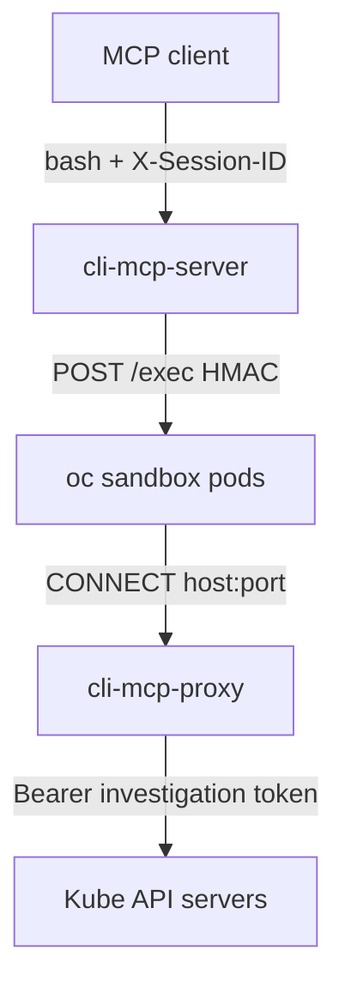

# CLI MCP — credential-isolating proxy

**Status:** Paused — Q1 decided (real operator); remaining questions and this doc’s HOW wait on the operator **implementation**

**Related:** [Questions](credential-proxy-questions.md) · [Operator HOW](cli-mcp-operator-design.md) · [As-built design](../design.md) · [Architecture overview](../architecture-overview.md) · [Umbrella analysis](../../../docs/proposals/cli-mcp-credential-proxy.md)

> **Paused.** Q1: instance infrastructure (proxy Deployment, CA, dummy kubeconfig, NetworkPolicies, MCP Deployment) will be managed by a **CLI MCP Operator** (CR per instance), not by an ensure-loop in the MCP server. The MCP process stays the stateless `bash` / session data plane.
>
> This document is the **WHAT**: components, security invariants, network topology. Treat HOW (who applies objects, flags, in-process reconcile, implementation phases below) as **stale until rewritten against the operator**. The operator HOW is [Final](cli-mcp-operator-design.md). Q2–Q12 in the [questions doc](credential-proxy-questions.md) stay paused until that operator is implemented. Do not implement the proxy stack in `cmd/server`.

This is proxy design for an **open-source Kubernetes operator**. Docs describe the product any cluster can install. First-party internal deploy is one catalog consumer, not part of the operator API.

v1 gives an MCP client a per-session `oc`/`kubectl` bash sandbox whose **effective** cluster identity is always the investigation ServiceAccount, even if the model passes `--token`, `--server`, `--kubeconfig`, or a token copied from another MCP tool.

## Overview

CLI MCP is a stateless control plane plus per-session sandbox pods (`bash` over HMAC-authenticated `/exec`). Today the investigation kubeconfig Secret is mounted into every sandbox (`pkg/session/manager.go`). The sandbox image includes `oc`, `kubectl`, and `curl`. There is no command allowlist. That is a token-replay path:

1. Another MCP tool, or anything the sandbox can read, can yield a projected SA token or a kubeconfig-like file. The model can feed that into the **same** bash session.
2. Client-side redaction of tool output sent back to the LLM does not stop a **same-sandbox** pipeline (`cat … | oc --token …`) where the token never returns to the client.
3. `oc --token <stolen>` or `curl -H Authorization:` talks to the API with that identity. Read-only investigation RBAC on the **mounted** kubeconfig is bypassed.

NetworkPolicy and a dummy kubeconfig are not enough on their own: `unset HTTPS_PROXY` / `--server` must fail at the network, and any `Authorization` that does reach the API must be **stripped and replaced** with the investigation token.

This design adds a third binary — **`cli-mcp-proxy`** — a MITM forward proxy copied from `claw-operator` (own image, own lifecycle). Sandbox pods receive a dummy kubeconfig and can reach **only** that proxy. The proxy holds the real kubeconfig and injects tokens.

**v1 scope:** one MCP instance, one sandbox image (`oc`/`kubectl`), one proxy (kube API hosts only).

A second class (illustrated as **curl**: no `oc`, HTTP(S) allowlist, must not reach kube APIs) is **architecture-only and out of scope for v1**. It exists so v1 labels, NetworkPolicies, and “one proxy per MCP instance” do not paint us into a shared-proxy corner.

## Design Principles

1. **Sandbox remains the security boundary** — no bash command allowlists. Capability is image + investigation RBAC + proxy L7 + NetworkPolicy.
2. **The sandbox never holds a useful cluster credential** — dummy kubeconfig token, `automountServiceAccountToken: false`, sandbox pod SA has no RoleBindings.
3. **Strip then inject** — client `Authorization` / impersonation headers are discarded; the proxy injects the configured credential for that host. Stolen tokens in the sandbox cannot be replayed through the proxy.
4. **NetworkPolicy is what makes the proxy mandatory** — dummy kubeconfig is convenience; egress-to-proxy-only is the control. Direct API, `--server`, and `unset HTTPS_PROXY` fail closed.
5. **One proxy per MCP instance / class, shared by all sessions of that class** — not a sidecar (shared netns = bypass), not per-session (same identity anyway).
6. **Do not share a proxy across classes** — a union allowlist would let the `oc` sandbox `CONNECT` to whatever a later class may reach. Curl in this doc is only that illustration.
7. **Do not consume the claw-operator proxy image** — copy the MITM + kubernetes injector into this repo and ship `cli-mcp-proxy`.
8. **No namespace EgressFirewall to kube API IPs once the proxy is in place** — that EF was a no-proxy stopgap and would reopen direct API from sandbox pods.
9. **MCP stays a dumb shell proxy** — it still does not parse bash. Credential isolation is a network/identity feature, not a command filter.
10. **Fail closed** — if the proxy, dummy kubeconfig, or NetworkPolicies are not ready, do not create sandbox pods that could egress more freely.

Q1 (ownership): **CLI MCP Operator** — see [questions](credential-proxy-questions.md). The operator is HOW; this list is WHAT it must be able to represent.

## Architecture / How It Works

### As-built (today)

```
MCP client ──bash + X-Session-ID──► cli-mcp-server
                                      │ POST /exec (HMAC)
                                      ▼
                               sandbox pod
                               KUBECONFIG=/config/kubeconfig  ← real Secret
                               automount SA token: default true
                                      │
                                      ▼
                               kube API (unrestricted egress)
```

### v1 (`oc` class)

```
MCP client
  │  bash + X-Session-ID
  ▼
cli-mcp-server (instance=oc)
  │  POST /exec (HMAC) to sandbox :8090
  ▼
oc sandbox pods
  dummy KUBECONFIG (real server URLs, placeholder token, proxy CA)
  HTTPS_PROXY=http://cli-mcp-proxy-oc:8080
  automountServiceAccountToken: false
  │  CONNECT api.<cluster>:6443
  ▼
cli-mcp-proxy (MITM)
  real kubeconfig Secret (tokens)
  strip Authorization + Impersonate-*
  inject investigation Bearer for that hostname:port
  │
  ▼
kube API server(s)   RBAC = investigation SA (get/list/watch, no exec)
```



Later class (**example only, not v1**) — same MITM binary, different instance / image / route ConfigMap / NPs:

```
cli-mcp-server (instance=curl)     out of scope for v1
  ▼
curl sandbox pods                  no kubeconfig / no oc
  HTTPS_PROXY=http://cli-mcp-proxy-curl:8080
  │  CONNECT <allowed-http-hosts>
  ▼
cli-mcp-proxy-curl                 routes = curl allowlist; not kube API
```

### Traffic rules the proxy enforces

On `CONNECT` and on each MITM’d request:

| Step | Behavior |
|---|---|
| Host allowlist | `MatchRoute` on `hostname:port` from the route list (derived from kubeconfig cluster servers). Unknown host → 403, no tunnel. |
| MITM | Kubernetes routes always MITM (credential injection). Leaf certs signed by the proxy CA. Dummy kubeconfig’s `certificate-authority-data` is that CA so `oc`/`kubectl` trust the intercept. |
| Strip | Remove `Authorization`, `Impersonate-*`, `X-Api-Key`, `Proxy-Authorization` on the **tunneled** request (same list as claw `StripAuthHeaders`). |
| Inject | `kubernetes` injector maps `hostname:port` → token from the **real** kubeconfig. |
| Upstream TLS | Proxy verifies the real API server using each cluster’s original CA (`caCert` on the route), not `InsecureSkipVerify`. |

`oc --token <stolen>`, `oc --kubeconfig /workspace/leaked`, and `curl -H 'Authorization: Bearer …'` that still go through `HTTPS_PROXY` therefore authenticate as the investigation SA.

### What NetworkPolicy does (both directions)

NetworkPolicy is **not** optional. Without it the model unsets `HTTPS_PROXY` and talks to the API with any token.

| Policy | Selects | Allows |
|---|---|
| **Sandbox egress** | This instance’s sandbox pods | TCP `:8080` to **this** instance’s proxy pods; DNS (UDP/TCP 53 and 5353, OpenShift DNS in `openshift-dns` when on OpenShift) |
| **Sandbox ingress** | This instance’s sandbox pods | TCP `:8090` only from this instance’s MCP server pods (already in the as-built design) |
| **Proxy ingress** | This instance’s proxy pods | TCP `:8080` only from this instance’s sandbox pods. **This stops unauthorized clients** (the MCP client, other MCP servers, a later curl sandbox, a random pod in the instance namespace). |
| **Proxy egress** | This instance’s proxy pods | DNS + kube API ports. Tightness of destinations is [Q4](credential-proxy-questions.md). |

A NetworkPolicy with `policyTypes: [Egress]` on sandbox pods makes those pods default-deny egress except the listed rules. A namespace-wide default-deny is not required.

Selectors must be **instance-specific** (`cli-mcp.redhat.com/instance=<CR name>` plus `component`), not a shared `component=sandbox` alone. Same namespace, two future instances: `oc` sandboxes must not reach the curl proxy (and vice versa). Curl = example, not v1. (Operator Q8 already dropped as-built `tarsy.redhat.com/*` keys.)

Proxy Service is **ClusterIP only** — no Route, NodePort, or LoadBalancer.

Do **not** add an EgressFirewall that allows sandbox pods to kube API IPs.

> **Open question:** optional `Proxy-Authorization` on CONNECT as a belt beyond NP — see [Q3](credential-proxy-questions.md).
>
> **Open question:** CONNECT to raw IPs — see [Q5](credential-proxy-questions.md).
>
> **Open question:** L7 denylist of `pods/exec` and related subresources — see [Q6](credential-proxy-questions.md).

### Dummy kubeconfig

Copied from claw `sanitizeKubeconfig`:

- Preserve clusters (real `server` URLs), contexts, namespaces.
- Replace every user token with `proxy-managed-token`. Clear `tokenFile`.
- Reject kubeconfigs that use client certs, exec, auth-provider, or basic auth (token-only, same as claw ADR-0003).
- Set each cluster’s `certificate-authority-data` to the **proxy CA** (not the real API CA). Clear `insecure-skip-tls-verify`.
- Real API CAs go on the proxy **route** `caCert` so the proxy can verify upstream.

Delivery: ConfigMap (no real credentials), mounted read-only at `/config` with `KUBECONFIG=/config/kubeconfig`. The real kubeconfig Secret is mounted **only** on the proxy.

Today `buildBasePodSpec` mounts Secret `cli-mcp-investigation-kubeconfig` into every sandbox, including the warm pool. That mount becomes the dummy ConfigMap. Warm pool pods get the same dummy + `HTTPS_PROXY`; they have nothing useful to steal.

### Identities (three, not two)

| Identity | Where | Purpose |
|---|---|---|
| `cli-mcp-server` SA | MCP server pod | Sandbox pods plus session auth Secret **create/delete** (no secret get/list/watch). NPs, CA, dummy kubeconfig are the operator (Q1). In-cluster client. **Not** used for investigation API calls. |
| Investigation tokens | Real kubeconfig Secret on the **proxy** | get/list/watch on every cluster `server` in that kubeconfig. **No `pods/exec`**, no secrets, no impersonate, no VM start/stop, no `nodes/proxy`. Dedicated Secret — do **not** reuse an SA or kubeconfig that already has exec, VM mutate, or `nodes/proxy`. |
| Sandbox pod SA | Sandbox pods | Exists because OpenShift requires an SA. **No RoleBindings. `automountServiceAccountToken: false`.** Avoids a second in-cluster identity beside the dummy kubeconfig. |

> **Open question:** exact investigation ClusterRole — see [Q2](credential-proxy-questions.md).
>
> **Open question:** sandbox SA name — see [Q9](credential-proxy-questions.md). Operator Q12 already chose a dedicated sandbox SA with automount false; proxy Q9 should not re-litigate that.

Current as-built sets `ServiceAccountName: cli-mcp-investigation-sa` and does **not** set `automountServiceAccountToken`. Kubernetes defaults that to **true**, so today a sandbox would also get a projected token for that SA. That must not survive this change. (Operator phase already switches the pod SA and automount; this pass swaps the mounted kubeconfig for dummy.)

### Images (v1)

| Image | Binary | Role |
|---|---|---|
| `cli-mcp-server` | `cmd/server` | MCP `bash`, session lifecycle, (Q1) reconcile derived objects |
| `cli-mcp-sandbox` | `cmd/agent` + `oc`/`kubectl`/`jq`/`yq`/`curl` | Per-session bash. Unchanged CLIs; env/mounts change. |
| `cli-mcp-proxy` | `cmd/proxy` | MITM forward proxy |

CD (`.github/workflows/cd.yml`) gains a third matrix entry. `Containerfile.proxy` is a minimal UBI image like the server.

### Package layout (target)

```
cmd/server/      MCP server (existing) + startup reconcile
cmd/agent/       sandbox agent (unchanged)
cmd/proxy/       new — claw-style flags: --config, --ca-cert, --ca-key, --listen
pkg/session/     pod spec: dummy CM, HTTPS_PROXY, labels, automount false
pkg/proxy/       MITM server + kubernetes injector (copied/adapted from claw)
pkg/kubeconfig/  validate token-only kubeconfig, sanitize dummy, build route JSON
pkg/infra/       CA ensure, dummy ConfigMap, NetworkPolicies  (shape depends on Q1)
```

> **Open question:** how much of claw’s injector surface to copy — see [Q7](credential-proxy-questions.md).

`pkg/infra` / “startup reconcile” above is **stale HOW** (Q1: operator owns those objects, not `cmd/server`).

### Sandbox pod spec changes

On top of the as-built spec (`buildBasePodSpec` / warm pool):

| Field | v1 |
|---|---|
| Labels | Operator Q8: `cli-mcp.redhat.com/component=sandbox`, `cli-mcp.redhat.com/session-id` when assigned, `cli-mcp.redhat.com/instance=<CR name>`. Replace as-built `tarsy.redhat.com/*`. Proxy pods: `component=proxy` + same instance. |
| `automountServiceAccountToken` | `false` |
| `serviceAccountName` | Dedicated sandbox SA (operator Q12 / [Q9](credential-proxy-questions.md)), not the investigation SA |
| kubeconfig volume | ConfigMap dummy, not the real Secret |
| Env | `KUBECONFIG=/config/kubeconfig` (unchanged path); `HTTP_PROXY` + `HTTPS_PROXY` = `http://<proxy-service>:8080`; `NO_PROXY=127.0.0.1,localhost,::1` so the agent loopback readiness probe and local curl do not go through the proxy. **Do not** put `.svc`, `.cluster.local`, or API hostnames in `NO_PROXY` — that would bypass the proxy for in-cluster API. |
| Readiness | Unchanged: exec `curl` to `127.0.0.1:8090/health` (loopback; works with server-only ingress NP) |

`NO_PROXY` is a load-bearing footgun: a broad cluster-local list would let `oc` reach `kubernetes.default.svc` directly.

### Proxy configuration

Route list JSON (claw format), one route per kubeconfig cluster server:

```json
{
  "routes": [
    {
      "domain": "api.host.example.com:6443",
      "injector": "kubernetes",
      "kubeconfigPath": "/etc/kube/config",
      "caCert": "<base64 PEM of real API CA>"
    }
  ]
}
```

v1 enables only kubernetes routes. The binary stays route-list driven so a later class is a new instance + ConfigMap, not a new architecture.

Real kubeconfig: admin-provided Secret (GitOps, External Secrets, or `kubectl`). Cluster admin provisions investigation SAs and tokens; this operator does not mint tokens.

> **Open question:** proxy restart when that Secret rotates — see [Q11](credential-proxy-questions.md).
>
> **Open question:** CA create-if-missing vs rotation — see [Q10](credential-proxy-questions.md).

### MCP server flags (additive)

Existing flags stay. Additions (names indicative):

| Flag | Role |
|---|---|
| `--instance-name` | Label + resource name suffix (v1 default `oc`) |
| `--investigation-kubeconfig-secret` | Real kubeconfig (proxy mount / dummy source) |
| `--proxy-service` | DNS name used in `HTTPS_PROXY` |
| `--dummy-kubeconfig-configmap` | Well-known dummy ConfigMap name |
| `--proxy-ca-secret` | Proxy CA Secret name |

Exact reconcile loop vs “GitOps already created it” depends on Q1 (decided: **operator** renders these onto the MCP Deployment; MCP does not watch the CR).

`--kubeconfig` on the server remains the **MCP’s** client-go config for managing sandbox resources (in-cluster in production). It is not the investigation kubeconfig.

### What does not change

- Single MCP tool: `bash`. No command filter.
- `X-Session-ID`, HMAC `/exec`, warm pool, idle GC, `DELETE /sessions/{id}`.
- Namespace-pinned `exec` / file forensics, if needed, stay on a **different** tool. This proxy does not provide `oc exec`.
- Client-side data masking is still useful for tokens that **do** return to the LLM; it is not a replay control.

## Core Concepts

| Concept | Role |
|---|---|
| **Instance / class** | One MCP Deployment + one sandbox image + one proxy + one NP set. v1: `oc`. A later curl instance is a second CR of the same operator with different flags/image — **not v1**. |
| **Dummy kubeconfig** | What `oc`/`kubectl` read in the sandbox. Real hosts, fake token, proxy CA. |
| **Real kubeconfig** | Tokens + real API CAs. Proxy only. Token-only auth. |
| **MITM forward proxy** | `HTTPS_PROXY` + CONNECT. Clients keep real hostnames. A kube-API reverse proxy would not extend to a later non-kube class. |
| **Strip-then-inject** | Stolen `Authorization` cannot survive the hop to the API. |
| **Proxy ingress NP** | Only this instance’s sandbox pods may use the proxy. |
| **Sandbox egress NP** | Sandboxes cannot skip the proxy. |
| **Investigation RBAC** | Last line if injection works as designed: even “successful” API calls are view-only, no exec. |

## Implementation Plan

**Paused.** Do not execute these phases as written. They assume in-process MCP ownership of child objects (pre-Q1). After the operator is implemented, rewrite this plan as operator reconcilers + a later proxy pass.

### Phase 0 — Decisions

Q1 done (operator). Q2–Q12 paused. Operator HOW: [cli-mcp-operator-design.md](cli-mcp-operator-design.md) (Final).

### Phase 1 — Proxy binary in this repo

- Add `cmd/proxy` + `pkg/proxy` (goproxy MITM, route JSON, `StripAuthHeaders`, kubernetes injector, upstream CA pool).
- Unit tests: route match (host:port), unknown host CONNECT rejected, Authorization stripped and replaced, token-only kubeconfig validation, sanitize swaps CA + dummy token.
- `Containerfile.proxy`, `make build-proxy` / `image-proxy`, CD matrix entry.
- **Verify:** `go test ./pkg/proxy/... ./pkg/kubeconfig/...`; local CONNECT to a fake API with dummy vs real token.

### Phase 2 — Sandbox pod contract

- Dummy ConfigMap mount; `HTTP_PROXY`/`HTTPS_PROXY`/`NO_PROXY`; `automountServiceAccountToken: false`; instance label; sandbox SA.
- Update `pkg/session` tests (`buildBasePodSpec`, warm pool spec).
- **Verify:** existing session/pool tests; golden pod spec assertions for env, volumes, automount, labels.

### Phase 3 — Derived cluster objects + fail-closed

- CA ensure, dummy ConfigMap, four NetworkPolicies, route ConfigMap — **owned per Q1** (operator).
- MCP RBAC in GitOps for whatever the server applies.
- Startup: if proxy/dummy/NPs are not ready, do not create sandbox pods ([Q12](credential-proxy-questions.md)).
- **Verify:** fake client-go tests for reconcile; NP selectors cannot match a different instance label.

### Phase 4 — First-party install (separate from this repo)

- Catalog consumer: `CliMcpInstance` + Secrets + investigation ClusterRole(s)+bindings + cluster RBAC, in whatever namespace that environment uses. Operator already owns MCP Deployment (kube-rbac-proxy sidecar), and in this pass proxy Deployment+ClusterIP Service, SAs, dummy/routes/NPs.
- Wire the MCP client to the instance only after it is Ready (including proxy children).
- **Do not** add namespace EgressFirewall to API IPs.
- **Verify:** `kubectl auth can-i` as investigation SA (no exec, no secrets get, no impersonate); NetworkPolicy from a throwaway pod in the instance namespace cannot CONNECT to the proxy; sandbox cannot reach API IPs.

### Phase 5 — Enablement

- Confirm `oc --token` / `curl -H Authorization` through the sandbox still only has investigation RBAC. Confirm `unset HTTPS_PROXY` / `oc --server` fail. Then production.

## Open Questions

Full options: [credential-proxy-questions.md](credential-proxy-questions.md). **Q2–Q12 paused** pending operator implementation.

| # | Topic |
|---|---|
| [Q1](credential-proxy-questions.md) | **Decided:** CLI MCP Operator (not in-process MCP, not GitOps-static) |
| [Q2](credential-proxy-questions.md) | Investigation ClusterRole scope |
| [Q3](credential-proxy-questions.md) | Proxy-Authorization belt |
| [Q4](credential-proxy-questions.md) | Proxy egress tightness |
| [Q5](credential-proxy-questions.md) | CONNECT to raw IPs |
| [Q6](credential-proxy-questions.md) | L7 denylist for kube subresources |
| [Q7](credential-proxy-questions.md) | How much claw proxy code to copy |
| [Q8](credential-proxy-questions.md) | Instance label / naming — **constrained by operator Q8** (`cli-mcp.redhat.com`; drop `tarsy.redhat.com`) |
| [Q9](credential-proxy-questions.md) | Sandbox pod ServiceAccount — **constrained by operator Q12** (dedicated SA, automount false) |
| [Q10](credential-proxy-questions.md) | Proxy CA lifecycle |
| [Q11](credential-proxy-questions.md) | Investigation kubeconfig rotation |
| [Q12](credential-proxy-questions.md) | Fail-closed until proxy is ready |

## Out of scope / non-goals

- Command allowlists on `bash`.
- `oc exec` / port-forward / attach through the proxy (use a namespace-pinned tool if you need that).
- Sharing the claw-operator proxy image or extracting a new common proxy repo.
- Namespace EgressFirewall to kube API IPs **together with** the proxy.
- Per-session proxy pods or proxy sidecars.
- One shared proxy for multiple classes (union allowlist).
- **A curl (or any non-oc) MCP instance, sandbox image, or proxy — v1 is oc/kubectl + kube-API proxy only.** Curl in this doc is only to illustrate a second class.
- Automatic proxy CA rotation (Q10 may confirm generate-once).
- Per-user credentials (shared investigation kubeconfig, unchanged from as-built).
- Interactive stdin (`oc edit`, `oc exec -it`).
