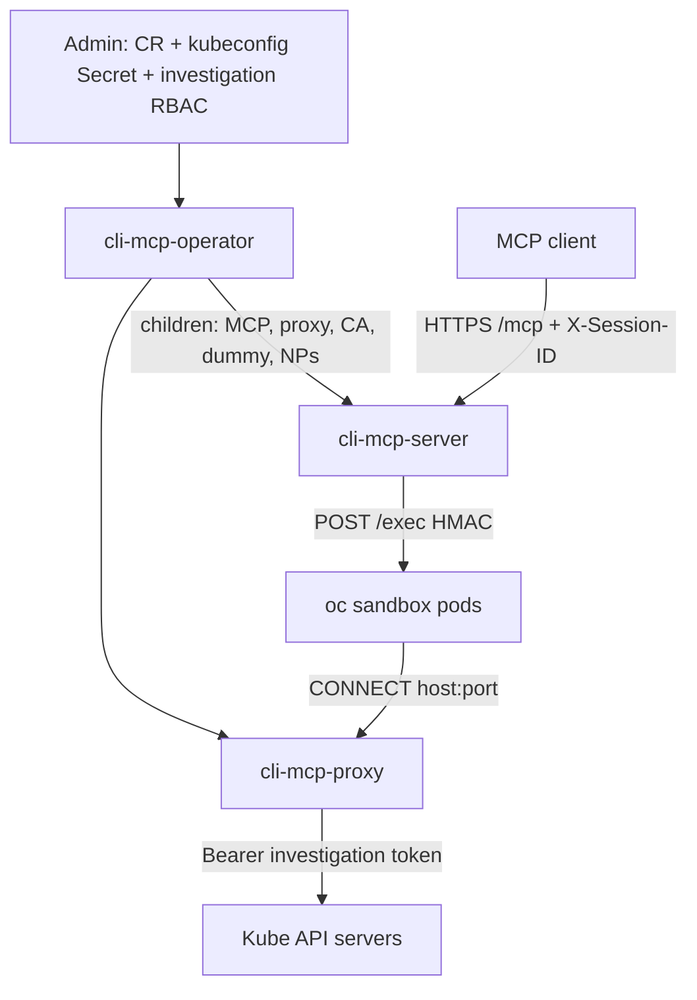

# CLI MCP — credential-isolating proxy

**Status:** Final

**Related:** [Questions](credential-proxy-questions.md) · [Operator HOW](cli-mcp-operator-design.md) · [As-built design](../design.md) · [Architecture overview](../architecture-overview.md)

This is **Phase 7**: the operator (phases 1–5) is implemented. This document is the proxy **WHAT** plus **HOW against that operator**. Q1–Q15 are decided — see the [questions doc](credential-proxy-questions.md).

This is proxy design for an **open-source Kubernetes operator**. Docs describe the product any cluster can install. First-party internal deploy is one catalog consumer, not part of the operator API.

v1 gives an MCP client a per-session `oc`/`kubectl` bash sandbox whose **effective** cluster identity is always the investigation ServiceAccount, even if the model passes `--token`, `--server`, `--kubeconfig`, or a token copied from another MCP tool.

The pre-operator pass is the completed **sketch** (components, threat, topology). This pass does not add a second sketch file.

## Overview

CLI MCP is a stateless control plane plus per-session sandbox pods (`bash` over HMAC-authenticated `/exec`). Today the operator and MCP both call `pkg/session.BuildBasePodSpec`, which **mounts the admin investigation kubeconfig Secret** (`cli-mcp-<name>-kubeconfig`) into every sandbox. The sandbox image includes `oc`, `kubectl`, and `curl`. There is no command allowlist. Sandbox ingress is locked (`:8090` from this instance’s `component=server` pods). Sandbox **egress is unrestricted**. That is a token-replay path:

1. Another MCP tool, or anything the sandbox can read, can yield a projected SA token or a kubeconfig-like file. The model can feed that into the **same** bash session.
2. Client-side redaction of tool output sent back to the LLM does not stop a **same-sandbox** pipeline (`cat … | oc --token …`) where the token never returns to the client.
3. `oc --token <stolen>` or `curl -H Authorization:` talks to the API with that identity. Read-only investigation RBAC on the **mounted** kubeconfig is bypassed.

NetworkPolicy and a dummy kubeconfig are not enough on their own: `unset HTTPS_PROXY` / `--server` must fail at the network, and any `Authorization` that does reach the API must be **stripped and replaced** with the investigation token.

This design adds a fourth **built** image — **`cli-mcp-proxy`** — a MITM forward proxy copied from `claw-operator` (own image, own lifecycle). The catalog already pins a fifth **related** image (`RELATED_IMAGE_KUBE_RBAC_PROXY`) that this repo does not build. The **operator** creates one MITM proxy per `CliMcpInstance`. Sandbox pods receive a dummy kubeconfig and can reach **only** that proxy. The proxy holds the real kubeconfig and injects tokens.

**v1 scope:** one MCP instance, one sandbox image (`oc`/`kubectl`), one proxy (kube API hosts only).

A second class (illustrated as **curl**: no `oc`, HTTP(S) allowlist, must not reach kube APIs) is **architecture-only and out of scope for v1**. It exists so v1 labels, NetworkPolicies, and “one proxy per MCP instance” do not paint us into a shared-proxy corner.

## Design Principles

1. **Sandbox remains the security boundary** — no bash command allowlists. Capability is image + investigation RBAC + proxy L7 + NetworkPolicy.
2. **The sandbox never holds a useful cluster credential** — dummy kubeconfig token, `automountServiceAccountToken: false`, sandbox pod SA has no RoleBindings.
3. **Strip then inject** — client `Authorization` / impersonation headers are discarded; the proxy injects the configured credential for that host. Stolen tokens in the sandbox cannot be replayed through the proxy.
4. **NetworkPolicy is what makes the proxy mandatory** — dummy kubeconfig is convenience; egress-to-proxy-only is the control. Direct API, `--server`, and `unset HTTPS_PROXY` fail closed.
5. **One proxy per MCP instance / class, shared by all sessions of that class** — not a sidecar (shared netns = bypass), not per-session (same identity anyway).
6. **Do not share a proxy across classes** — a union allowlist would let the `oc` sandbox `CONNECT` to whatever a later class may reach. Curl in this doc is only that illustration.
7. **Do not consume the claw-operator proxy image** — copy the MITM + kubernetes injector into this repo and ship `cli-mcp-proxy`.
8. **No namespace EgressFirewall to kube API IPs once the proxy is in place** — that EF was a no-proxy stopgap and would reopen direct API from sandbox pods.
9. **MCP stays a dumb shell proxy** — it still does not parse bash. Credential isolation is a network/identity feature, not a command filter. MCP does **not** watch `CliMcpInstance` (operator Q9).
10. **Fail closed** — if the proxy, dummy kubeconfig, or NetworkPolicies are not ready, do not create sandbox pods that could egress more freely. The operator enforces this (pool + MCP rollout order). MCP does not grow an infra ensure-loop.
11. **Operator-created SA ⇒ operator-created cluster binding.** The proxy pod SA needs no cluster RBAC (tokens come from the mounted kubeconfig). Investigation ClusterRole/Binding stay **admin/GitOps** — the operator does not mint those identities.
12. **Same ownership split as today.** Admin provides `cli-mcp-<name>-kubeconfig`. Operator derives dummy ConfigMap + route ConfigMap + CA, mounts the real Secret **only** on the proxy, and **unmounts it from sandbox pods**. Do not delete the admin Secret.

## Architecture / How It Works

### As-built (operator phases 1–5, before this pass)

```
MCP client ──HTTPS /mcp + X-Session-ID──► cli-mcp-server (kube-rbac-proxy :8443)
                                              │ POST /exec (HMAC)
                                              ▼
                                       sandbox pod
                                       KUBECONFIG=/config/kubeconfig  ← real Secret
                                       SA cli-mcp-<name>-sandbox, automount false
                                              │
                                              ▼
                                       kube API (unrestricted egress)
```

Operator children today (CR `metadata.name=oc`): MCP Deployment+Service+SA+Role/RB (`cli-mcp-<name>`), client SA/Role/RB (`cli-mcp-<name>-client`, namespaced `climcpinstances/mcp`), kube-rbac-proxy ConfigMap (`cli-mcp-<name>-krp`), shared ClusterRoleBinding `cli-mcp-auth-delegator` (subjects = live MCP SAs), sandbox SA (`cli-mcp-<name>-sandbox`), HMAC Secret, sandbox **ingress** NP only. Warm pool and idle GC are operator-owned. MCP always claims then creates on demand. `BuildBasePodSpec` always mounts Secret `cli-mcp-<name>-kubeconfig`. Ready does **not** parse that kubeconfig (key presence only).

### v1 (`oc` class) after this pass

```
MCP client
  │  bash + X-Session-ID
  ▼
cli-mcp-server (instance=<CR name>)
  │  POST /exec (HMAC) to sandbox :8090
  ▼
oc sandbox pods
  dummy KUBECONFIG (real server URLs, placeholder token, proxy CA)
  HTTPS_PROXY=http://cli-mcp-<name>-proxy:8080
  automountServiceAccountToken: false
  │  CONNECT api.<cluster>:6443
  ▼
cli-mcp-proxy (MITM)
  real kubeconfig Secret (tokens)
  strip Authorization + Impersonate-*
  inject investigation Bearer for that hostname:port
  │
  ▼
kube API server(s)   RBAC = investigation SA (get/list/watch, no exec)
```


```mermaid
flowchart TB
  Admin["Admin: CR + kubeconfig Secret + investigation RBAC"]
  Op["cli-mcp-operator"]
  Client["MCP client"]
  MCP["cli-mcp-server"]
  Sandbox["oc sandbox pods"]
  Proxy["cli-mcp-proxy"]
  API["Kube API servers"]

  Admin --> Op
  Op -->|"children: MCP, proxy, CA, dummy, NPs"| MCP
  Op --> Proxy
  Client -->|"HTTPS /mcp + X-Session-ID"| MCP
  MCP -->|"POST /exec HMAC"| Sandbox
  Sandbox -->|"CONNECT host:port"| Proxy
  Proxy -->|"Bearer investigation token"| API
```

Later class (**example only, not v1**) — same MITM binary, different instance / image / route ConfigMap / NPs:

```
cli-mcp-server (instance=curl)     out of scope for v1
  ▼
curl sandbox pods                  no kubeconfig / no oc
  HTTPS_PROXY=http://cli-mcp-curl-proxy:8080
  │  CONNECT <allowed-http-hosts>
  ▼
cli-mcp-curl-proxy                 routes = curl allowlist; not kube API
```

### Who owns what (HOW against the operator)

| Owner | Objects / jobs |
|---|---|
| **Admin / GitOps** | `CliMcpInstance`, Secret `cli-mcp-<name>-kubeconfig` (key `kubeconfig`), TLS `cli-mcp-<name>-tls` (non-OpenShift), **investigation** SA + ClusterRole/Binding whose tokens are minted into that kubeconfig (operator does not create them), SCC/PSA as needed. TokenRequest against `status.clientServiceAccount` after Ready. |
| **Operator** | Everything it already owns (MCP + client SA/Role, KRP ConfigMap, shared `cli-mcp-auth-delegator`), **plus** MITM proxy Deployment+ClusterIP Service+SA, proxy CA Secret (generate-once), dummy kubeconfig ConfigMap, route ConfigMap, sandbox **egress** rules, proxy ingress+egress NP. Derives dummy + routes by **parsing** the admin kubeconfig. Stamps kubeconfig `resourceVersion` on the MITM proxy pod template (same pattern as HMAC / KRP RV on MCP). Unmounts the real Secret from sandboxes. Fail-closed pool/MCP. Ready includes proxy children. |
| **MCP** | Unchanged hot path: claim / on-demand create / `/exec` / `DELETE /sessions/{id}`. Flag-driven. Does **not** reconcile proxy objects. New flags tell `BuildBasePodSpec` to mount the dummy ConfigMap and set `HTTP_PROXY`/`HTTPS_PROXY`/`NO_PROXY`. |
| **`cli-mcp-proxy` process** | MITM CONNECT. Reads route JSON + CA + kubeconfig at **startup** only. |

Do **not** put an ensure-loop in `cmd/server`. Do **not** freeze dummy kubeconfig or routes in GitOps.

### Traffic rules the proxy enforces

On `CONNECT` and on each MITM’d request:

| Step | Behavior |
|---|---|
| Host allowlist | `MatchRoute` on `hostname:port` from the route list (derived from kubeconfig cluster servers). Unknown host → 403, no tunnel. Raw IP CONNECT is allowed **only** if that `ip:port` is literally a kubeconfig `server` (Q5). |
| MITM | Kubernetes routes always MITM (credential injection). Leaf certs signed by the proxy CA. Dummy kubeconfig’s `certificate-authority-data` is that CA so `oc`/`kubectl` trust the intercept. |
| Strip | Remove `Authorization`, `Impersonate-*`, `X-Api-Key`, `Proxy-Authorization` on the **tunneled** request (same list as claw `StripAuthHeaders`). |
| L7 denylist | On kubernetes routes, reject paths whose subresource suffix is `exec`, `attach`, `portforward`, or `proxy` (Q6). `logs` and `watch` stay allowed. RBAC remains authoritative. |
| Inject | `kubernetes` injector maps `hostname:port` → token from the **real** kubeconfig. |
| Upstream TLS | Proxy verifies the real API server using each cluster’s original CA (`caCert` on the route), not `InsecureSkipVerify`. |

`oc --token <stolen>`, `oc --kubeconfig /workspace/leaked`, and `curl -H 'Authorization: Bearer …'` that still go through `HTTPS_PROXY` therefore authenticate as the investigation SA.

### What NetworkPolicy does (both directions)

NetworkPolicy is **not** optional. Without it the model unsets `HTTPS_PROXY` and talks to the API with any token.

| Policy | Selects | Allows |
|---|---|
| **Sandbox ingress** | This instance’s sandbox pods | TCP `:8090` only from this instance’s MCP server pods (**already shipped**; keep) |
| **Sandbox egress** | This instance’s sandbox pods | TCP `:8080` to **this** instance’s proxy pods; DNS (UDP/TCP 53 and 5353). **Add to the existing sandbox NP** (`cli-mcp-<name>-sandbox`) so we do not invent a second name that blows the 63-char budget at CR name 44. |
| **Proxy ingress** | This instance’s proxy pods | TCP `:8080` only from this instance’s sandbox pods. **This stops unauthorized clients** (the MCP client, other MCP servers, a later curl sandbox, a random pod in the instance namespace). |
| **Proxy egress** | This instance’s proxy pods | DNS (53/5353, `namespaceSelector: {}`) + TCP 443 and 6443 to `0.0.0.0/0` (and `::/0` if dual-stack). L7 `MatchRoute` is the real host allowlist (Q4). |

A NetworkPolicy with `policyTypes: [Egress]` on sandbox pods makes those pods default-deny egress except the listed rules. Folding egress into the existing ingress NP means `policyTypes: [Ingress, Egress]`. A namespace-wide default-deny is not required.

Selectors must be **instance-specific** (`cli-mcp.redhat.com/instance=<CR name>` plus `component`), not a shared `component=sandbox` alone.

Proxy Service is **ClusterIP only** — no Route, NodePort, or LoadBalancer.

Do **not** add an EgressFirewall that allows sandbox pods to kube API IPs.

DNS peers: copy claw’s portable rule (ports 53/5353, `namespaceSelector: {}`) so generic Kubernetes and OpenShift both work. That is slightly loose (DNS ports to any namespace); L7 still 403s unknown CONNECT.

### Dummy kubeconfig

Derived by the operator from the live admin Secret + proxy CA (not frozen in git). Claw’s `sanitizeKubeconfig` only replaces tokens; **this operator must also swap cluster CAs** so `oc` trusts MITM:

- Preserve clusters (real `server` URLs), contexts, namespaces.
- Replace every user token with `proxy-managed-token`. Clear `tokenFile`.
- Reject kubeconfigs that use client certs, exec, auth-provider, or basic auth (token-only).
- Set each cluster’s `certificate-authority-data` to the **proxy CA**. Clear `insecure-skip-tls-verify`.
- Real API CAs go on the proxy **route** `caCert` so the proxy can verify upstream.

Delivery: ConfigMap `cli-mcp-<name>-dummy`, data key `kubeconfig`, mounted read-only at `/config` with `KUBECONFIG=/config/kubeconfig`. The real kubeconfig Secret is mounted **only** on the proxy.

Warm pool pods get the same dummy + `HTTPS_PROXY`; they have nothing useful to steal.

### Identities

| Identity | Where | Purpose |
|---|---|---|
| `cli-mcp-<name>` SA | MCP server pod (kube-rbac-proxy sidecar + server) | Already operator-owned. Sandbox pods plus session auth Secret **create/delete**. Subject on shared CRB `cli-mcp-auth-delegator`. **Not** used for investigation API calls. |
| `cli-mcp-<name>-client` SA | MCP HTTP client | Already operator-owned. Namespaced Role `climcpinstances/mcp`. Token is **not** operator-minted (`status.clientServiceAccount`). |
| `cli-mcp-<name>-proxy` SA | MITM proxy pod | Operator-owned. **No RoleBindings. `automountServiceAccountToken: false`.** Upstream auth is the mounted kubeconfig, not a projected token. Dedicated SA — the kube-rbac-proxy sidecar stays on the MCP pod SA. |
| Investigation tokens | Real kubeconfig Secret on the **MITM proxy** | get/list/watch on every cluster `server` in that kubeconfig. **No `pods/exec`**, **no secrets**, no impersonate, no VM start/stop, no `nodes/proxy`. Admin-minted into `cli-mcp-<name>-kubeconfig`. Dedicated Secret — do **not** reuse an SA or kubeconfig that already has exec, VM mutate, or `nodes/proxy`. Sample ClusterRole in `config/samples/` (Q2: custom list, **not** `view`). |
| `cli-mcp-<name>-sandbox` SA | Sandbox pods | Already operator-owned. **No RoleBindings. `automountServiceAccountToken: false`.** |

### Child names (63-char labels, CR name ≤ 44)

Operator CEL already caps `metadata.name` at 44 so `cli-mcp-<name>-kubeconfig` fits. Proxy children must stay inside that budget. **Do not** use `cli-mcp-<name>-dummy-kubeconfig` (name+26 → 70 at name=44).

| Object | Name | Notes |
|---|---|---|
| MITM proxy Deployment, Service, SA, NP | `cli-mcp-<name>-proxy` | Suffix style, same as sandbox / client / krp (several kinds, one name). Not `cli-mcp-proxy-<name>`. |
| Proxy CA Secret | `cli-mcp-<name>-proxy-ca` | Keys `ca.crt` / `ca.key`. 61 chars at name=44. |
| Dummy kubeconfig ConfigMap | `cli-mcp-<name>-dummy` | Data key `kubeconfig`. Additional CM beside existing `cli-mcp-<name>-krp`. |
| Route ConfigMap | `cli-mcp-<name>-routes` | Data key `proxy-config.json`. |
| Sandbox SA + NP (ingress+egress) | `cli-mcp-<name>-sandbox` | Existing name; add egress. |
| Admin kubeconfig Secret | `cli-mcp-<name>-kubeconfig` | Unchanged. Not ownerRef’d. Longest child (63 at name=44). |

### Images (v1)

| Image | Binary | Role |
|---|---|---|
| `cli-mcp-operator` | `cmd/operator` | Reconcile, including proxy children |
| `cli-mcp-server` | `cmd/server` | MCP `bash`, session lifecycle |
| `cli-mcp-sandbox` | `cmd/agent` + `oc`/`kubectl`/`jq`/`yq`/`curl` | Per-session bash. Unchanged CLIs; env/mounts change. |
| `cli-mcp-proxy` | `cmd/proxy` | MITM forward proxy |

`RELATED_IMAGE_PROXY` on the operator Deployment (OLM `relatedImages`). Distinct from `RELATED_IMAGE_KUBE_RBAC_PROXY` — do not reuse that env, the `REPLACE_KUBE_RBAC_PROXY_IMAGE` placeholder, or the stamp-script identifier that already means kube-rbac-proxy. `hack/stamp-bundle-placeholders.py` / `replace-bundle-images.py` gain `REPLACE_PROXY_IMAGE` with **exactly one** match per field (same helper as the existing relatedImages). Empty `RELATED_IMAGE_PROXY` is apply-fail, same as empty `RELATED_IMAGE_SERVER` / `RELATED_IMAGE_KUBE_RBAC_PROXY` in `applyDeployment`.

No `spec.proxyImage`, no `spec.proxy`, no `spec.proxyContainer` in v1 (Q13). Catalog bump rolls every instance’s MITM proxy. Proxy container resources use DefaultConfig-like requests/limits (MCP may use `spec.serverContainer`; MITM has no equivalent).

CD/CI matrix today is three built images: operator, server, sandbox (`Containerfile.agent`). Add a fourth: `cli-mcp-proxy` / `Containerfile.proxy` (ubi-minimal like `Containerfile.server`, not the sandbox agent base). kube-rbac-proxy stays a relatedImages pin, not a matrix build. Proxy readiness: **TCP** on `:8080` (not `/bin/bash`; HTTP probes against the pod IP are the wrong tool here).

### Package layout (target)

```
cmd/server/      MCP server. New flags only. Must not import internal/controller or pkg/proxy.
cmd/agent/       sandbox agent (unchanged)
cmd/proxy/       new — claw-style flags: --config, --ca-cert, --ca-key, --listen
cmd/operator/    manager; applies proxy children
pkg/session/     pod spec: dummy CM or Secret, HTTPS_PROXY, reserved env, automount false
pkg/proxy/       MITM server + kubernetes + bearer + none injectors (copied/adapted from claw; no gateway/Slack/GCP/oauth2)
pkg/kubeconfig/  validate token-only kubeconfig, sanitize dummy (token + proxy CA), build route JSON
internal/controller/  CA generate-once, dummy/routes apply, proxy Deployment, NPs, Ready, fail-closed
```

```
cmd/server, cmd/agent  →  pkg/session (+ existing pkg/*)     not pkg/proxy
cmd/proxy              →  pkg/proxy + pkg/kubeconfig
cmd/operator           →  internal/controller + pkg/session + pkg/kubeconfig
pkg/session            ✗  api/  ✗  pkg/proxy
pkg/kubeconfig         ✗  api/
```

Extend `cmd/server/import_boundary_test.go` so the data-plane list includes `./cmd/proxy` (today it is `./cmd/server`, `./cmd/agent`, `./pkg/...`). Operator `Containerfile.operator` already COPY `pkg/`, so `pkg/kubeconfig` is in the manager image with no extra COPY. Server still COPY `cmd/server` + `pkg/` only. Proxy COPY `cmd/proxy` + `pkg/proxy` + `pkg/kubeconfig` only (keep session/sandbox packages out of that image). Operator must not import `pkg/proxy`.

### Sandbox pod spec changes

On top of today’s `BuildBasePodSpec` (instance+component labels, dedicated SA, automount false, non-root / drop-caps, exec curl loopback probe). **Two callers** use that builder: MCP on-demand create (flags from `mcpServerArgs`) and the operator warm pool (`poolSandboxConfig` in `overlay.go`). Both must take the dummy path in-cluster.

| Field | In-cluster v1 | Local `cmd/server` without proxy flags |
|---|---|---|
| kubeconfig volume | ConfigMap `cli-mcp-<name>-dummy` | Secret `cli-mcp-<name>-kubeconfig` (today) |
| Env | `KUBECONFIG=/config/kubeconfig`; `HTTP_PROXY` + `HTTPS_PROXY` = `http://cli-mcp-<name>-proxy:8080`; `NO_PROXY=127.0.0.1,localhost,::1` | `KUBECONFIG` + `HOME` only |
| Reserved env (ignored from `spec.sandbox.env`) | add `HTTP_PROXY`, `HTTPS_PROXY`, `NO_PROXY` to today’s `KUBECONFIG` / `HOME` / `SANDBOX_AUTH_TOKEN` | same reserved set (harmless if unused) |

`NO_PROXY` is a load-bearing footgun: a broad cluster-local list would let `oc` reach `kubernetes.default.svc` directly. **Do not** put `.svc`, `.cluster.local`, or API hostnames in `NO_PROXY`.

Overlay hash lives in the operator (`overlayFingerprint` / `overlayHash` in `internal/controller/overlay.go`), not in `pkg/session`. Today it is image+CPU/memory+env+pullPolicy only — it does **not** include `KubeconfigSecret`. **Add dummy ConfigMap name (or Secret name) and proxy URL** so the Secret→dummy cutover rebuilds unassigned pool pods. Assigned sessions keep the old spec until DELETE / idle GC / CR delete (same as overlay today).

### Proxy configuration

Route list JSON (claw format), one route per kubeconfig cluster server, written by the operator to ConfigMap `cli-mcp-<name>-routes`:

```json
{
  "routes": [
    {
      "domain": "api.host.example.com:6443",
      "injector": "kubernetes",
      "kubeconfigPath": "/etc/kube/config",
      "caCert": "<base64 PEM of real API CA>"
    }
  ]
}
```

v1 enables only kubernetes routes. The binary stays route-list driven so a later class is a new instance + ConfigMap, not a new architecture.

Real kubeconfig: admin-provided Secret (GitOps, External Secrets, or `kubectl`). Cluster admin provisions investigation SAs and tokens; this operator does not mint tokens.

Proxy Deployment: `NormalizeDeployment` then CreateOrUpdate (same as MCP — do not flap on API defaulting). Same pod security as MCP (non-root, drop ALL caps, runtime-default seccomp). Stamp annotation `cli-mcp.redhat.com/kubeconfig-resource-version` (and CA Secret RV) on the proxy pod template so token/CA rotation rolls the proxy (Q11). Mount the admin kubeconfig Secret at the path in route JSON (`/etc/kube/config`) and the CA Secret at `--ca-cert`/`--ca-key`. Do **not** SSA/CreateOrUpdate pool pods.

### MCP server flags (additive)

Existing required flags stay for identity (`--instance-name`, `--sandbox-service-account`, `--namespace`, …). Today `--kubeconfig-secret` is **required** (`cmd/server/flags.go`) and `mcpServerArgs` always passes it. After this pass validation is **XOR**: exactly one of `--kubeconfig-secret` or (`--dummy-kubeconfig-configmap` **and** `--proxy-url`). In-cluster `mcpServerArgs` **never** passes `--kubeconfig-secret`; it passes dummy ConfigMap name + `http://cli-mcp-<name>-proxy:8080`. Local without dummy flags keeps today’s Secret mount.

| Flag | Role |
|---|---|
| `--dummy-kubeconfig-configmap` | Well-known dummy ConfigMap name. If set (with `--proxy-url`), builder mounts ConfigMap not Secret. |
| `--proxy-url` | Value for `HTTP_PROXY`/`HTTPS_PROXY` (e.g. `http://cli-mcp-oc-proxy:8080`). |

`--kubeconfig` on the server remains the **MCP’s** client-go config for managing sandbox resources (in-cluster in production). It is not the investigation kubeconfig.

The operator still does **not** pass `--warm-pool-size` / `--idle-timeout`.

### Reconcile order and fail-closed

MCP does not watch the CR and will create on-demand pods whenever it is running. Ready-status alone does **not** stop that. The operator must:

1. **Apply order** (extend `applyChildren`; security objects **before** the MCP Deployment). HMAC stays before children. Shared `cli-mcp-auth-delegator` stays `applyAuthDelegatorCRB` after children (not a per-instance apply). Today: sandbox SA → MCP SA/Role/RB → Service → sandbox ingress NP → client SA/Role/RB → KRP ConfigMap → MCP Deployment. Insert MITM objects **after** KRP, **before** MCP Deployment: **proxy CA → dummy ConfigMap → route ConfigMap → proxy SA/Service/NP → proxy Deployment**, and fold egress into the existing sandbox NP apply. Then MCP Deployment with dummy flags.
2. **Pool mutate = false** until dummy ConfigMap exists, sandbox NP has egress, and proxy Service exists. (Today pool mutates whenever `applyChildren` succeeds.)
3. Do **not** create sandbox pods that still mount the real Secret after egress NP is in force (oc would break *and* the token would sit on disk). The builder cutover and overlay rebuild handle unassigned pods.

Catalog **ship order**: the `cli-mcp-server` image that understands dummy flags must be in the catalog **with** the operator that passes those flags. An operator that passes `--dummy-kubeconfig-configmap` to a server image that still requires `--kubeconfig-secret` will crash-loop MCP.

`status.Ready` (operator Q15) **folds proxy children into the same aggregate**. No separate `ProxyReady`. `missingChildren` today lists MCP/client/sandbox SAs, Roles/RBs, Service, sandbox NP, MCP Deployment, HMAC, KRP ConfigMap — add proxy SA/Service/Deployment/NP, dummy + routes ConfigMaps, CA Secret. Missing those → `ChildrenNotReady`. `readyGate` today only tests MCP Deployment Available; also require the MITM Deployment Available. If the MITM Deployment is the one that is not Available, keep reason `DeploymentUnavailable` and name that Deployment in the message. Unparseable or non-token-only kubeconfig → `KubeconfigInvalid` (Q14; new API reason — does not exist yet). Never put token material in condition messages. Missing/empty kubeconfig key stays `SecretKeysInvalid`. Empty CA keys stay `SecretKeysInvalid` (same as HMAC).

Finalizer: unchanged order (patch shared `cli-mcp-auth-delegator` subjects, scale MCP to 0, wait server pods, delete sandbox pods/secrets, remove finalizer). Do **not** delete the shared CRB. MITM proxy children have `ownerRef` → CR and GC after the finalizer drops. Do not wait for them in the finalizer. Do not delete the admin kubeconfig.

Dummy + routes ConfigMaps use the same namespaced configmaps verbs and `Owns(&corev1.ConfigMap{})` already used for `cli-mcp-<name>-krp`. Keep those off ClusterRole `manager-role`.

### What does not change

- Single MCP tool: `bash`. No command filter.
- `X-Session-ID`, HMAC `/exec`, warm pool, idle GC, `DELETE /sessions/{id}`.
- Two Pod writers and claim contract (operator Q5 / Phase 5).
- Namespace-pinned `exec` / file forensics, if needed, stay on a **different** tool. This proxy does not provide `oc exec`.
- Client-side data masking is still useful for tokens that **do** return to the LLM; it is not a replay control.
- Operator does not mint investigation tokens. HMAC generate-once stays as today.

## Core Concepts

| Concept | Role |
|---|---|
| **Instance / class** | One `CliMcpInstance` = one MCP Deployment + one sandbox image + one proxy + one NP set. v1 sample name `oc`. A later curl instance is a second CR — **not v1**. |
| **Dummy kubeconfig** | What `oc`/`kubectl` read in the sandbox. Real hosts, fake token, proxy CA. Operator-derived ConfigMap. |
| **Real kubeconfig** | Tokens + real API CAs. Proxy only. Token-only auth. Admin Secret, conventional name. |
| **MITM forward proxy** | `HTTPS_PROXY` + CONNECT. Clients keep real hostnames. A kube-API reverse proxy would not extend to a later non-kube class. |
| **Strip-then-inject** | Stolen `Authorization` cannot survive the hop to the API. |
| **Proxy ingress NP** | Only this instance’s sandbox pods may use the proxy. |
| **Sandbox egress NP** | Sandboxes cannot skip the proxy. |
| **Investigation RBAC** | Last line if injection works as designed: even “successful” API calls are a custom read-only ClusterRole (**not** `view` — no secrets, no exec). Admin-owned; sample in this repo. |
| **Fail-closed** | No sandbox create/claim path that races ahead of dummy + egress NP. |

## Implementation Plan

Q1–Q15 are decided. This sequence is **not** operator phases 1–5. Same PR as the first code PR must update these docs if behavior or a question changes (Phase 4/5 learning).

### P0 — Decisions

Done. Recorded in [credential-proxy-questions.md](credential-proxy-questions.md).

### P1 — Proxy binary in this repo

- Add `cmd/proxy` + `pkg/proxy` (goproxy MITM, route JSON, `StripAuthHeaders`, kubernetes + bearer + none injectors, upstream CA pool, Q6 denylist). Copy from in-tree `claw-operator/internal/proxy`. Do not copy gateway/Slack/GCP/oauth2/path_token/api_key.
- Add `pkg/kubeconfig`: token-only validation, sanitize (placeholder token **and** proxy CA), route JSON from kubeconfig cluster servers.
- Unit tests: route match (host:port), unknown host CONNECT rejected, Authorization stripped and replaced, token-only kubeconfig validation, sanitize swaps CA + dummy token, `logs`/`watch` still allowed, `exec`/`attach`/`portforward`/`proxy` rejected.
- `Containerfile.proxy` (ubi-minimal, like `Containerfile.server`), `make build-proxy` / `image-proxy`, CI/CD **fourth** matrix entry (today: operator, server, sandbox via `Containerfile.agent`). `RELATED_IMAGE_PROXY` + `REPLACE_PROXY_IMAGE` in stamp/replace scripts (**exactly one** match; do not collide with `REPLACE_KUBE_RBAC_PROXY_IMAGE`). Add `./cmd/proxy` to the import-boundary test.
- **Verify:** `go test ./pkg/proxy/... ./pkg/kubeconfig/...`; local CONNECT to a fake API with dummy vs real token.
- **Out of this PR:** operator children, sandbox builder cutover, catalog consume.

### P2 — Sandbox pod contract

- `BuildBasePodSpec`: if dummy ConfigMap + proxy URL set → ConfigMap mount + proxy env; else today’s Secret mount. `SandboxConfig` grows those fields; both MCP flags and (later) `poolSandboxConfig` use them.
- Reserved env: `HTTP_PROXY`, `HTTPS_PROXY`, `NO_PROXY` in `reservedSandboxEnv` (today: `KUBECONFIG` / `HOME` / `SANDBOX_AUTH_TOKEN`).
- MCP flags `--dummy-kubeconfig-configmap`, `--proxy-url`. XOR with `--kubeconfig-secret` (Q15). `mcpServerArgs` / `poolSandboxConfig` wiring waits for P3.
- `pkg/session`: add `ComponentProxy` (`component=proxy`). Only `sandbox` and `server` exist today.
- **Verify:** `pkg/session` golden pod spec (env, volumes, automount, labels) for both paths. Existing claim/pool unit tests stay green. Overlay hash stays P3 (`overlay.go`).
- **Out of this PR:** operator Ready / children.

### P3 — Operator children + fail-closed + Ready

Depends on P1+P2.

- Images: `RELATED_IMAGE_PROXY` on `Images` / `ImagesFromEnv`; fail `applyDeployment` (and proxy apply) if empty, same as server / kube-rbac-proxy.
- `mcpServerArgs`: pass `--dummy-kubeconfig-configmap` + `--proxy-url`; stop `--kubeconfig-secret`.
- `poolSandboxConfig`: dummy ConfigMap + proxy URL on `SandboxConfig` (not `KubeconfigSecret`). Overlay fingerprint includes those fields.
- CA Secret generate-once (Q10, HMAC-like: never overwrite a present Secret; empty keys stay `SecretKeysInvalid`).
- Parse admin kubeconfig → dummy ConfigMap + route ConfigMap; mount real Secret on MITM proxy only.
- Proxy Deployment+Service+SA+NP; fold egress into `applySandboxIngressNP` (already named `cli-mcp-<name>-sandbox`; today that apply runs **before** KRP — keep it; early egress is fail-closed). `NormalizeDeployment` on the MITM Deployment.
- Stamp kubeconfig (and CA) RV on MITM proxy pod template (Q11). Secret watch already maps `cli-mcp-<name>-kubeconfig` via `instanceFromAdminSecret`; CA is operator-owned (`Owns` Secret, same as HMAC).
- Dummy + routes ConfigMaps (`Owns` ConfigMap and namespaced configmaps verbs already exist for KRP).
- Fail-closed (Q12): `reconcilePool(..., mutate)` is `applyErr == nil` today — also require dummy ConfigMap, sandbox NP egress, proxy Service.
- Ready: extend `missingChildren`; check MITM Deployment Available; `KubeconfigInvalid` (Q14).
- Sample investigation ClusterRole/Binding YAML under `config/samples/` (admin-owned; not a reconciler child) per [Q2](credential-proxy-questions.md).
- **Test tips:** envtest for children, dummy has `proxy-managed-token` and not the real token, sandbox volume is ConfigMap, overlay rebuild of unassigned on cutover, pool mutate skipped until dummy+egress NP, Ready `KubeconfigInvalid` on client-cert kubeconfig, proxy Deployment generation stable across extra reconciles, two MCP replicas still cannot double-claim. Kind e2e isolation may wait for P4 if kubelet NetworkPolicy + sandbox image are not cheap in scaffold e2e.
- **Coverage check:** envtest + `pkg/session` + `pkg/proxy` + `pkg/kubeconfig` + `hack/*_test.py` for the new REPLACE_ field. Do not copy claw `coverpkg=./internal/...`.
- **Done when:** a CR goes Ready only with proxy children; sandboxes mount dummy; `oc` through the proxy is investigation RBAC; catalog relatedImages include proxy.
- **Out of this PR:** production first-party MCP client wiring.

### P4 — Isolation verification (test/dev, may be this repo e2e and/or GitOps)

- Confirm `oc --token` / `curl -H Authorization` through the sandbox still only has investigation RBAC.
- Confirm `unset HTTPS_PROXY` / `oc --server` fail at the network.
- Confirm a throwaway pod in the instance namespace **without** sandbox labels cannot CONNECT to the proxy.
- Confirm sandbox cannot reach API IPs directly.
- `kubectl auth can-i --list` as the investigation SA (no exec, no secrets get, no impersonate).
- **Do not** add namespace EgressFirewall to API IPs.
- **Do not** wire TARSy / production MCP clients until this passes.

### P5 — First-party production/stage client wiring

Other repo / GitOps. Unlocks only after P3 is catalog-published and P4 isolation checks pass. Not a phase of operator 1–5.

## Open Questions

Full options: [credential-proxy-questions.md](credential-proxy-questions.md).

| # | Topic |
|---|---|
| [Q1](credential-proxy-questions.md) | **Decided:** CLI MCP Operator (not in-process MCP, not GitOps-static) |
| [Q2](credential-proxy-questions.md) | **Decided:** custom investigation ClusterRole (no `view`, no secrets); sample only, not an operator child |
| [Q3](credential-proxy-questions.md) | **Decided:** NetworkPolicy only (no Proxy-Authorization) |
| [Q4](credential-proxy-questions.md) | **Decided:** proxy egress DNS + 443/6443 to `0.0.0.0/0` (L7 allowlist) |
| [Q5](credential-proxy-questions.md) | **Decided:** CONNECT only to kubeconfig server host:port (no resolved IPs) |
| [Q6](credential-proxy-questions.md) | **Decided:** L7 denylist for exec/attach/portforward/proxy; logs/watch allowed |
| [Q7](credential-proxy-questions.md) | **Decided:** copy MITM + kubernetes + bearer + none; no gateway/Slack/GCP |
| [Q8](credential-proxy-questions.md) | **Decided:** `component=proxy`; suffix names (`cli-mcp-<name>-proxy`, `…-dummy`, `…-routes`, `…-proxy-ca`) |
| [Q9](credential-proxy-questions.md) | **Decided:** keep sandbox SA; add proxy SA with no RoleBindings, automount false |
| [Q10](credential-proxy-questions.md) | **Decided:** generate-once CA (HMAC-like; no auto-rotation) |
| [Q11](credential-proxy-questions.md) | **Decided:** operator stamps kubeconfig RV on the proxy Deployment |
| [Q12](credential-proxy-questions.md) | **Decided:** gate pool on dummy+egress NP; assigned pods keep old spec until idle |
| [Q13](credential-proxy-questions.md) | **Decided:** no `spec.proxy` in v1; image from `RELATED_IMAGE_PROXY` |
| [Q14](credential-proxy-questions.md) | **Decided:** parse kubeconfig in Ready; `KubeconfigInvalid` |
| [Q15](credential-proxy-questions.md) | **Decided:** XOR flags; local Secret mount remains; in-cluster always dummy |

## Out of scope / non-goals

- Command allowlists on `bash`.
- `oc exec` / port-forward / attach through the proxy (use a namespace-pinned tool if you need that).
- Sharing the claw-operator proxy image or extracting a new common proxy repo.
- Namespace EgressFirewall to kube API IPs **together with** the proxy.
- Per-session proxy pods or proxy sidecars.
- One shared proxy for multiple classes (union allowlist).
- **A curl (or any non-oc) MCP instance, sandbox image, or proxy — v1 is oc/kubectl + kube-API proxy only.** Curl in this doc is only to illustrate a second class.
- Automatic proxy CA rotation (Q10: generate-once; break-glass delete Secret).
- Per-user credentials (shared investigation kubeconfig, unchanged from as-built).
- Interactive stdin (`oc edit`, `oc exec -it`).
- Operator-minted investigation tokens.
- MCP Secret get/list/watch.
- First-party production/stage MCP client wiring in P0–P3.
